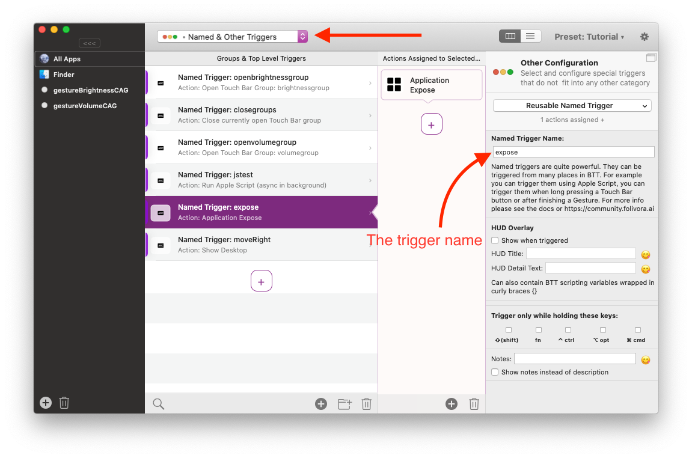

# Reusable Named Triggers

Named triggers are basically pointers to one or multiple actions. Named triggers do have a name, but otherwise no configuration.

---
### Use Cases for Named Triggers

**1.) Reusability** 

Imagine you have a specific action which you want to execute via different triggers. For example send the same keyboard shortcut when doing a three finger tap, pressing a specific Touch Bar button and performing a gesture. You could assign that same shortcut to all of these triggers and it would work fine. However if you later decide to change the shortcut you would have to re-configure all of the triggers you assigned it to.

With **named triggers** you can assign the shortcut only once - to a custom named trigger - and then assign that named trigger to the real triggers. If you now decide to change the shortcut, you only have to change it for the named trigger.

**2.) Call from Scripts**

Named Triggers can be called using the [BetterTouchTool scripting interfaces](1101_scripting_btt.md) using the **trigger_named** function. This allows you to configure any sequence of actions within BTT and trigger it using e.g. Apple Script or from within a floating webview.

**3.) Special Functionality / Multi Action Triggers**

Some triggers in BTT offer special functionality e.g. when being long pressed. However the BTT UI only allows to assign one action sequence to any given trigger. Named triggers allow you to jump to a different action sequence when the special functionality is triggerd.

One example for this is "long press" on Touch Bar buttons, which lets you set a named trigger that is executed when a long press has been recognized.

--- 
### Defining named triggers:

Select the "Named & Other Triggers" section in BTT. There you'll find and be able to assign actions:

