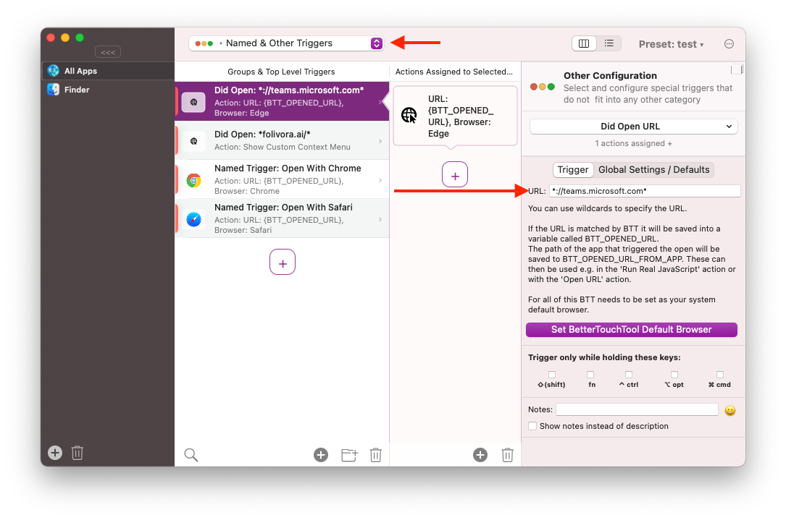
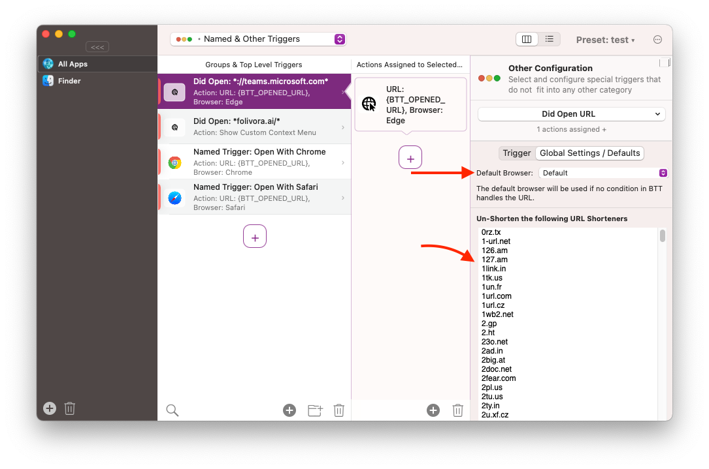
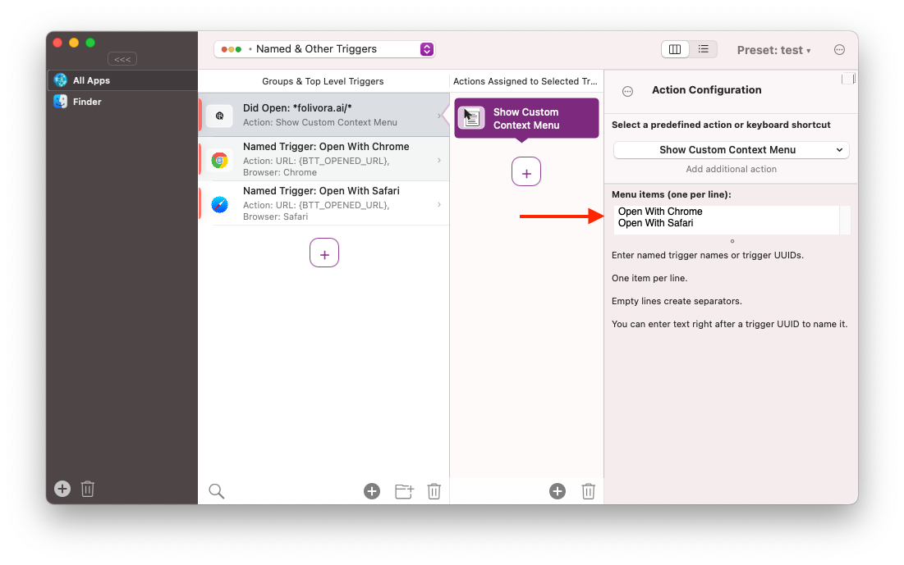

# Did Open URL / URL Based Trigger

BetterTouchTool (starting with version 3.521) allows you to set it as default browser. If you do that, BTT can handle urls, e.g. to open specific sites with specific browsers.

The sections on this page:
* Adding the Trigger
* Configuring the Trigger
* Configuring the Action
* Show Browser Selection in Context Menu
* Advanced Usage with Scripts

-------

## 1 Adding the Trigger
Go to the **Named & Other Triggers** section in BTT and add a new trigger. Select **Did Open URL** from the General section.

## 2 Configuring the Trigger
It is pretty simple to do the basic setup so BTT can know which URLs it should intercept. You just need to specify the URL (you can use wildcards *).

Now whenever a matching URL is called it will be saved into the BTT internal variable called **BTT_OPENED_URL**.
Additionally BTT will save the path to the app that triggered the opening of the URL in the variable called **BTT_OPENED_URL_FROM_APP**



**Global Settings**

There are currently two global settings (they apply to all **Did Open URL** triggers): 
* **Default Browser**: This is the Browser that is used for URLs that do not match any of the rules configured in BTT.

* **URL Shorteners**: BTT will try to un-shorten links from shortener services defind in the list. If you do not want any un-shortening to happen, remove all entries from that list.




## 3 Configuring the Action
One of the main use cases for this feature is to allow the usage of different web browsers for different websites. This can be achieved easily using the predefined action "Open URL / Open URL with Selection".
Instead of specifying a URL you enter the variable like this: **{BTT_OPENED_URL}**, then just select the browser you want to use for the URL.


## 4 Show Browser Selection in Context Menu

It's also possible to show a menu with a list of possible Browsers when clicking on a link. To do this use the predefined action "Show Custom Context Menu" and create multiple [Named Triggers](1002_named_triggers.md)
, one for every Browser you want to support:



It will then show a menu like this when clicking a link:


## 5 Advanced Usage With Scripts

If you need more flexibility, e.g. to trigger some advanced Browser features for specific URLs I recommend to use the predefined action **"Run Real JavaScript"**. While the Apple Script actions would also work I feel the JavaScript action is easier to use.

Here is an example on how to use the "Run Real Java Script" action to access the opened URL and app that triggered it - and then running a shell script to open a specific Browser:


```JavaScript
(async ()=> {

// this gets the url that was opened
let url = await get_string_variable({variable_name:'BTT_OPENED_URL'});

// in case you want to decide based on the app you can also get the app path from where it was opened
let appPath = await get_string_variable( {variable_name:'BTT_OPENED_URL_FROM_APP'});

// this will open safari with the given URL
let openScript = {
    launchPath: '/usr/bin/open',     
	parameters: '-b;;com.apple.Safari;;' + url, 
};


await runShellScript(openScript);

returnToBTT(url+'-'+appPath);
})();
```
