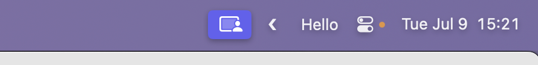
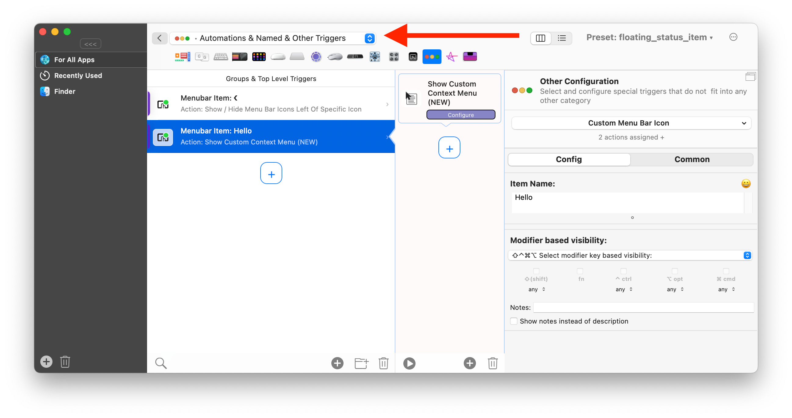
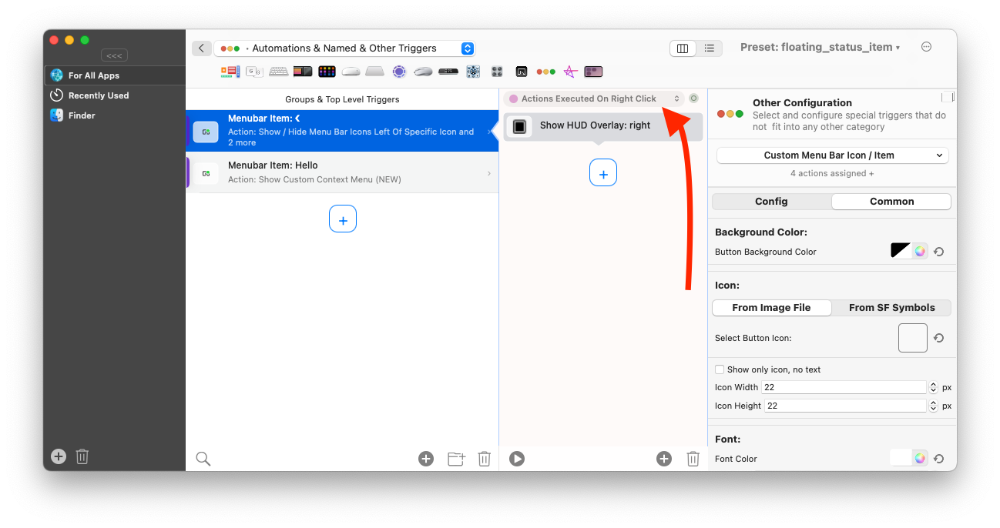

# Custom Menubar Status Items / Icons

BetterTouchTool allows you to add custom icons to your menubar. They can trigger any BetterTouchTool action when clicked and they can also be scripted to show dynamic content.

You can configure the custom menubar status items in the "Automations & Named & Other Triggers" section in BetterTouchTool. There are three different types available:

* Custom Menu Bar Icon (Static)
* Apple / Java Script Menu Bar Icon (Scriptable)
* Shell Script Menu Bar Icon (Scriptable)

You can either use the custom items to trigger any standard action offered by BTT, or you can assign the predefined action "Show Custom Context Menu (New)" to show a menu when clicked.

You can also configure separate actions for right-clicking the menu bar icon:

