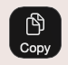
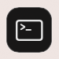
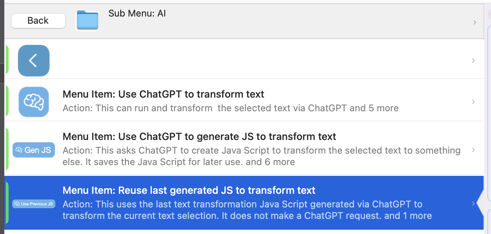
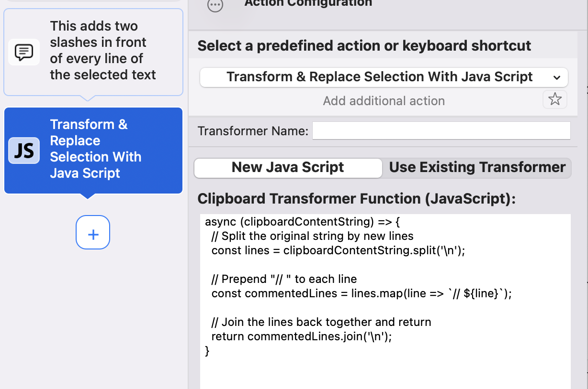
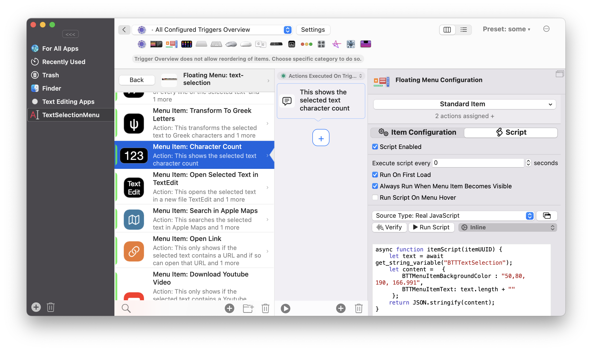
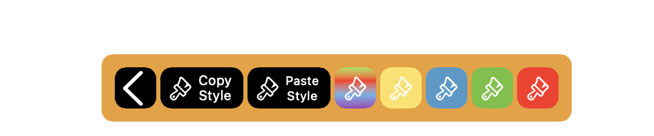
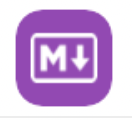
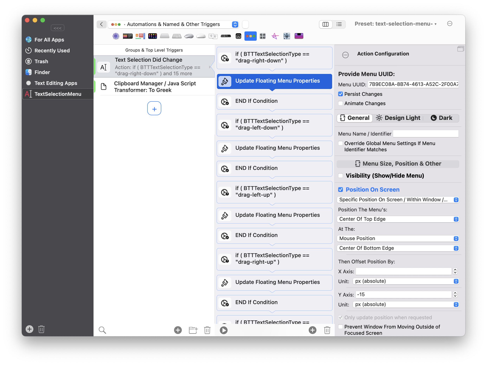
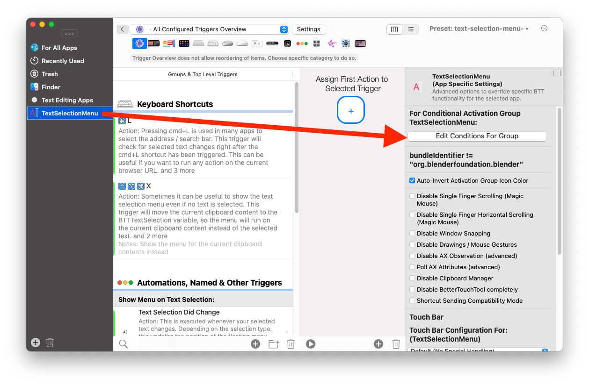
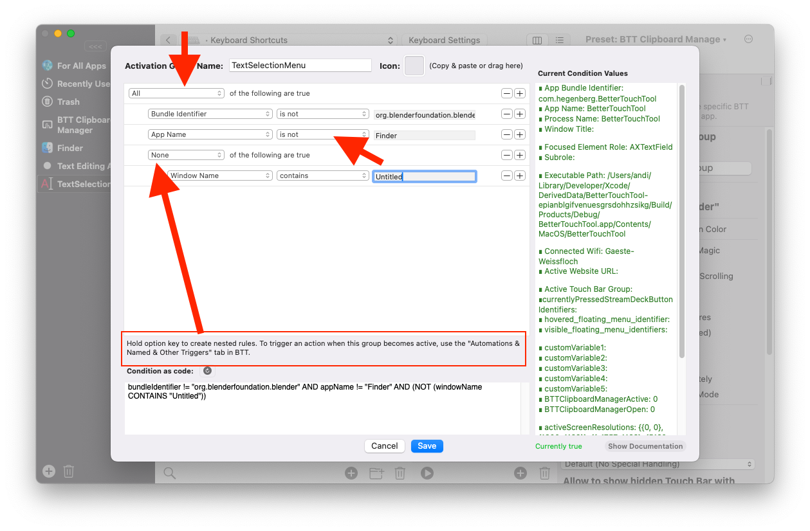

# Text Selection Did Change

Download example preset here: https://folivora.ai/releases/text-selection-base.bttpresetzip


- [Text Selection Did Change](#text-selection-did-change)
  - [Introduction](#introduction)
  - [Useful BetterTouchTool Actions To Be Used](#useful-bettertouchtool-actions-to-be-used)
  - [Variables](#variables)
  - [Example Base Preset (Download \& Description)](#example-base-preset-download--description)
    - [Floating Menu: text-selection](#floating-menu-text-selection)
    - [Keyboard Shortcuts and Key Sequences:](#keyboard-shortcuts-and-key-sequences)
      - [Double Tap Right Option Key](#double-tap-right-option-key)
      - [cmd+L](#cmdl)
      - [ctrl+opt+cmd+x](#ctrloptcmdx)
      - [Automations, Named \& Other Triggers: Text Selection Did Change](#automations-named--other-triggers-text-selection-did-change)
    - [Included Items Overview](#included-items-overview)
      - [Item: Copy](#item-copy)
      - [Item: Copy as HTML:](#item-copy-as-html)
      - [Item: Paste](#item-paste)
      - [Item: Cut](#item-cut)
      - [Item: Append](#item-append)
      - [Item: Search With Google](#item-search-with-google)
      - [Item: Run in Terminal](#item-run-in-terminal)
      - [Item: AI (ChatGPT)](#item-ai-chatgpt)
      - [Item: Strike Through](#item-strike-through)
      - [Item: Comment Lines](#item-comment-lines)
      - [Item: Character Count](#item-character-count)
      - [Item: Open In Text Edit](#item-open-in-text-edit)
      - [Item: Search In Apple Maps:](#item-search-in-apple-maps)
      - [Item: Open Selected URL](#item-open-selected-url)
      - [Item: Download Youtube Video](#item-download-youtube-video)
      - [Submmenu: Format](#submmenu-format)
      - [Submenu: Markdown](#submenu-markdown)
  - [Extending / Modifying The Base Preset](#extending--modifying-the-base-preset)
  - [Customizing The Popup Positioning](#customizing-the-popup-positioning)
  - [Disable Text Selection Menu For Specific Apps / Windows](#disable-text-selection-menu-for-specific-apps--windows)
  - [Showing Specific Items Only In Specific Apps](#showing-specific-items-only-in-specific-apps)

## Introduction

Starting with BetterTouchTool 5.133 there is a new trigger in the "Automations, Named & Other Triggers" section that is called "Text Selection Did Change". It triggers whenever you select some new text.

While this is a pretty simple trigger, it is very powerful when combined with BetterTouchTool's [Floating Menus](1600_floating_menus.md) and BTT's various scripting capabilities.

I know there are other great tools like PopClip that can do similar things, but I believe the power and flexibility of BTT's Floating Menus can really make this great.

Have a look at this example
<div style="margin-left:60px; margin-right:60px; padding:65.06% 0 0 0;position:relative;"><iframe src="https://player.vimeo.com/video/1050456543?badge=0&amp;autopause=0&amp;player_id=0&amp;app_id=58479&amp;autoplay=1&amp;loop=1" frameborder="0" allow="autoplay; fullscreen; picture-in-picture; clipboard-write; encrypted-media" style="position:absolute;top:0;left:0;width:100%;height:100%;" title="BetterTouchTool Text Selection Did Change Trigger"></iframe></div><script src="https://player.vimeo.com/api/player.js"></script>


Some examples of what actions you could add to such a menu:

* Search selected address in Apple / Google Maps
* Search selected text in your favorite search engine or other website
* Quickly run some Shortcut from the Shortcuts app on the selected text
* Copy / Cut / Paste
* Open a link
* Change formatting of selected text, e.g. strike through
* Copy Format from one string and transfer it onto some other string
* Run AI (e.g. ChatGPT) on the selected text - e.g. to fix spelling or transform it.
* Show the number of characters in selected text
* Download Youtube video when selecting a Youtube link
* Transform selected text using Java Script 
* Run selected text in terminal
* Open a selected tracking number in Parcels app (https://apps.apple.com/de/app/parcel-delivery-tracking/id639968404?l=en-GB&mt=12)
* Create a new note from the selected text
* Extract any kind of data and use it (e.g. phone numbers)

## Useful BetterTouchTool Actions To Be Used

Of course you can use any of BetterTouchTool's actions or scripting capabilities, I just want to note some actions that are especially useful in combination with the text selection menu. Most of these will also be demoed in the example preset below.

* Transform & Replace Selected Text With Java Script 
* Transform & Replace Selected Text With ChatGPT
* Open URL / Open URL With Selection
* Change Formatting Of Selected Text
* Copy Text Style / Formatting
* Paste Text Style / Formatting
* Run Shell Script
* Run Real Java Script
* Trigger Menu Bar Menu Item
* (of course) sending keyboard shortcuts

## Variables

Before the "Selected Text Did Change" trigger is triggered, BetterTouchTool will set the following variables that you can use in any scripts and in many BTT actions:


* **BTTTextSelection**: The selected text
* **BTTTextSelectionRTF**: The selected text as rich text in RTF format.

* **BTTTextSelectionElementRole**: The role of the element in which text was selected (e.g. AXTextArea). This could be used to show different floating menus depending on the element.
* **BTTTextSelectionElementSubRole**: : The sub-role of the element in which text was selected. This could be used to show different floating menus depending on the element.
* **BTTTextSelectionType** gives the type of event that triggered the text selection. Currently can be:
    * double-click
    * drag-left-up
    * drag-left-down
    * drag-right-up
    * drag-right-down
* **BTTTextSelectionCuttable**: Cut is available in current context
* **BTTTextSelectionEditable**: Current selected text can be modified


## Example Base Preset (Download & Description)
Here you can download an example preset that shows various possibilities:
https://folivora.ai/releases/text-selection-base.bttpresetzip

This is how it will look like when selecting text:


These triggers will be added to your BTT once you import the preset:


Quick video walkthrough:
<div style="margin-left:60px; margin-right:60px;padding:74.79% 0 0 0;position:relative;"><iframe src="https://player.vimeo.com/video/1050792569?badge=0&amp;autopause=0&amp;player_id=0&amp;app_id=58479&amp;autoplay=1&amp;loop=1" frameborder="0" allow="autoplay; fullscreen; picture-in-picture; clipboard-write; encrypted-media" style="position:absolute;top:0;left:0;width:100%;height:100%;" title="BetterTouchTool_text_selection_preset"></iframe></div><script src="https://player.vimeo.com/api/player.js"></script>

Let's go through the added items:

### Floating Menu: text-selection

This is the menu that will be shown it contains various items that in some way work with the selected text. Let's have a look on all the items that are included in the menu. You can also download the items separately here: [Individual Items](1010_text_selection_did_change_widgets.md)

This is a standard floating menu, it is fully customizable, see: [Floating Menus](1600_floating_menus.md)

---

### Keyboard Shortcuts and Key Sequences:
#### Double Tap Right Option Key

This runs BTT's text selection detection manually. Can be useful if you have selected text via keyboard as this is not automatically caught by BTT.

#### cmd+L

That shortcut is often used to select the addressbar in browsers or other apps. It can be helpful to have the text selection menu popup in this situation, thus BTT overrides that shortcut and automatically triggers the text selection detection

#### ctrl+opt+cmd+x

It can be helpful to show the menu even if no text is selected. This shortcut moves the current clipboard content to the BTTTextSelection variable (on which the menu operates) and then displays the menu. This means the menu will work on the current clipboard contents when this shortcut is pressed.

--- 

#### Automations, Named & Other Triggers: Text Selection Did Change

This is the main trigger that is responsible for positioning and showing the menu. It is triggered whenever you select some text.

--- 
### Included Items Overview

#### Item: Copy


This is a very simple item. It just executes the cmd+c shortcut to copy the selected text.

---

#### Item: Copy as HTML:


This item is configured to only show while holding the CMD key. It will try to copy the selected text as HTML. This is not possible everywhere, but most Browsers will allow it.

---

#### Item: Paste


This is a very simple item. It just executes the cmd+v shortcut to paste the current clipboard content.

---

#### Item: Cut


This is a very simple item. It just executes the cmd+x shortcut to cut the selected text.

---

#### Item: Append


This item appends the currently selected text to the current clipboard contents. It does that by using the predefined action "Transform Clipboard Contents With Java Script". The following simple script is used:

```JS
async (clipboardContentString) => {
   let selectedText = await get_string_variable("BTTTextSelection");
   // the \n will add a new line, if you don't need that just remove it.
   return clipboardContentString+"\n"+selectedText;
}
```

---

#### Item: Search With Google


This item searches the currently selected text on Google. It is very simple to set up by using the predefined action "Open URL / Open URL With Selection":


You can easily adapt this to other URLs. For example if you wanted to search Yahoo, the query would look like this:

```
https://search.yahoo.com/search?q={BTTTextSelection}
```

---

#### Item: Run in Terminal



This will run the currently selected text in terminal. To achieve this it runs the following Apple Script:

```AppleScript
tell application "BetterTouchTool"
    -- you can access the current text selection in Apple Script like this:
	set theSelection to get_string_variable "BTTTextSelection"
end tell

tell application "Terminal"
	activate
	if (count of windows) < 1 then
		do script "" -- opens a new Terminal window if none exists
	end if
	set theTab to selected tab of the first window
	do script theSelection in theTab
end tell
```

---

#### Item: AI (ChatGPT)


This submenu contains a few items that allow you to transform the currently selected text with ChatGPT.



BTT comes with a limited free contingent for the 4o-mini model. To use other models you'll need to enter your own API key.

1. The first submenu item uses the predefined action "Transform & Replace Selection with ChatGPT". That action has various options, e.g. you can provide your own API key, or different URL in case you are running a local model. 

2. The second submenu item is something I have been using a LOT recently. It asks ChatGPT to generate Java Script to transform the selected text based on your needs. It then transforms the currently selected text via that JS and saves the JS for later use.

3. This one reuses the last generated Java Script to transform the selected text. It does not need an internet connection.


---

#### Item: Strike Through


This will try to strike through the currently selected text. It will only work if the current app allows rich text.

---

#### Item: Comment Lines


This item adds two slahes at the beginning of every selected line. It is a good example on how to transform selected text. It uses the predefined action "Transfrom & Replace Selection With Java Script":



With this Java Script:

```JS
async (clipboardContentString) => {
  // Split the original string by new lines
  const lines = clipboardContentString.split('\n');

  // Prepend "// " to each line
  const commentedLines = lines.map(line => `// ${line}`);

  // Join the lines back together and return
  return commentedLines.join('\n');
}
```

If you need any specific text transformation, ChatGPT can often help you with generating the necessary Java Script. Just provide it this base function:

```JS
// the currently selected text is passed to this function in "clipboardContentString". You can modify that however you like. The currently selected text is replaced by whatever you return from this function. For example this would make the selected text upper case.
async (clipboardContentString) => {
  return clipboardContentString.toUpperCase();
}
```

---

#### Item: Character Count


This item is not super useful, it just shows the number of currently selected characters. However it is a good example on how to use the selected text to dynamically change the display of a floating menu item.

It uses this simple script as the menu item's script:
```JS
async function itemScript(itemUUID) {
    // first get the selected text
	let selectedText = await get_string_variable("BTTTextSelection");

     // then return a update definition for the floating menu item. You can update any property a floating menu item has.
	let content = 	{
		BTTMenuItemBackgroundColor : "50,80, 190, 166.991",
        BTTMenuItemText: selectedText.length + ""
	 };

     // make sure to return a stringified version of that 
 	return JSON.stringify(content);
}
```



#### Item: Open In Text Edit


This item will open the selected text in a new file in Text Edit. It uses the predefined action "Run Shell Script" to execute this Terminal command:

```sh
FILE="/tmp/btt-selected-text.txt" && echo "{BTTTextSelection}" >| "$FILE" && open -a TextEdit "$FILE"
```

---

#### Item: Search In Apple Maps:


This searches the selected text in Apple Maps. It uses the "Open URL / Open URL With Selection" action to do so:


This is the apple maps search URL:
```JS
maps://maps.apple.com/?q={BTTTextSelection}
```

To open that in Apple Maps you need to use the "Use Browser" option with "Custom Open Command" selected. This is the custom open command:

```JS
/usr/bin/open -b com.apple.Maps '{url}'
```

#### Item: Open Selected URL


This action will try to extract the first link from the currently selected text and open it in your default browser. It only shows up if the selected text actually contains a link. It checks the plain text version (saved in variable BTTTextSelection) and the rich text version of the currently selected text (saved in BTTTextSelectionRTF)

To achieve this the item requires two scripts. The first script is assigned to the floating menu item itself. It hides the floating menu item if it can not find a link.

---

##### Item Visibility Script
```JS
function extractFirstLink(text) {
  const urlRegex = /[a-zA-Z][a-zA-Z0-9+\-.]*:\/\/[^\s"'`<>]+/;

  const match = text.match(urlRegex);
  if (!match) {
    return null;
  }
  return match[0];
}

async function itemScript(itemUUID) {
    // by default update the item to be invisible
  let content = {
    BTTMenuItemVisibleWhileActive: 0,
    BTTMenuItemVisibleWhileInactive: 0,
    BTTMenuItemMinWidth: 1
  };
  
  
    // first try to get the selected text in plain text
    let selectedText = await get_string_variable("BTTTextSelection");
	
	let link = extractFirstLink(selectedText);
	
	if(!link) {
        // if no link could be extracted, try to get the rich text RTF format instead. This might contain rich text or HTML links.
        selectedText = await get_string_variable("BTTTextSelectionRTF");
	
	    link = extractFirstLink(selectedText);
    }
  
    if (link !== null) {
        // make the item visible if a link was found

        content = {
        BTTMenuItemVisibleWhileActive: 1,
        BTTMenuItemVisibleWhileInactive: 1,
        BTTMenuItemMinWidth: 1
        };
    }
  
  return JSON.stringify(content);
}

```
---

##### Action Script:

To actually open the found URL, we use the predefined action "Run Real Java Script" with this script:

```JS
function extractFirstLink(text) {
  const urlRegex = /[a-zA-Z][a-zA-Z0-9+\-.]*:\/\/[^\s"'`<>]+/;

  const match = text.match(urlRegex);
  if (!match) {
    return null;
  }
  return match[0];
}


async function openLink() {

    let selectedText = await get_string_variable("BTTTextSelection");
	
	let link = extractFirstLink(selectedText);
	
	if(!link) {
        selectedText = await get_string_variable("BTTTextSelectionRTF");
	
	    link = extractFirstLink(selectedText);
    }

    // use BTT's standard scripting interface to trigger the open url action:
    let result =  await trigger_action({json: JSON.stringify({
    BTTPredefinedActionType: 59,
    BTTPredefinedActionName: 'Open URL  or  Open URL With Selection',
    BTTOpenURL: link,
    BTTOpenURLBrowser: 'Default',
    }), wait_for_reply: true});

    // for debugging return the selected text
	return selectedText
}
```

---

#### Item: Download Youtube Video


This item is only shown if a youtube link is selected. Clicking it will download the youtube video to your downloads folder.

**Note** this requires yt-dlp and ffmpeg to be installed on your system via brew.

```
brew install yt-dlp
brew install ffmpeg
```

Like the previous link widget example, this widget requires two scripts, one that hides the item if no youtube link is selected (or shows it otherwise) and one that downloads the Youtube video when clicked. As they are quite similar to the previous widget I'll just show the action script here:

```JS
function extractFirstYoutubeLink(text) {
if(!text) {return null;}

  const youtubeRegex = /(?:https?:\/\/)?(?:www\.)?(?:youtube\.com|youtu\.be)(?:\/[^\s"'`<>]*)?/i;

  const match = text.match(youtubeRegex);
  if (!match) {
    return null;
  }

  let found = match[0];
  if (!/^https?:\/\//i.test(found)) {
    found = 'https://' + found;
  }

  return found;
}


async function downloadYoutubeVideo() {

    // first try to grab link from plain text
    let selectedText =  await get_string_variable("BTTTextSelection");;
    let link = extractFirstYoutubeLink(selectedText);

	if(!link) {
        // if no link was found in plain text try to extract from RTF / rich text
        selectedText = await get_string_variable("BTTTextSelectionRTF");
	
	    link = extractFirstYoutubeLink(selectedText);
    }

    // run yt-dlp command line utility to download the video from the found link
    let shellScript = `/opt/homebrew/bin/yt-dlp \
  --output "~/Downloads/%(title)s.%(ext)s" \
  -f "bestvideo+bestaudio/best" \
  --no-part \
  --prefer-ffmpeg \
  --ffmpeg-location "/opt/homebrew/bin/ffmpeg" \
  --remux-video mp4 \
  "${link}"`;

    let shellScriptWrapper = {
        script: shellScript
    
    };

    let result = await runShellScript(shellScriptWrapper);

	return shellScript;
}
```

---

#### Submmenu: Format



This submenu contains various example formatting actions.

---

#### Submenu: Markdown



This submenu contains various markdown example actions


## Extending / Modifying The Base Preset

If you would like to use the preset shared above as a base for your own menu, be aware that by default any modifications will be lost if you import a newer version of the same preset. (Only modifications to the enabled state, order and display order will be preserved)

To workaround this, I would recommend to create a separate preset in which you duplicate the menu from the example preset, then disable the menu in the example preset itself:

<div style="margin-left:60px; margin-right:60px; padding:54.55% 0 0 0;position:relative;"><iframe src="https://player.vimeo.com/video/1051103409?badge=0&amp;autopause=0&amp;player_id=0&amp;app_id=58479" frameborder="0" allow="autoplay; fullscreen; picture-in-picture; clipboard-write; encrypted-media" style="position:absolute;top:0;left:0;width:100%;height:100%;" title="customize_text_selection_menu"></iframe></div><script src="https://player.vimeo.com/api/player.js"></script>

You can even merge multiple menus if they have the same identifier - in that case you'll need to use the "display order" property to specify the order of  items across menus.

## Customizing The Popup Positioning

BetteTouchTool tries to position the menu above or below the mouse cursor depending on how you selected the text. You can easily modify this behavior.

Open the "Automations, Named & Other Triggers" section. There you'll find the "Text Selection Did Change" Trigger. This is the one that is responsible for recognizing that text has been selected and showing the menu.

When selecting that trigger you'll see that it contains multiple if conditions. These check the variable "BTTTextSelectionType" variable. This variable can have these values:

* double-click
* drag-left-up
* drag-left-down
* drag-right-up
* drag-right-down

Now depending on the BTTTextSelectionType the predefined action "Update Floating Menu Properties" will be called. This action updates the positioning properties of the menu - before in the last step of the action sequence the menu is finally being shown.




## Disable Text Selection Menu For Specific Apps / Windows

Because this is a very new trigger that can definitely interfere with some specific apps, you might want to disable it in specific situations. Also please report any app where it causes issues on https://community.folivora.ai

Disabling the menu for specific apps or windows can be done easily. 

Te example preset has configured everything related to the text selection trigger in a [Conditional Activation Group](1400_conditions.md). To exclude apps, you can edit the conditions:



The default conditions already exlcude one app: "Blender". This is done by specifying bundleIdentifier is not "org.blenderfoundation.blender"

You can also exclude apps by name or window name (or any other condition available). Hold option to create nested rules.

For example this would exclude Blender (default), Finder and any window that contains "Untitled" in it's title.



## Showing Specific Items Only In Specific Apps

Sometimes it can be useful to display certain items only in specific apps. For example some coding assistance items only in code editors or some browser specific items only in browsers.

To achieve this you can create additional [Conditional Activation Groups](1400_conditions.md). If you add a floating menu with the same identifier (in the preset it's called text-selection), the items added to that will be merged into your main preset.

You might need to use the "Display Order" property to define the position of these merged items.

The default preset already contains one example for a conditional activation group that adds an item to your text-selection menu.


It is active if any of the conditions shown here are active (Text Edit, Sublime Text, Code and Xcode):


The example contains the menu with the correct identifier and one example item (which however is disabled):
