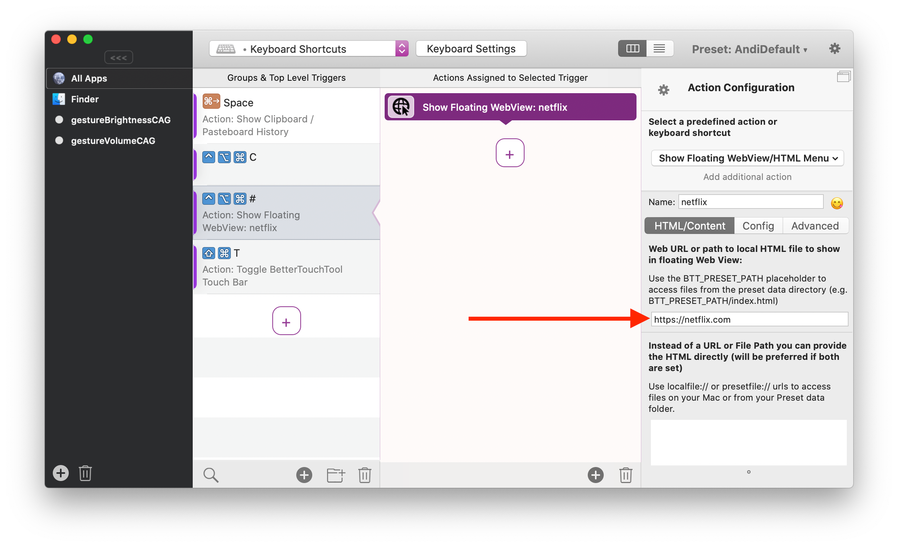
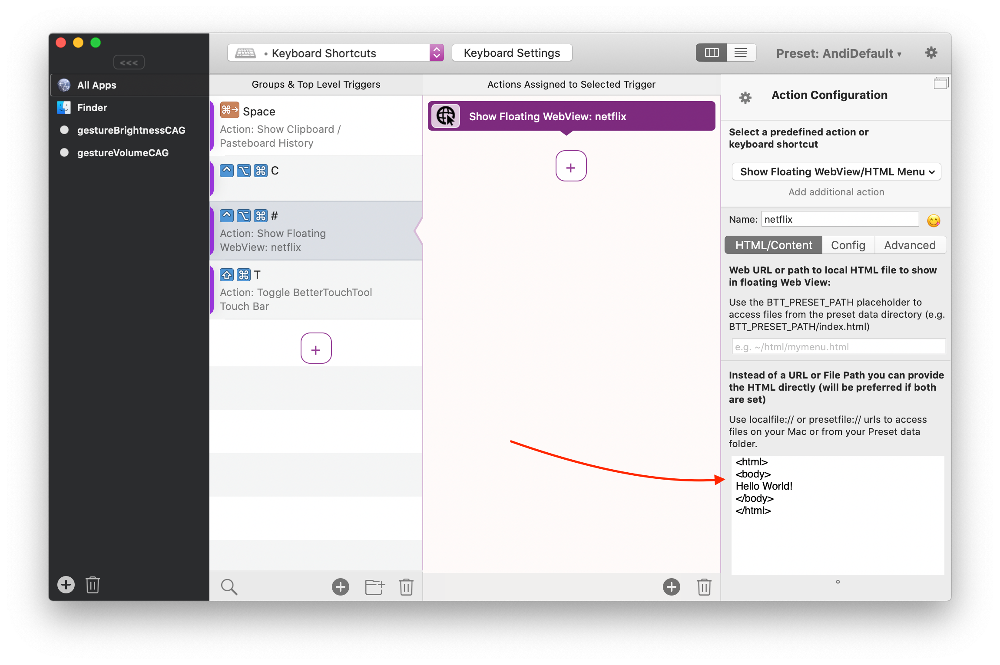

## Basic Setup

### Setting up a trigger to show / hide the foating webview
The floating webview works just like any other predefined action in BTT. Basically you first select a trigger, which can be anything BTT has to offer (e.g. Keyboard Shortcut, Touch Bar Button, Trackpad Gesture...). After that you assign the predefined action **Show Floating WebView/HTML Menu** to the trigger.

In case you want to launch the same webview using multiple different triggers, instead of duplicating it multiple times you can just assign it to a [Reusable Named Trigger](1002_named_triggers.md)

### Loading HTML from a URL
Loading a website from a URL just requires you to enter the URL:


### Loading from a HTML file in your Preset's data folder (recommended)
Every Preset in BTT has its own data folder. You can access it via the preset menu. If you place HTML files etc. in that folder you can reference them by using the **BTT_PRESET_PATH** placeholder. For example, if you have a file called index.html in your preset's data folder, you can access it via BTT_PRESET_PATH/index.html.
This is pretty useful, because it allows you to export your preset including the associated files, so if you want to share your webview config you can easily do that.
.

### Providing HTML directly:
Of course you can also enter HTML directly. This is not recommended for larger sites, but might be helpful for testing:
.

### Accessing images and other files on your disk
The webview does NOT support to access files using the file:// protocol. However if you need to access a locally stored file from your hard drive, you can use localfile:// instead. For example ``````

Usually you should store all files used by the webview in the Preset's data directory. You can reference these files from within the webview using the presetfile:// protocol. For example ``````

### Refreshing the Content
By default the content of the webview will stay loaded in background and it is assumed that it doesn't change. However during development you often want to see the latest changes immediately. To achieve this, open the advanced section and select "Do NOT keep content active in background". Afterwards the webview will reload everytime you hide/unhide it.