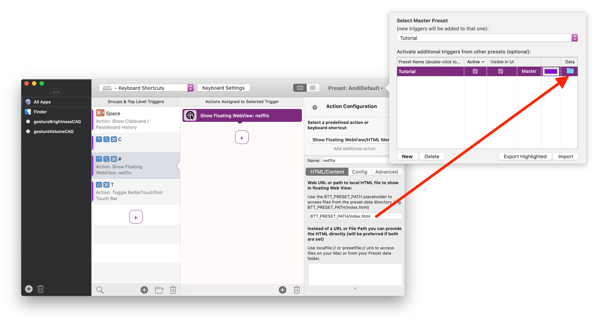
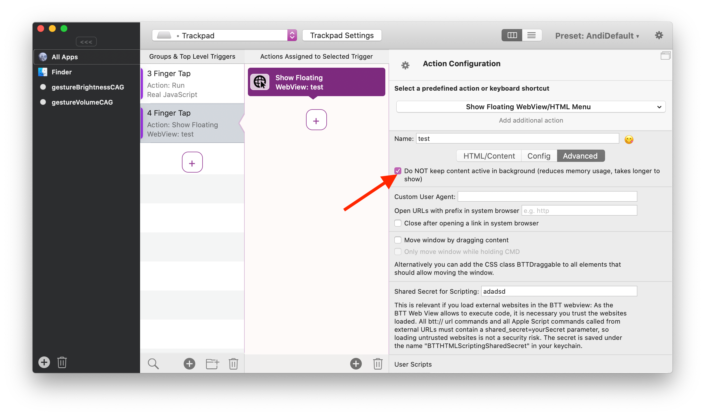

## Development Hints

Some useful tips & tricks that make working with the web view easier.

1.) **Use an external HTML file.** Best solution is to place it in the preset's data folder and reference it using BTT_PRESET_PATH/thenameofthefile.html. You can use your facorite editor (I recommend Visual Studio Code) to edit the file.
.

2.) **Disable caching while developing.** You probably want the webview to automatically reload when hiding / closing it. To achieve this, enable the "DO NOT keep active in background" option.
.

3.) **Use the debugger / inspector.** You can right-click any BTT webview and choose "Inspect Element" to open the webview inspector. This can be a bit slow though. If you want faster debugging enable Safari's developer mode, then you can also access the BTT webviews through the Safari Develop menu: 

.

