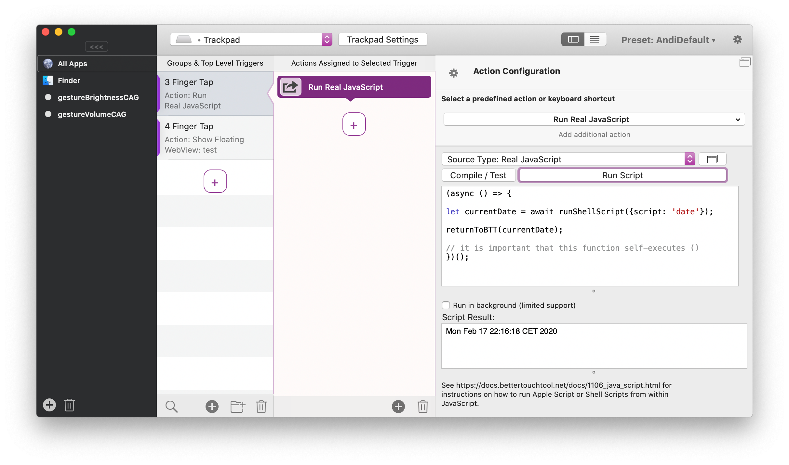

## Using Real Java Script in BTT

**NOTE**: If you are using the floating webview action in BTT have a look here instead: [Floating Webview JavaScript](10_2_floating_menu_javascript.md)

---
This feature is new in BetterTouchTool version 3.333. I think it is the most powerful and easiest way to script BetterTouchtool.

It's basically just modern Java Script (so you can use async await and the like) however it has a few important additions:

*  It can call any Apple Script - and get the result
*  It can call any Shell Script - and get the result.
*  It can trigger all functions available in BetterTouchTool's scripting interface.


By combining these three you can automate almost any task on your Mac.



[Using Real Java Script in BTT](#using-real-java-script-in-btt)
- [Using Real Java Script in BTT](#using-real-java-script-in-btt)
  - [1.) Running Standard Apple Scripts: : runAppleScript(yourScript)](#1-running-standard-apple-scripts--runapplescriptyourscript)
  - [1.) Running Java Script For Automation (JXA) Scripts: runJXA(yourScript)](#1-running-java-script-for-automation-jxa-scripts-runjxayourscript)
  - [3.) Running Shell Scripts: runShellScript({script: "/usr/bin/say hello"})](#3-running-shell-scripts-runshellscriptscript-%22usrbinsay-hello%22)
  - [4.) Running Shortcuts From Apple's Shortcuts App: runAppleShortcut({name: "somename", "input": "someoptionalinput"})](#4-running-shortcuts-from-apples-shortcuts-app-runappleshortcutname-%22somename%22-%22input%22-%22someoptionalinput%22)
  - [5.) Read and Write Files: readFile(path: string, readAsBase64: Boolean)](#5-read-and-write-files-readfilepath-string-readasbase64-boolean)
  - [6.) Load the contents of a URL as base64: fetchURLAsBase64(path: string, readAsBase64: Boolean)](#6-load-the-contents-of-a-url-as-base64-fetchurlasbase64path-string-readasbase64-boolean)
  - [7.) Write String/Data to File:  writeStringToFile(dataString: string, path: string, stringIsBase64: Boolean)](#7-write-stringdata-to-file-writestringtofiledatastring-string-path-string-stringisbase64-boolean)
- [8.) Using the JavaScript to call BTT scripting functions](#8-using-the-javascript-to-call-btt-scripting-functions)
- [9.)  Available BetterTouchTool Scripting Interfaces](#9-available-bettertouchtool-scripting-interfaces)
  - [Example script function calls:](#example-script-function-calls)
  - [**trigger\_named**](#triggernamed)
    - [Example](#example)
  - [**trigger\_named\_async\_without\_response**](#triggernamedasyncwithoutresponse)
    - [Example](#example-1)
  - [**cancel\_delayed\_named\_trigger\_execution**](#canceldelayednamedtriggerexecution)
    - [Example](#example-2)
  - [**update\_touch\_bar\_widget**](#updatetouchbarwidget)
    - [Example:](#example-3)
  - [**update\_menubar\_item**](#updatemenubaritem)
    - [Example:](#example-4)
  - [**update\_stream\_deck\_widget**](#updatestreamdeckwidget)
    - [Example:](#example-5)
  - [**trigger\_action**](#triggeraction)
    - [Example:](#example-6)
  - [**execute\_assigned\_actions\_for\_trigger**](#executeassignedactionsfortrigger)
    - [Example](#example-7)
  - [**refresh\_widget**](#refreshwidget)
    - [Example](#example-8)
  - [**update\_trigger**](#updatetrigger)
    - [Example:](#example-9)
  - [**get\_trigger**](#gettrigger)
  - [**get\_triggers**](#gettriggers)
  - [**add\_new\_trigger**](#addnewtrigger)
    - [Example](#example-10)
  - [**delete\_trigger**](#deletetrigger)
    - [Example](#example-11)
  - [**get\_clipboard\_content**](#getclipboardcontent)
    - [Example](#example-12)
  - [**get\_selection**](#getselection)
    - [Example](#example-13)
  - [**set\_persistent\_string\_variable**](#setpersistentstringvariable)
    - [Java Script for Automation Example:](#java-script-for-automation-example)
  - [**set\_string\_variable**](#setstringvariable)
  - [**set\_persistent\_number\_variable**](#setpersistentnumbervariable)
  - [**set\_number\_variable**](#setnumbervariable)
  - [**get\_number\_variable**](#getnumbervariable)
  - [**get\_string\_variable**](#getstringvariable)
  - [**export\_preset**](#exportpreset)
  - [**import\_preset**](#importpreset)
  - [**get\_preset\_details**](#getpresetdetails)
  - [**display\_notification**](#displaynotification)
  - [**paste\_text**](#pastetext)
  - [**reveal\_element\_in\_ui**](#revealelementinui)
  - [**get\_menu\_item\_details**](#getmenuitemdetails)
  - [**set\_clipboard\_content**](#setclipboardcontent)
  - [**set\_clipboard\_contents**](#setclipboardcontents)
  - [**get\_items\_from\_clipboard\_manager**](#getitemsfromclipboardmanager)
  - [**paste\_clipboard\_manager\_items\_with\_uuids**](#pasteclipboardmanageritemswithuuids)
  - [**show\_simple\_json\_format\_menu**](#showsimplejsonformatmenu)
  - [**set\_keychain\_item**](#setkeychainitem)
  - [**get\_keychain\_item**](#getkeychainitem)
  - [get-selected-text](#get-selected-text)


### 1.) Running Standard Apple Scripts: : runAppleScript(yourScript) 
To run a Apple Script from within the Java Script code, use the runAppleScript(scriptCode) function. The function takes a string that defines the Apple Script, and returns a promise which resolves to the result value.

I'm always using it with async await, but you can also use classic Promise syntax.

**Example: Run Apple Script from within Java Script**

```JavaScript
// You can either wrap your script in a self executing async function or a standard named async function. If you use a named function, you can use return instead of returnToBTT
async function someFunctionName() {

// put the Apple Script into a string (back ticks are great for multi -line strings)
let appleScript = `
    set theDialogText to "The curent date and time is " & (current date) & "."
    set result to display dialog theDialogText
    return result
`;

// this will execute the Apple Script and store the result in the result variable.
let result = await runAppleScript(appleScript);

// do whatever you want with the result

// at the end you always need to call returnToBTT to exit the script / return the value to BTT.
return result;

// it is important that this function self-executes ()
}


```


### 1.) Running Java Script For Automation (JXA) Scripts: runJXA(yourScript) 
To run a Apple Script from within the Java Script code, use the runAppleScript(scriptCode) function. The function takes a string that defines the Apple Script, and returns a promise which resolves to the result value.

I'm always using it with async await, but you can also use classic Promise syntax.

**Example: Run JavaScript For Automation (JXA) from within Java Script (requires BTT >= 4.903)**

```JavaScript
// You can either wrap your script in a self executing async function or a standard named async function. If you use a named function, you can use return instead of returnToBTT
async function someFunctionName() {

// put the Apple Script into a string (back ticks are great for multi -line strings)
let jxaScript = `
    var app = Application.currentApplication()
    app.includeStandardAdditions = true

    var response = app.displayDialog("Test?", {
        defaultAnswer: "",
        withIcon: "note",
        buttons: ["Cancel", "Continue"],
        defaultButton: "Continue"
    })
    // Result: {"buttonReturned":"Continue", "textReturned":"Test"}
    app.displayDialog("Hello, " + (response.textReturned) + ".");
`;

// this will execute the JXA Apple Script and store the result in the result variable.
let result = await runJXA(jxaScript);

// do whatever you want with the result

// at the end you always need to call returnToBTT to exit the script / return the value to BTT.
return result;

// it is important that this function self-executes ()
}


```


### 3.) Running Shell Scripts: runShellScript({script: "/usr/bin/say hello"})

**Example: Run Shell Script from within Java Script**

```JavaScript
// You can either wrap your script in a self executing async function or a standard named async function. If you use a named function, you can use return instead of returnToBTT
async function someFunctionName() {

// put the shell script into a string (single backticks are great for multiline strings)
let shellScript = `say hello world`;


let shellScriptWrapper = {
    script: shellScript, // mandatory
    launchPath: '/bin/bash', //optional - default is /bin/bash
    parameters: '-c', // optional - default is -c. If you use multiple parameters please separate them by ;; e.g. -c;;date
	environmentVariables: '' //optional e.g. VAR1=/test/;VAR2=/test2/;
};

// this will execute the Apple Script and store the result in the result variable.
let result = await runShellScript(shellScriptWrapper);

// do whatever you want with the result

// at the end you always need to call returnToBTT to exit the script / return the value to BTT.
return result;

// it is important that this function self-executes ()
}
```

### 4.) Running Shortcuts From Apple's Shortcuts App: runAppleShortcut({name: "somename", "input": "someoptionalinput"})

You can provide the name of the shortcut and some input (optional).

```JavaScript
async function somefunctionname() {
  let shortcut = "some name";
  let input = "some input";
  let result = await runAppleShortcut({name: shortcut, input: input});
  return result;
}
```


If you want to provide multiple files as input, please separate them with two semicolons. For example

```JavaScript
async function somefunctionname() {
  runAppleShortcut({name: 'multi-file-test', input: '~/Downloads/test1.png;;~/Downloads/test2.png'});
  return result;
}
```

### 5.) Read and Write Files: readFile(path: string, readAsBase64: Boolean)

```
async function doSomething() {
  // note: this immediately returns, readFile is synchronous
 	let fileContentAsString = readFile("~/Library/Application Support/BetterTouchTool/app-cache.json");
  return fileContentasString:
}
```

### 6.) Load the contents of a URL as base64: fetchURLAsBase64(path: string, readAsBase64: Boolean)

```
async function loadURL() {
    // note: this immediately returns, fetchURLAsBase64 is synchronous
 	return fetchURLAsBase64("https://folivora.ai/favicon.ico");
}
```

### 7.) Write String/Data to File:  writeStringToFile(dataString: string, path: string, stringIsBase64: Boolean)

```
async function doSomething() {
 return writeStringToFile(
    JSON.stringify(menuItems),
    "~/Library/Application Support/BetterTouchTool/app-cache.json"
}
```

## 8.) Using the JavaScript to call BTT scripting functions
All BetterTouchTool scripting functions can be accessed from Java Script. 

## 9.)  Available BetterTouchTool Scripting Interfaces
The available scripting functions are:
* trigger_named
* update_touch_bar_widget
* update_menubar_item
* update_stream_deck_widget
* trigger_action
* execute_assigned_actions_for_trigger
* refresh_widget
* get_trigger
* get_triggers
* update_trigger (to create or if exists update a trigger)
* add_new_trigger 
* delete_trigger
* delete_triggers
* trigger_named
* trigger_named_async_without_response
* cancel_delayed_named_trigger_execution
* get_dock_badge_for
* get_active_touch_bar_group
* is_true_tone_enabled
* get_location
* set_persistent_string_variable
* set_string_variable
* set_persistent_number_variable
* set_number_variable
* get_number_variable
* get_string_variable
* export_preset
* import_preset
* display_notification
* paste_text
* set_clipboard_content
* set_clipboard_contents
* get_items_from_clipboard_manager
* paste_clipboard_manager_items_with_uuids
* show_simple_json_format_menu
* get-selected-text
* 

Floating Menus:
* update_menu_item
* get_menu_item_value
* set_menu_item_value
* webview_menu_item_load_html_url_js

---

### Example script function calls:

### **trigger_named**
This method will trigger the specified named trigger (which can be configured in the "Other" tab in BetterTouchTool.)


#### Example
```JavaScript
async function somefunctionname() {
let result = await trigger_named({trigger_name: 'Action5', wait_for_reply: true});
// Currently only the Apple Script and Shell Script actions return results, if you don't care about the result, setting wait_for_reply to false can make execution a bit faster (default is true)
return result;
}
```

---


### **trigger_named_async_without_response**
This method will trigger the specified named trigger (which can be configured in the "Other" tab in BetterTouchTool.). 

Optional parameter: 
**delay** This lets you set a delay before the named trigger is executed (in seconds). While the trigger has not been executed you can cancel the execution by calling the  **cancel_delayed_named_trigger_execution** function

#### Example
```JavaScript
async function somefunctionname() {
  trigger_named_async_without_response({trigger_name: 'Action5',  wait_for_reply: false});
// Currently only the Apple Script and Shell Script actions return results.
return "done";
}
```

---

### **cancel_delayed_named_trigger_execution**
This method will cancel the execution of a delayed named trigger (see previous function)

#### Example
```JavaScript
async function somefunctionname() {
  cancel_delayed_named_trigger_execution({trigger_name: 'Action5'});
// Currently only the Apple Script and Shell Script actions return results.
return "done";
}
```

---


### **update_touch_bar_widget**
This method will temporarily update the contents of a Touch  Bar Script Widget (identified by its uuid). You can provide a new text to show, a new icon and a new background color.

For the icon you can either provide it directly using the icon_data parameter (must be base64 encoded) or you can provide a file path (via the icon_path parameter) that points to the new icon.

You can get the uuid by right-clicking any script widget in BTT.

#### Example:
```JavaScript
async function somefunctionname() {
    
let widgetConfig = {
	text: "hi there!",
	icon_path: "/Users/andi/Desktop/test.png",
	background_color: "200,100,100,255"	
};

  update_touch_bar_widget({uuid: '9990CE09-9820-4D67-9C52-8BABAB263056', json: widgetConfig});

return "done";

}
```
---


### **update_menubar_item**
This method will temporarily update the contents of a Menubar Status Item (identified by its uuid). You can provide a new text to show, a new icon and a new background color.

For the icon you can either provide it directly using the icon_data parameter (must be base64 encoded) or you can provide a file path (via the icon_path parameter) that points to the new icon.

You can get the uuid by right-clicking any script widget in BTT.

#### Example:
```JavaScript
async function somefunctionname() {
    
let widgetConfig = {
	text: "hi there!",
	icon_path: "/Users/andi/Desktop/test.png",
	background_color: "200,100,100,255"	
};

  update_menubar_item({uuid: '9990CE09-9820-4D67-9C52-8BABAB263056', json: widgetConfig});

return "done";

}
```
---


### **update_stream_deck_widget**
This method will temporarily update the contents of a Stream Deck Script Widget (identified by its uuid). The changes will not be persisted. You can provide a new text to show on the button and you can update any other of the button's properties. To see what properties are possible right-click an existing & configured Strem Deck button in BTT and choose "copy". When pasting this copied button into some text editor you'll see the possible values in the "BTTTriggerConfig" section.


#### Example:
```JavaScript
async function somefunctionname() {
    
let widgetConfig = {
	text: "some new title!",
	BTTStreamDeckBackgroundColor: "200,100,100,255",
  BTTStreamDeckSFSymbolName : "bitcoinsign.circle.fill",

};

  update_stream_deck_widget({uuid: '9990CE09-9820-4D67-9C52-8BABAB263056', json: JSON.stringify(widgetConfig)});

return "done";

}
```
---


### **trigger_action**
This method will trigger any of BetterTouchTool's predefined actions (or any combination of them).

You need to provide a JSON description of the action you want to trigger as a string. The easiest way to get such a JSON description is to right-click the trigger you have configured in BetterTouchTool and choose "Copy JSON". This will copy the complete JSON (including the configuration for the trigger itself), but this action will ignore anything that's not needed. (or you can delete the not needed parts)
#### Example:
```JavaScript
async function somefunctionname() {

let actionDefinition = {
  "BTTPredefinedActionType" : 153, 
  "BTTPredefinedActionName" : "Move Mouse To Position", 
  "BTTMoveMouseToPosition" : "{100, 100}", 
  "BTTMoveMouseRelative" : "6"
};


let result = await trigger_action({json: JSON.stringify(actionDefinition), wait_for_reply: false});

return result;

}
```

---


### **execute_assigned_actions_for_trigger**
This method execute all the assigned actions for a given trigger (i.e. gesture, shortcut, drawing etc.) identified by its uuid.

You can get the uuid by right-clicking any configured trigger in BetterTouchTool.

#### Example
```JavaScript
async function somefunctionname() {

    let result = await execute_assigned_actions_for_trigger({uuid: '2F34005D-4537-464D-94E9-A7F42DA39DF1'});
    // Currently only the Apple Script and Shell Script actions return results.
    return result;
}

```
---


### **refresh_widget**
This method will execute all scripts assigned to a script widget and update its contents accordingly.

The widget is identified by its uuid, which you can get by right-clicking the widget in BetterTouchTool.

#### Example
```JavaScript
async function somefunctionname() {

  refresh_widget({uuid: '2F34005D-4537-464D-94E9-A7F42DA39DF1'});

return "done";

}

```

---


### **update_trigger**
This method will create or update the configuration of any specified trigger (i.e. gestures, shortcuts, touchbar items etc.).

You need to provide the uuid of the trigger you want to update (get by right-clicking it in BTT) and a JSON object defining the updates. To know how the JSON object should look like, right-click the trigger in BTT and choose "Copy JSON".

**Optional Parameter**: trigger_parent_uuid (if you want to add the trigger to a group)


#### Example:
Hint: don't forget to use JSON.stringify() before passing the updateDefinition object.

```JavaScript
async function somefunctionname() {

var updateDefinition = JSON.stringify(
  {
    "BTTTriggerConfig": {
      "BTTTouchBarButtonName" : "New Name",
      "BTTTouchBarItemIconHeight": 25
    }
  }
);

  update_trigger({uuid: 'ED631459-115C-4D8C-940A-D428E4EAE086', json: updateDefinition});

return "done";

}
```

---

### **get_trigger**
This allows you to retrieve the json representation of any trigger (e.g. gesture, Touch Bar button, keyboard shortcut etc.) identified by the given UUID. 

You can get the UUID by right-clicking any trigger in BTT.


```JavaScript
async function somefunctionname() {

let result = await get_trigger({uuid:'123e4567-e89b-12d3-a456-426655440000'})
return result;
}

```

---


### **get_triggers**
This allows you to retrieve the JSON description of multiple triggers in BTT (e.g. Touch Bar item, Gesture, Keyboard Shortcut etc.) based on a few properties.

You can get the properties of a specific trigger by selecting it in BTT and copy pasting it to some text editor.

The get_triggers() function supports these parameters (all optional):

* trigger_type (e.g. BTTTriggerTypeMagicMouse)
* trigger_id (e.g. 643 for named triggers)
* trigger_parent_uuid (if you want to get the items of a folder)
* trigger_uuid (to get a specific trigger)
* trigger_app_bundle_identifier (to get triggers assigned to a specific app)


```JavaScript
async function somefunctionname() {

  let allNamedTriggersJSONString = await get_triggers({trigger_id: 643});
  let allTriggersJSONArray = JSON.parse(allNamedTriggersJSONString);

  let allNamedTriggerNames = [];
  for(let trigger of allTriggersJSONArray) {
    allNamedTriggerNames.push(trigger["BTTTriggerName"]);
  }

  return allNamedTriggerNames;
}

```

---


### **add_new_trigger**
This method will add a new trigger to BTT (i.e. gestures, shortcuts, touchbar items etc.).

You need to provide a JSON object defining the new trigger. To know how the JSON object should look like, right-click any existing trigger in BTT and choose "Copy JSON".

**Optional Parameter**: trigger_parent_uuid (if you want to add the trigger to a group)

#### Example
```JavaScript

async function somefunctionname() {
var newTriggerDefinition = {
  "BTTTriggerClass" : "BTTTriggerTypeKeyboardShortcut",
  "BTTPredefinedActionType" : 5,
  "BTTPredefinedActionName" : "Mission Control",
  "BTTAdditionalConfiguration" : "1179648",
  "BTTTriggerOnDown" : 1,
  "BTTEnabled" : 1,
  "BTTShortcutKeyCode" : 2,
  "BTTShortcutModifierKeys" : 1179648,
  "BTTOrder" : 3
}

  add_new_trigger({json: JSON.stringify(newTriggerDefinition)});

return "done";

}

```


### **delete_trigger**
This method will delete a trigger from BetterTouchTool.
You need to provide the uuid of the trigger you want to delete (get by right-clicking it in BTT).

#### Example
```JavaScript
async function somefunctionname() {
 let result = await add_new_trigger({uuid: '2F34005D-4537-464D-94E9-A7F42DA39DF1'});
return result;
}

```
---

### **get_clipboard_content**
Gives you the current text content of the clipboard.

#### Example
```JavaScript
async function somefunctionname() {

let result = await get_clipboard_content({format: "public.html" /*optional*/, asBase64: false, excludeConcealed: false});

return result;

}

```

For the format parameter you can use any possible UTI or one of these strings:

Default formats are (more are possible):

* all - returns all currently stored formats as a JSON string
* NSPasteboardTypeString
* NSPasteboardTypeTIFF
* NSPasteboardTypePNG
* NSPasteboardTypeRTF
* NSPasteboardTypeRTFD
* NSPasteboardTypeHTML
* NSPasteboardTypeTabularText
* NSPasteboardTypeFont
* NSPasteboardTypeRuler
* NSPasteboardTypeColor
* NSPasteboardTypeSound
* NSPasteboardTypeMultipleTextSelection
* NSPasteboardTypeTextFinderOptions
* NSPasteboardTypeURL
* NSPasteboardTypeFileURL

---


### **get_selection**
Gives you the currently selected text/item

#### Example
```JavaScript
async function somefunctionname() {

let result = await get_selection({format: "public.html" /*optional*/, asBase64: false});

return result;

}

```

For the format parameter you can use any possible UTI or one of these strings:

Default formats are (more are possible):

* NSPasteboardTypeString
* NSPasteboardTypeTIFF
* NSPasteboardTypePNG
* NSPasteboardTypeRTF
* NSPasteboardTypeRTFD
* NSPasteboardTypeHTML
* NSPasteboardTypeTabularText
* NSPasteboardTypeFont
* NSPasteboardTypeRuler
* NSPasteboardTypeColor
* NSPasteboardTypeSound
* NSPasteboardTypeMultipleTextSelection
* NSPasteboardTypeTextFinderOptions
* NSPasteboardTypeURL
* NSPasteboardTypeFileURL

---

### **set_persistent_string_variable**
This allows you to set a variable to a given string that persists over BTT relaunches.


#### Java Script for Automation Example:
```JavaScript
async function somefunctionname() {

let result = await set_persistent_string_variable({variable_name: 'test', to: "this is a test value"});

return result;

}
```

---

### **set_string_variable**
This allows you to set a variable to a given string that persists over BTT relaunches.

```JavaScript
async function somefunctionname() {

let result = await set_string_variable({variable_name: 'test', to: "this is a test value"});

return result;

}
```

---


### **set_persistent_number_variable**
This allows you to set a variable to a given string that persists over BTT relaunches.

```JavaScript
async function somefunctionname() {

let result = await set_persistent_number_variable({variable_name: 'test', to: 12345});

return result;

}
```

---


### **set_number_variable**
This allows you to set a variable to a given string that persists over BTT relaunches.


```JavaScript
async function somefunctionname() {

let result = await set_number_variable({variable_name:'OutputVolume' to: 0.5});

return result;
}
```

---

### **get_number_variable**
This allows you to retrieve the contents of a number variable with the given name


```JavaScript
async function somefunctionname() {

let result = await get_number_variable({variable_name:'OutputVolume'})
return result;

}
```

---

### **get_string_variable**
This allows you to retrieve the contents of a string variable with the given name


```JavaScript
async function somefunctionname() {

let result = await get_string_variable({variable_name:'BTTActiveAppBundleIdentifier'})
return result;
}

```

---


### **export_preset**
This allows you to export a specific preset


```JavaScript
async function somefunctionname() {

let result = await export_preset({name:'the_preset_name', compress: 1, includeSettings: 0, outputPath: '~/Downloads', comment: 'this is a great preset', link: 'https://someoptionallink', minimumVersion: '4.123'})
return result;
}

```

---


### **import_preset**
This allows you to import a specific preset


```JavaScript
async function somefunctionname() {

let result = await import_preset({path:'/path/to/your/preset.bttpreset'})
return result;
}

```

---


### **get_preset_details**
This allows you to query the state of a preset.  Note: this returns a JSON array - which usually contains details for one preset but in some situations might contain multiple preset details.


```JavaScript
async function someJavaScriptFunction() {
	let presetDetails = await get_preset_details({name: "theNameOfThePreset"});
    return presetDetails;
}

```

Example output:
```JSON
[
  {
    "uuid" : "F8367505-8409-4828-B5FA-8596932687F4",
    "hidden" : 0,
    "name" : "thePresetName",
    "activated" : 2, // this can be 0 (disabled), 1 (enabled) or 2 (enabled & master preset)
    "color" : "30.069600, 113.581080, 136.680000, 255.000000"
  }
]
```

---

### **display_notification**
This shows a notification


```JavaScript
async function somefunctionname() {

let result = await display_notification({title:'notification title', subTitle: 'some subttitle', soundName: 'frog', imagePath: '~/Downloads/image.png'})
return result;
}

```
  
---

### **paste_text**
This pastes some text

Parameters:

**text**: The text to paste.

**insert_by_pasting**: If set to true BTT will use cmd+v to paste the text. Otherwise it will actually try to type it (only possible for standard formats)

**move_cursor_left_by_x_after_pasting**: If specified BTT will move the cursor by the given amount to the left.


**format**: Optional. The format the text will be interpreted as when pasting (e.g. if you want to paste a table, you can use set the string to ```<table>...</table>```and specify the format NSPasteboardTypeHTML)
Note, this only works if insert_by_pasting is set to true.

Default formats are (more are possible):
* NSPasteboardTypeString
* NSPasteboardTypeTIFF
* NSPasteboardTypePNG
* NSPasteboardTypeRTF
* NSPasteboardTypeRTFD
* NSPasteboardTypeHTML
* NSPasteboardTypeTabularText
* NSPasteboardTypeFont
* NSPasteboardTypeRuler
* NSPasteboardTypeColor
* NSPasteboardTypeSound
* NSPasteboardTypeMultipleTextSelection
* NSPasteboardTypeTextFinderOptions
* NSPasteboardTypeURL
* NSPasteboardTypeFileURL

```JavaScript
let result = await paste_text({text:'<strong>Hello world</strong>', format: 'NSPasteboardTypeHTML', insert_by_pasting: true})

```
  
---


### **reveal_element_in_ui**
This will show a BTT trigger identified by it's UUID in the BetterTouchTool user interface.

Parameters:
**The UUID of the trigger** (you can get the UUID of a trigger by right-clicking it or e.g. via the "get_triggers" scripting function)


```JavaScript
async function someJavaScriptFunction() {
    await reveal_element_in_ui("39CDAF30-98BB-4F54-B87F-273B6081149E");
    return "done"";
}

```
---

### **get_menu_item_details**
Gets the details (available, enabled, checked) of a given menubar menu item. This can be helpful to perform actions conditionally if a menu item is enabled/disabled.

Parameters:
**The path to the menu bar item** E.g. "Edit;Cut" or "Window;Move & Resize; Left"

```JavaScript
async function someJavaScriptFunction() {
    let menuItemDetailsString =   await get_menu_item_details("Edit;Cut");
    let menuItemDetails = JSON.parse(menuItemDetailsString);

    // The object looks like this: {"available": false, "enabled": false, "checked": false}
 
    return menuItemDetails.enabled;
}

```
  
---


### **set_clipboard_content**
Changes the content of the clipboard

Parameters:

**content**: The content to put in your clipboard.
**format**: Optional. The format the content will be interpreted as when pasting (e.g. if you want to paste a table, you can use set the string to ```<table>...</table>``` and specify the format NSPasteboardTypeHTML)

Default formats are (more are possible):

* NSPasteboardTypeString
* NSPasteboardTypeTIFF
* NSPasteboardTypePNG
* NSPasteboardTypeRTF
* NSPasteboardTypeRTFD
* NSPasteboardTypeHTML
* NSPasteboardTypeTabularText
* NSPasteboardTypeFont
* NSPasteboardTypeRuler
* NSPasteboardTypeColor
* NSPasteboardTypeSound
* NSPasteboardTypeMultipleTextSelection
* NSPasteboardTypeTextFinderOptions
* NSPasteboardTypeURL
* NSPasteboardTypeFileURL

```JavaScript
async function somefunctionname() {

let result = await set_clipboard_content({content:'<strong>Hello world</strong>', format: 'NSPasteboardTypeHTML'})
return result;
}

```
  
---


### **set_clipboard_contents**
Changes the content of the clipboard. This is almost the same as set_clipboard_content (without the s at the end), however it allows to set different data for different formats. For example you might want to set a plain string for apps that only support plain text, but set a HTML or RTF representation for apps that support these.

Parameters:

**contents**: An array of the contents to put in your clipboard as array. If you want to set binary data it must be base64 encoded. Otherwise just provide an array of standard strings.
**formats**:  An array of the formats the content will be interpreted as when pasting (e.g. if you want to paste a table, you can use set the string to ```<table>...</table>``` and specify the format NSPasteboardTypeHTML)

Default formats are (more are possible):

* NSPasteboardTypeString
* NSPasteboardTypeTIFF
* NSPasteboardTypePNG
* NSPasteboardTypeRTF
* NSPasteboardTypeRTFD
* NSPasteboardTypeHTML
* NSPasteboardTypeTabularText
* NSPasteboardTypeFont
* NSPasteboardTypeRuler
* NSPasteboardTypeColor
* NSPasteboardTypeSound
* NSPasteboardTypeMultipleTextSelection
* NSPasteboardTypeTextFinderOptions
* NSPasteboardTypeURL
* NSPasteboardTypeFileURL

```JavaScript
async function somefunctionname() {
  // this example sets plain "hello" for apps that only support plain text and a HTML formatted "hello world" for apps that support pasting HTML formatted content
  await set_clipboard_contents({contents: ["hello", "<b>hello</b> world"], "formats": ["NSPasteboardTypeString","NSPasteboardTypeHTML"]})
return result;
}

```
  
---

### **get_items_from_clipboard_manager**
This function allows you to retrieve arbitrary items from the BTT clipboard manager (if the clipboard manager is active)

Parameters:

* **start**: The offeset from which to start retrieving items.
* **numberOfItems**: The number of items to retrieve starting from **start**
* **format**: Optional: the format you want to retrieve. This defaults to NSPasteboardTypeString (standard string). If you set it to **all** it will retrieve all stored formats for every item. For other supports formats scroll up to the previous *set_clipboard_content* function.
* **snippetGroup**: Optional: the name of the snippet group you want to retrieve from
* **asBase64**: Return the content as base64 encoded string

```JavaScript

async function retrieveItems() {
    //additional supported parameters: format, snippetGroup and asBase64
    // if format is set to "all", it will return all stored information about the requested items, apart from "all" it supports any pasteboard UTI
	return get_items_from_clipboard_manager({start: 0, numberOfItems: 5});
}
```

The output of this will be a JSON string, you need to use JSON.parse(result) to convert it to a Java Script object:

```JavaScript
{
  "items" : [
   
    {
      "meta" : {
        "copiedFrom" : "com.sublimetext.4",
        "uuid" : "1B1F7F7D-EF28-4B45-9AF1-248768BFCB8C",
        "previewText" : "Test5",
        "date" : "2025-10-01T13:25:09Z"
      },
      "content" : "Test5"
    },
    {
      "meta" : {
        "copiedFrom" : "com.sublimetext.4",
        "uuid" : "10C6C74F-8373-4810-909E-544318EC4ED7",
        "previewText" : "Test4",
        "date" : "2025-10-01T13:25:08Z"
      },
      "content" : "Test4"
    },
    {
      "meta" : {
        "copiedFrom" : "com.sublimetext.4",
        "uuid" : "D8956BBC-7699-43D7-BF22-3E648B05D631",
        "previewText" : "Test3",
        "date" : "2025-10-01T13:25:08Z"
      },
      "content" : "Test3"
    },
    {
      "meta" : {
        "copiedFrom" : "com.sublimetext.4",
        "uuid" : "A9880066-4438-4CD2-A103-FB7E3CAD47FC",
        "previewText" : "Test2",
        "date" : "2025-10-01T13:25:07Z"
      },
      "content" : "Test2"
    },
    {
      "meta" : {
        "copiedFrom" : "com.sublimetext.4",
        "uuid" : "0BD5D9D6-B76D-4E91-99E9-5B59F9067C44",
        "previewText" : "Test1",
        "date" : "2025-10-01T13:25:07Z"
      },
      "content" : "Test1"
    }
  ],
  "latest" : "2025-10-01T13:25:14Z"
}
```
  
---

### **paste_clipboard_manager_items_with_uuids**
This function will paste one or more specific items from the BTT clipboard manager (if the clipboard manager is active)

Parameters:

* **uuids**: A comma separated string with the UUIDs of the clipboard manager items you want to paste. To retrieve these UUIDs use the *get_items_from_clipboard_manager* function
* **deleteAfterPaste**: if true, the pasted items will be removed from the clipboard manager

```JavaScript
async function pasteSomeItems() {
    //additional supported parameters: deleteAfterPaste
	return paste_clipboard_manager_items_with_uuids({uuids: "0BD5D9D6-B76D-4E91-99E9-5B59F9067C44,A9880066-4438-4CD2-A103-FB7E3CAD47FC"});
}
```


---

### **show_simple_json_format_menu**
Shows a menu defined via [Simple JSON FOrmat](1108_simple_format.md)

Parameters:

**json**: The JSON String or Object describing the menu

```JavaScript
async function showFloatingMenu() {


  let items = [
    {
      "title": "trigger some shortcut",
      "icon": "sfsymbol::globe",
      "action": "shortcut::TheShortcutFromTheShortcutsApp"
    },
    {
      "title": "trigger some named trigger",
      "icon": "sfsymbol::house",
      "action": "named::TheNameOfTheBTTNamedTrigger"
    }
  ];
  
  let container = {
    type: "floatingMenu",
    items: items,
    "BTTMenuItemBackgroundColor": "255.000000, 45.000001, 33.000002, 255.000000",
  };
  
  let result = await show_simple_json_format_menu( container);


  return result;
}

```


---

### **set_keychain_item**
This allows you to securely save information into macOS keychain

```JavaScript
async function somefunctionname() {

let result = await set_keychain_item("some-name", "some-secret");

return result;

}
```

---


### **get_keychain_item**
This allows you to retrieve securely saved information from macOS keychain

```JavaScript
async function somefunctionname() {

// this returns something that you have saved previously (e.g. via an other temporary script or by directly editing keychain)
let result = await get_keychain_item("some-name");

// if you want to access items created outside of BTT you might need to specify more details:
let external = await get_keychain_item({name: "name-field-in-keychain", account: "account-field-in-keychain"})

return result;

}
```

---

### get-selected-text
To access the currently selected text, make use of the selected_text variable like this:


```JavaScript
async function somefunctionname() {
let selectedText = await get_string_variable({variable_name:'selected_text'})
 return selectedText;
}

```