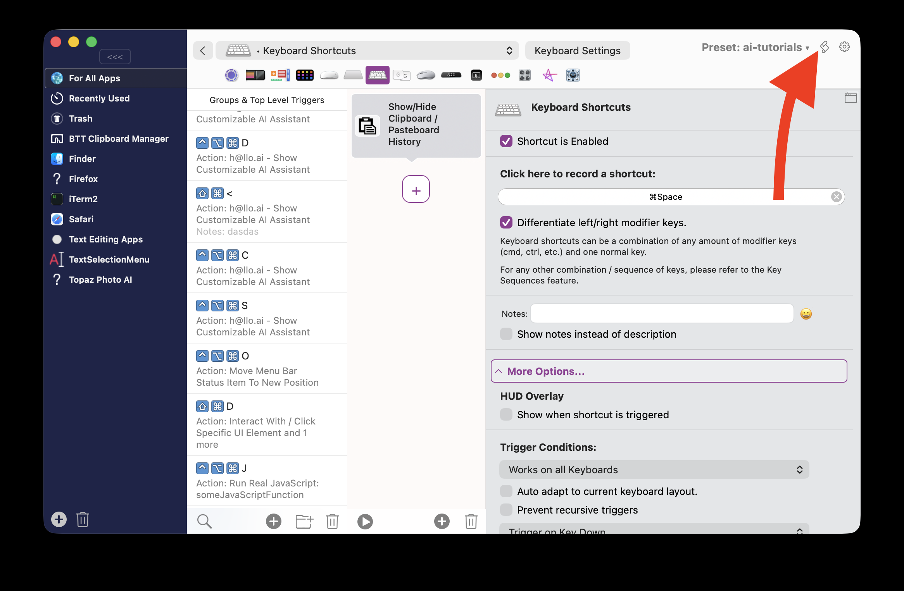
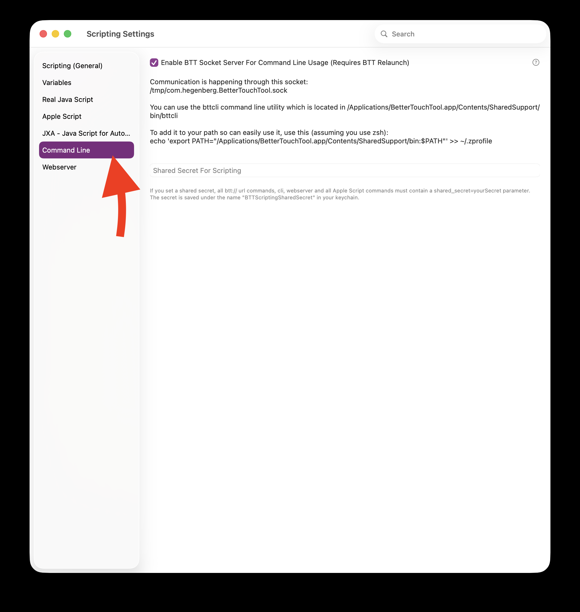

# BetterTouchTool CLI (bttcli) Documentation

- [BetterTouchTool CLI (bttcli) Documentation](#bettertouchtool-cli-bttcli-documentation)
  - [Overview](#overview)
  - [Socket Server Details](#socket-server-details)
  - [Usage Examples](#usage-examples)
  - [Command Format](#command-format)
  - [Supported Commands](#supported-commands)
    - [1. get\_selection](#1-getselection)
    - [2. get\_clipboard\_content](#2-getclipboardcontent)
    - [3. set\_clipboard\_content](#3-setclipboardcontent)
    - [4. set\_clipboard\_contents](#4-setclipboardcontents)
    - [5. is\_app\_running](#5-isapprunning)
    - [6. display\_notification](#6-displaynotification)
    - [7. get\_dock\_badge\_for](#7-getdockbadgefor)
    - [8. get\_active\_touch\_bar\_group](#8-getactivetouchbargroup)
    - [9. is\_true\_tone\_enabled](#9-istruetoneenabled)
    - [10. get\_location](#10-getlocation)
    - [11. get\_weather](#11-getweather)
    - [12. set\_persistent\_string\_variable](#12-setpersistentstringvariable)
    - [13. set\_string\_variable](#13-setstringvariable)
    - [14. set\_persistent\_number\_variable](#14-setpersistentnumbervariable)
    - [15. set\_number\_variable](#15-setnumbervariable)
    - [16. get\_number\_variable](#16-getnumbervariable)
    - [17. get\_string\_variable](#17-getstringvariable)
    - [18. reveal\_element\_in\_ui](#18-revealelementinui)
    - [19. paste\_text](#19-pastetext)
    - [20. get\_menu\_item\_value / get\_floating\_menu\_item\_value](#20-getmenuitemvalue--getfloatingmenuitemvalue)
    - [21. set\_menu\_item\_value](#21-setmenuitemvalue)
    - [22. update\_menu\_item / update\_floating\_menu\_item](#22-updatemenuitem--updatefloatingmenuitem)
    - [23. webview\_menu\_item\_load\_html\_url\_js](#23-webviewmenuitemloadhtmlurljs)
    - [24. trigger\_action](#24-triggeraction)
    - [25. execute\_assigned\_actions\_for\_trigger](#25-executeassignedactionsfortrigger)
    - [26. trigger\_named](#26-triggernamed)
    - [27. trigger\_named\_async\_without\_response](#27-triggernamedasyncwithoutresponse)
    - [28. cancel\_delayed\_named\_trigger\_execution](#28-canceldelayednamedtriggerexecution)
    - [29. run\_shortcut](#29-runshortcut)
    - [30. chat\_gpt](#30-chatgpt)
    - [31. get\_trigger](#31-gettrigger)
    - [32. get\_triggers](#32-gettriggers)
    - [33. add\_new\_trigger](#33-addnewtrigger)
    - [34. delete\_trigger](#34-deletetrigger)
    - [35. delete\_triggers](#35-deletetriggers)
    - [36. update\_trigger](#36-updatetrigger)
    - [37. get\_preset\_details](#37-getpresetdetails)
    - [38. import\_preset](#38-importpreset)
    - [39. export\_preset](#39-exportpreset)
    - [40. refresh\_widget](#40-refreshwidget)
    - [41. update\_touch\_bar\_widget](#41-updatetouchbarwidget)
    - [42. update\_stream\_deck\_widget](#42-updatestreamdeckwidget)
    - [43. update\_menubar\_item](#43-updatemenubaritem)
    - [44. get\_menu\_item\_details](#44-getmenuitemdetails)
    - [45. get\_menu\_item\_value\_objc / get\_floating\_menu\_item\_value\_objc](#45-getmenuitemvalueobjc--getfloatingmenuitemvalueobjc)
  - [Security Notes](#security-notes)

## Overview

BetterTouchTool provides a Unix socket server that allows external applications to communicate with BTT through the socket at `/tmp/com.hegenberg.BetterTouchTool.sock`. The `bttcli` tool is a command-line interface that communicates with this socket server.

**The Command Line / Socket Server support needs to be enabled in the BetterTouchTool Scripting Settings first**

## Socket Server Details

- **Socket Path**: `/tmp/com.hegenberg.BetterTouchTool.sock`
- **Protocol**: Unix domain socket
- **Security**: 
  - Socket server must be enabled in BTT preferences (`BTTSocketServer` setting)
  - Optional shared secret authentication
  - Socket permissions set to 0666 for accessibility




## Usage Examples

Using the bttcli tool:
```bash
# Get clipboard content
bttcli get_clipboard_content

# Set a variable
bttcli set_string_variable variableName=myVar to="Hello World"

# Get a variable
bttcli get_number_variable variableName=myVar

# Trigger a named trigger
bttcli trigger_named "MyTriggerName"

# Display a notification
bttcli display_notification "Hello from BTT" title="Notification Title"

# Check if an app is running
bttcli is_app_running "Safari"

# Update a Touch BarreadFile widget
bttcli update_touch_bar_widget "widget-uuid-here" text="New Text"

# Get selected text
bttcli get_selection

# Set multiple clipboard formats
bttcli set_clipboard_contents contents='["Hello","<b>Hello</b>"]' formats='["public.plain-text","public.html"]'

# Execute ChatGPT query
bttcli chat_gpt user="What is the weather like?" identifier="weather-conversation"
```

## Command Format

Commands are sent as HTTP-style requests to the socket server:
```
/<command_name>/?param1=value1&param2=value2
```

## Supported Commands

### 1. get_selection
Retrieves the currently selected text or content.
- **Parameters**:
  - `type` / `content` / `format`: Pasteboard type (default: `NSPasteboardTypeString`)
    - Supported types: `NSPasteboardTypeString`, `NSPasteboardTypeTIFF`, `NSPasteboardTypePNG`, `NSPasteboardTypeRTF`, `NSPasteboardTypeRTFD`, `NSPasteboardTypeHTML`, `NSPasteboardTypeTabularText`, `NSPasteboardTypeFont`, `NSPasteboardTypeRuler`, `NSPasteboardTypeColor`, `NSPasteboardTypeSound`, `NSPasteboardTypeMultipleTextSelection`, `NSPasteboardTypeTextFinderOptions`, `NSPasteboardTypeURL`, `NSPasteboardTypeFileURL`
  - `asBase64` / `asbase64`: Return content as base64 encoded (boolean)

### 2. get_clipboard_content
Gets the current clipboard content.
- **Parameters**:
  - `type` / `content` / `format`: Pasteboard type (same as get_selection)
  - `asBase64` / `asbase64`: Return content as base64 encoded (boolean)
  - `excludeConcealed`: Exclude concealed / sensitive items - return empty string instead.

### 3. set_clipboard_content
Sets the clipboard content.
- **Parameters**:
  - `content` / `text`: The content to set
  - `format`: The format/type to use

### 4. set_clipboard_contents
Sets multiple clipboard content types at once.
- **Parameters**:
  - `contents`: Array of content items
  - `formats`: Array of format types

### 5. is_app_running
Checks if an application is running.
- **Parameters**:
  - `app`: App name or bundle identifier

### 6. display_notification
Shows a system notification.
- **Parameters**:
  - `""` (unnamed): Notification body
  - `title`: Notification title
  - `subTitle`: Notification subtitle
  - `soundName`: Sound to play
  - `imagePath`: Path to notification image

### 7. get_dock_badge_for
Gets the badge count for a dock item.
- **Parameters**:
  - `app`: App name
  - `update_interval`: How often to check (minimum 0.5 seconds)

### 8. get_active_touch_bar_group
Returns the currently active Touch Bar group name.
- **Parameters**: None

### 9. is_true_tone_enabled
Checks if True Tone is enabled.
- **Parameters**: None

### 10. get_location
Gets the current location.
- **Parameters**:
  - `format`: Output format (default: `{LAT},{LON}`)

### 11. get_weather
Gets weather information for a location.
- **Parameters**:
  - `location`: Location coordinates or "auto" for current location
  - `unit`: Temperature unit ("fahrenheit" or default celsius)

### 12. set_persistent_string_variable
Sets a persistent string variable that survives BTT restarts.
- **Parameters**:
  - `variableName` / `variable_name`: Variable name
  - `to`: Value to set

### 13. set_string_variable
Sets a temporary string variable.
- **Parameters**:
  - `variableName` / `variable_name`: Variable name
  - `to`: Value to set

### 14. set_persistent_number_variable
Sets a persistent number variable.
- **Parameters**:
  - `variableName` / `variable_name`: Variable name
  - `to`: Numeric value to set

### 15. set_number_variable
Sets a temporary number variable.
- **Parameters**:
  - `variableName` / `variable_name`: Variable name
  - `to`: Numeric value to set

Special variables:
- `BTTDisabled`: Enable/disable BTT
- `BTTSiriRemoteMouseModeActive`: Toggle Siri Remote mouse mode
- `SystemDoNotDisturbState`: Toggle Do Not Disturb
- `BluetoothConnectionState-<address>`: Connect/disconnect Bluetooth devices
- `CurrentDisplayBrightness`: Set current display brightness
- `BuiltInDisplayBrightness`: Set built-in display brightness
- `OutputVolume`: Set output volume

### 16. get_number_variable
Gets a number variable value.
- **Parameters**:
  - `variableName` / `variable_name`: Variable name
  - `default`: Default value if variable doesn't exist

Special variables:
- `BTTIdleTime`: System idle time in seconds
- `BTTDisabled`: BTT disabled state
- `SystemDoNotDisturbState`: Do Not Disturb state
- `BluetoothConnectionState-<address>`: Bluetooth device connection state
- `CurrentDisplayBrightness`: Current display brightness
- `BuiltInDisplayBrightness`: Built-in display brightness
- `ActiveSpace`: Active Space ID
- `OutputVolume`: Current output volume

### 17. get_string_variable
Gets a string variable value.
- **Parameters**:
  - `variableName` / `variable_name`: Variable name
  - `default`: Default value if variable doesn't exist

Special variables:
- `BTTActiveWindowTitle`: Current window title
- `BTTActiveWindowNumber`: Current window number
- `BTTCurrentlyPlaying` / `BTTNowPlaying*`: Now playing information
- `clipboard_content`: Current clipboard content
- `hovered_link`: Currently hovered link
- `selected_text`: Currently selected text

### 18. reveal_element_in_ui
Reveals an element in the BTT UI.
- **Parameters**:
  - `uuid`: UUID of the element to reveal

### 19. paste_text
Pastes text by simulating keyboard input or clipboard paste.
- **Parameters**:
  - `text` / `text_to_paste`: Text to paste
  - `format`: Format type
  - `insert_by_pasting`: Use paste instead of typing (boolean)
  - `move_cursor_left_by_x_after_pasting`: Move cursor left after pasting

### 20. get_menu_item_value / get_floating_menu_item_value
Gets the value of a menu item.
- **Parameters**:
  - `uuid`: Item UUID
  - `menu_name`: Menu name (if not using UUID)
  - `item_name`: Item name (if not using UUID)
  - `itemUUID` / `item_uuid`: Alternative UUID parameter

### 21. set_menu_item_value
Sets the value of a menu item.
- **Parameters**:
  - `uuid`: Item UUID
  - `menu_name`: Menu name
  - `item_name`: Item name
  - `value`: Value to set

### 22. update_menu_item / update_floating_menu_item
Updates a menu item with JSON configuration.
- **Parameters**:
  - `uuid`: Item UUID
  - `menu_name`: Menu name
  - `item_name`: Item name
  - `json`: JSON configuration
  - `persist`: Save changes permanently (boolean)

### 23. webview_menu_item_load_html_url_js
Loads HTML/URL or executes JavaScript in a WebView menu item.
- **Parameters**:
  - `uuid`: Item UUID
  - `menu_name`: Menu name
  - `item_name`: Item name
  - `html_or_url`: HTML content or URL to load
  - `javascript_to_execute`: JavaScript to execute
  - `useragent`: Custom user agent

### 24. trigger_action
Triggers an action.
- **Parameters**:
  - `json`: JSON configuration of the action to trigger

### 25. execute_assigned_actions_for_trigger
Executes all actions assigned to a trigger.
- **Parameters**:
  - `uuid`: Trigger UUID

### 26. trigger_named
Triggers a named trigger and waits for completion.
- **Parameters**:
  - `trigger_name`: Trigger name
  - `cancel_delayed`: Cancel any delayed execution (boolean)

### 27. trigger_named_async_without_response
Triggers a named trigger without waiting for response.
- **Parameters**:
  - `trigger_name`: Trigger name
  - `delay`: Delay in seconds before triggering
  - `cancel_delayed`: Cancel any delayed execution (boolean)

### 28. cancel_delayed_named_trigger_execution
Cancels a delayed named trigger execution.
- **Parameters**:
  - `trigger_name`: Trigger name

### 29. run_shortcut
Runs an Apple Shortcuts shortcut.
- **Parameters**:
  - `shortcut_name`: Shortcut name
  - `input` / `shortcut_input`: Input to pass to shortcut

### 30. chat_gpt
Sends a request to ChatGPT.
- **Parameters**:
  - `identifier`: Conversation identifier
  - `input`: Input text
  - `user`: User prompt
  - `system`: System prompt (default: helpful assistant)
  - `maxHistory`: Maximum conversation history
  - `model`: GPT model to use (default: gpt-4o-mini)
  - `apiKey`: Custom API key
  - `customURL`: Custom API URL

### 31. get_trigger
Gets details for a specific trigger.
- **Parameters**:
  - `uuid`: Trigger UUID

### 32. get_triggers
Gets multiple triggers based on criteria.
- **Parameters**:
  - `trigger_uuid`: Specific trigger UUID
  - `trigger_type`: Type of trigger
  - `trigger_id`: Trigger ID
  - `return_only_if_modifiers_match`: Only return if modifiers match (boolean)
  - `trigger_parent_uuid`: Parent trigger UUID
  - `trigger_app_bundle_identifier`: App bundle identifier
  - `preset`: Preset name

### 33. add_new_trigger
Adds a new trigger.
- **Parameters**:
  - `json`: JSON configuration of the trigger

### 34. delete_trigger
Deletes a trigger.
- **Parameters**:
  - `uuid`: Trigger UUID

### 35. delete_triggers
Deletes multiple triggers.
- **Parameters**:
  - `trigger_uuid`: Specific trigger UUID
  - `trigger_type`: Type of trigger
  - `trigger_id`: Trigger ID
  - `return_only_if_modifiers_match`: Only if modifiers match
  - `trigger_parent_uuid`: Parent trigger UUID
  - `trigger_app_bundle_identifier`: App bundle identifier
  - `preset`: Preset name

### 36. update_trigger
Updates a trigger configuration.
- **Parameters**:
  - `uuid`: Trigger UUID
  - `trigger_parent_uuid`: Parent UUID
  - `json`: JSON configuration

### 37. get_preset_details
Gets details about a preset.
- **Parameters**:
  - `name`: Preset name

### 38. import_preset
Imports a preset from file.
- **Parameters**:
  - `path`: Path to preset file
  - `replaceExisting`: Replace if exists (boolean, default: true)

### 39. export_preset
Exports a preset to file.
- **Parameters**:
  - `name`: Preset name
  - `compress`: Compress output (boolean)
  - `includeSettings`: Include settings (boolean)
  - `outputPath`: Output file path
  - `comment`: Export comment
  - `link`: Associated link
  - `minimumVersion`: Minimum BTT version

### 40. refresh_widget
Refreshes a Touch Bar widget.
- **Parameters**:
  - `uuid`: Widget UUID

### 41. update_touch_bar_widget
Updates Touch Bar widget content.
- **Parameters**:
  - `""` (unnamed): Widget UUID
  - Various widget-specific parameters in the args dictionary

### 42. update_stream_deck_widget
Updates Stream Deck widget content.
- **Parameters**:
  - `""` (unnamed): Widget UUID
  - `text`: Text to display
  - `json`: JSON configuration

### 43. update_menubar_item
Updates menu bar item.
- **Parameters**:
  - `""` (unnamed): Item UUID
  - Various item-specific parameters in the args dictionary

### 44. get_menu_item_details
Gets detailed status of a menu item.
- **Parameters**:
  - `itemPath`: Menu item path

### 45. get_menu_item_value_objc / get_floating_menu_item_value_objc
Gets menu item value (Objective-C version, returns raw value).
- **Parameters**: Same as `get_menu_item_value`


## Security Notes
1. The socket server must be explicitly enabled in BTT preferences
2. An optional shared secret can be configured for authentication
3. The `import_preset` command shows a security warning unless the user has opted to always allow imports
4. External scripting must be enabled for non-webserver requests
