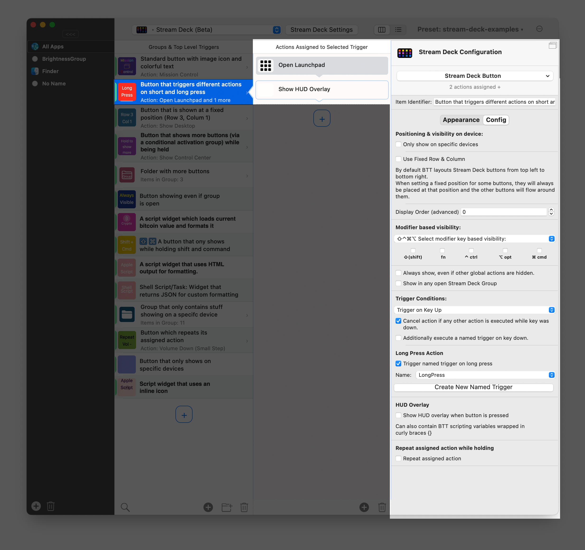

# Configure Long Press Actions for Stream Deck Buttons

This documentation uses the following example preset to explain some of the features.
[Example Preset Direct Link](https://folivora.ai/releases/ExampleStreamDeck.bttpreset)

## Short & Long Press

You can execute different actions when doing a long press, but still keep your default short press actions. To do this follow these steps:

1. **Trigger On Key Up**:
To configure a long press action for a Stream Deck Button, you first need to set the trigger condition to "Trigger on Key Up" (instead of key down).

2. **Configure Long Press Action**: Check the "Trigger named trigger on long press" checkbox, then select (or create) a [Named Trigger](./1002_named_triggers.md) that will be executed if the button is long-pressed.

3. **Cancel default action**:
You have now configured the button to trigger its default actions on key up and you assigned a long press action (which will be executed when holding the button down). This means if you try to perform a long press and hold down the button, it would execute your long press action, but would also trigger the default actions when you release the button.\
\
To prevent this you can check the **"Cancel action if any other action is executed while key was down"** checkbox. In our case this means it would cancel the standard "Key Up" action as soon as the long press action is triggered.

 
