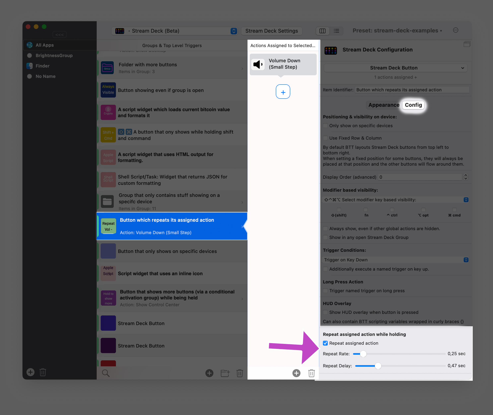

# Configure Key Repeat for Stream Deck Buttons

This documentation uses the following example preset to explain some of the features.
[Example Preset Direct Link](https://folivora.ai/releases/ExampleStreamDeck.bttpreset)

## Key Repeat

Setting up key repeat is really simple. Just check the "Repeat assigned action" checkbox and set the desired repeat rate & delay.

 
