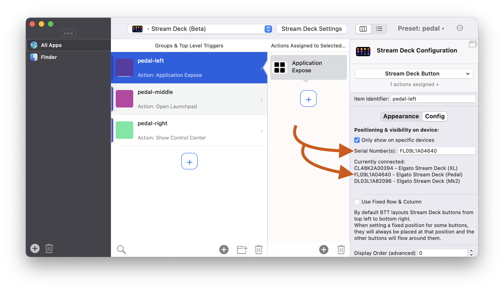

# Stream Deck Pedal

BetterTouchTool includes support for the Stream Deck Pedal: https://www.elgato.com/de/stream-deck-pedal

Although the pedal does not have display, BTT treats it like any other Stream Deck Device. I recommend to configure the pedal in a separate preset to keep everything clean:

  
  

The pedal is good to be combined with these features:
* [Showing / changing buttons while holding other buttons](1304_changing_buttons_while_holding.md)
* [Groups](1306_stream_deck_groups.md)