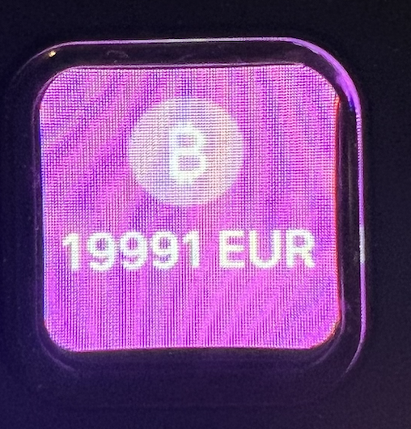
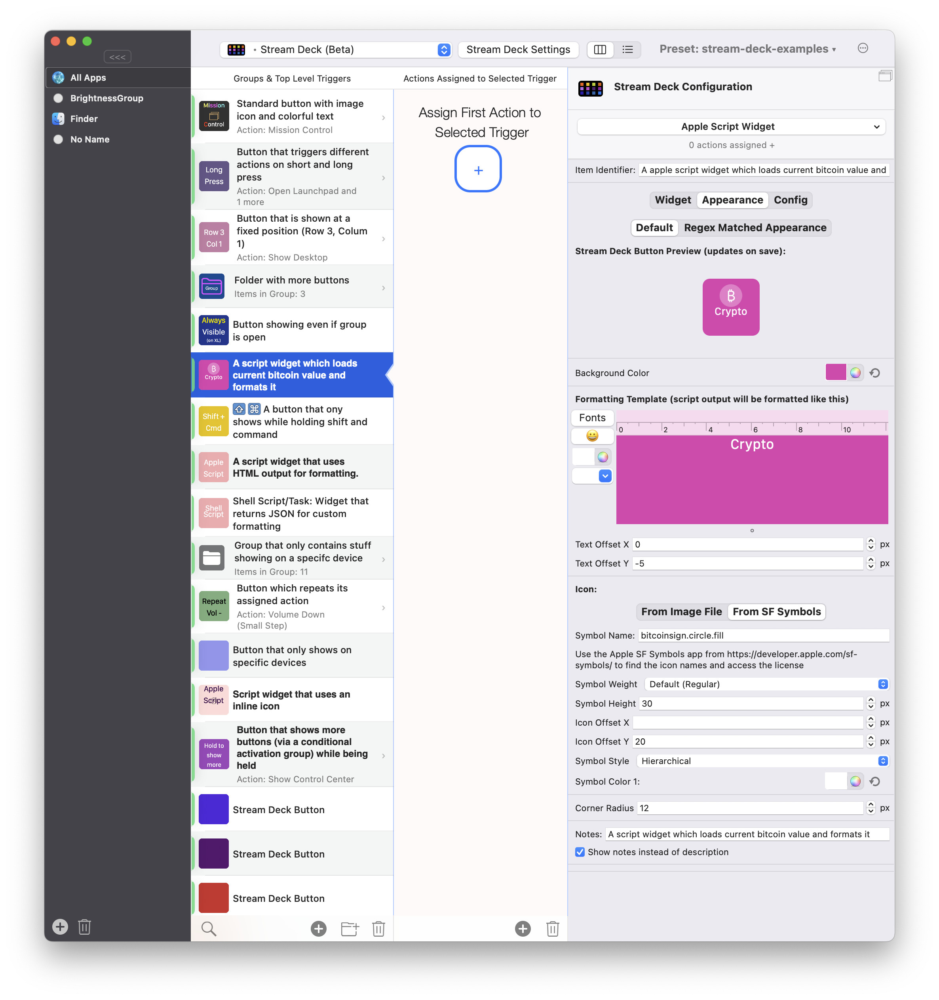
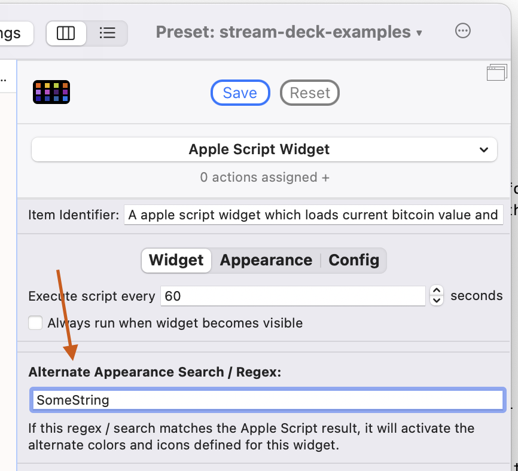
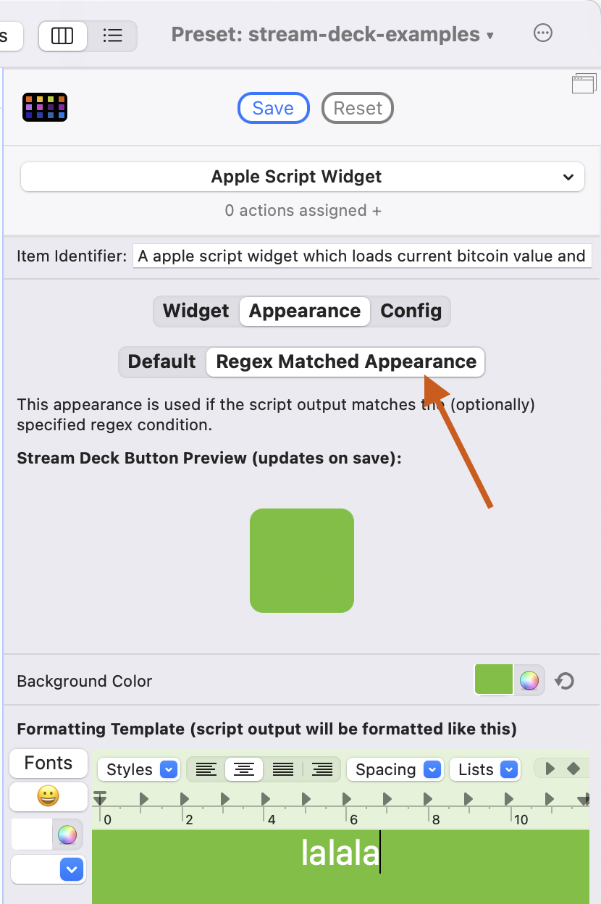
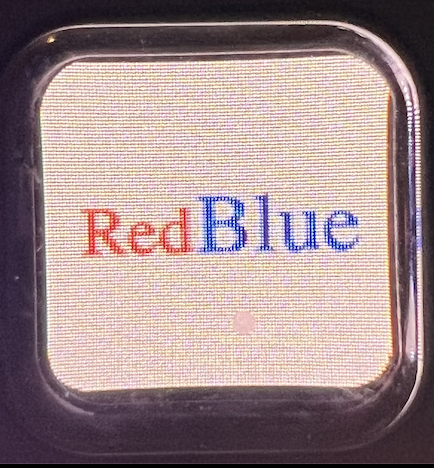
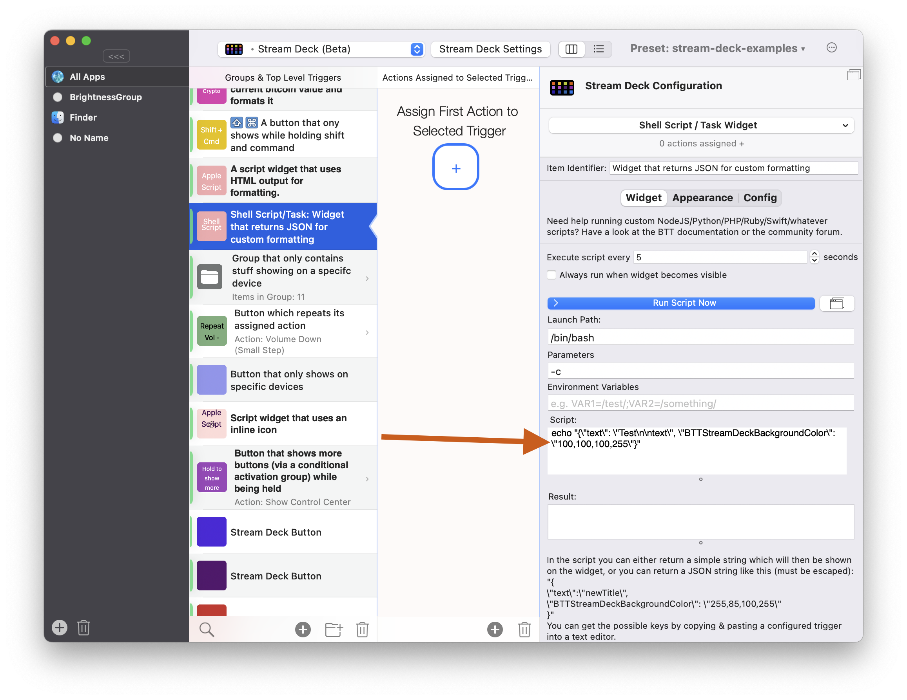
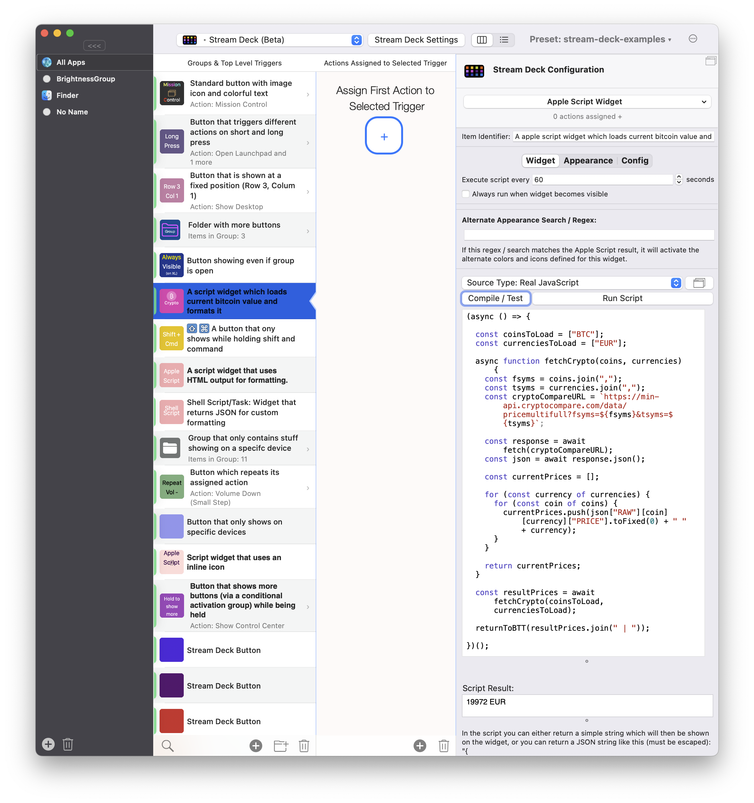

# Script & Shortcuts Widgets

Script widgets are super powerful. They can run Apple Scripts, Apple Shortcuts, Shell Scripts and Java Script. By doing this they can obtain all sort of information and render that info to a Stream Deck button.

  - [Formatting Output](#formatting-output)
    - [Using The Appearance Settings](#1-using-the-appearance-settings)
      - [Regex To Switch Between Appearances](#using-regex-to-switch-between-appearances)
    - [Returning HTML](#2-returning-html)
    - [Returning JSON ](#3-returning-json-that-describes-appearance--new-text-to-display)


 - [Example: Retrieve Bitcoin Price](#example-retrieve-bitcoin-price-java-script)


## Formatting Output

There are multiple options to format the output of a Script Widget:

### 1.) Using the Appearance settings:

When using the appearance settings, BetterTouchTool will transfer the format for every line you defined to the script output. If the script output is longer than the string you defined, BTT will use the format of the last formatted character. 



  

## Using Regex To Switch Between Appearances

You can configure two apperances for a Script Widget. This includes all formatting options like background color, text formatting template, icons etc.

By default the "Default" appearance is used. However you can easily switch to the other appearance by providing a search string / regex. If the script output contains the defined search string or matches the Regex, it will activate the "Regex Matched Appearance".

In general the text configured in the appearance settings will be overriden by whatever text your script outputs. However you can choose to only use the script output for regex matching - so the script output will not change the text configured in the appearance settings. To do this check the *"Do not update title based on script output - just use for regex matching and loading the configured appearance."* checkbox below the script code.

 
 


### 2.) Returning HTML:
A Script Widget can return basic HTML to format:



  

### 3.) Returning JSON that describes appearance & new text to display

A Script Widget can return (escaped) JSON that defines the new text and new appearance properties. To get a list of all the supported properties it's easiest to configure a button to your needs. Afterwards copy & paste it into a Text Editor and have a look at the "BTTTriggerConfig" section in the JSON.

```
echo "{\"text\": \"Test\n\ntext\", \"BTTStreamDeckBackgroundColor\": \"100,100,100,255\"}"
```
  

Here is an example of supported properties

```
      "BTTStreamDeckImageHeight" : 46,
      "BTTStreamDeckCornerRadius" : 12,
      "BTTStreamDeckBackgroundColor" : "25.742586, 54.602200, 140.808355, 255.000000",
      "BTTStreamDeckOnlyOnSpecificDevices" : 1,
      "BTTStreamDeckIconColor1" : "255.000000, 255.000000, 255.000000, 255.000000",
      "BTTStreamDeckAlternateImageHeight" : 50,
      "BTTStreamDeckAlwaysShowButton" : 0,
      "BTTStreamDeckDisplayOrder" : 1000,
      "BTTStreamDeckAlternateIconColor1" : "255, 255, 255, 255",
      "BTTStreamDeckIconColor2" : "255, 255, 255, 255",
      "BTTStreamDeckAlternateIconColor2" : "255, 255, 255, 255",
      "BTTStreamDeckAttributedTitle" : "cnRmZAAAAAADAAAAAgAAAAcAAABUWFQucnRmAQAAAC5uAgAAKwAAAAEAAABmAgAAe1xydGYxXGFuc2lcYW5zaWNwZzEyNTJcY29jb2FydGYyNjM4Clxjb2NvYXRleHRzY2FsaW5nMFxjb2NvYXBsYXRmb3JtMHtcZm9udHRibFxmMFxmbmlsXGZjaGFyc2V0MCBTRkNvbXBhY3QtUmVndWxhcjt9CntcY29sb3J0Ymw7XHJlZDI1NVxncmVlbjI1NVxibHVlMjU1O1xyZWQyNTVcZ3JlZW4yNDFcYmx1ZTA7XHJlZDI1NVxncmVlbjI1NVxibHVlMjU1O30Ke1wqXGV4cGFuZGVkY29sb3J0Ymw7O1xjc3B0aHJlZVxjMTAwMDAwXGM5NDQyOFxjMTQxMTk7XGNzc3JnYlxjMTAwMDAwXGMxMDAwMDBcYzEwMDAwMDt9ClxwYXJkXHR4NTYwXHR4MTEyMFx0eDE2ODBcdHgyMjQwXHR4MjgwMFx0eDMzNjBcdHgzOTIwXHR4NDQ4MFx0eDUwNDBcdHg1NjAwXHR4NjE2MFx0eDY3MjBcc2wwXHNsbWF4aW11bTUwMFxwYXJkaXJuYXR1cmFsXHFjXHBhcnRpZ2h0ZW5mYWN0b3IwCgpcZjBcZnM1MCBcY2YyIEFsd2F5c1xjZjMgXApccGFyZFx0eDU2MFx0eDExMjBcdHgxNjgwXHR4MjI0MFx0eDI4MDBcdHgzMzYwXHR4MzkyMFx0eDQ0ODBcdHg1MDQwXHR4NTYwMFx0eDYxNjBcdHg2NzIwXHBhcmRpcm5hdHVyYWxccWNccGFydGlnaHRlbmZhY3RvcjAKXGNmMyBWaXNpYmxlXAoKXGZzMjggKG9uIFhMKX0BAAAAIwAAAAEAAAAHAAAAVFhULnJ0ZhAAAADP7rpitgEAAAAAAAAAAAAA",
      "BTTStreamDeckAlternateBackgroundColor" : "108.194754, 155.000000, 201.000000, 255.000000",
      "BTTStreamDeckAlternateIconColor3" : "255, 255, 255, 255",
      "BTTStreamDeckAlternateCornerRadius" : 12,
      "BTTStreamDeckIconColor3" : "255, 255, 255, 255",
      "BTTStreamDeckSN" : "CL48K2A00394"
 ```

## Example Retrieve Bitcoin Price (Java Script):

  
