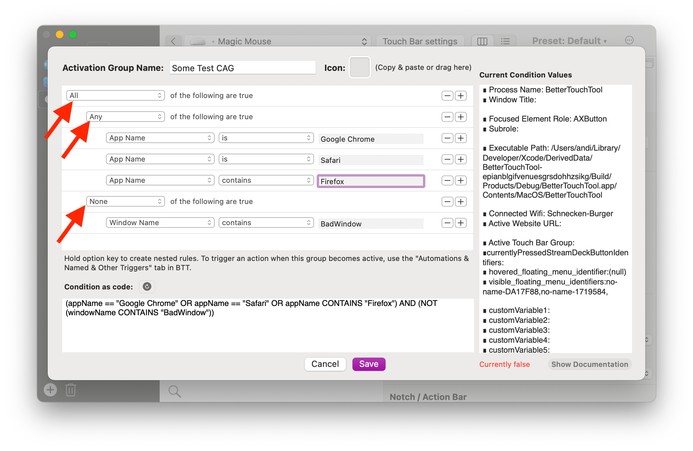
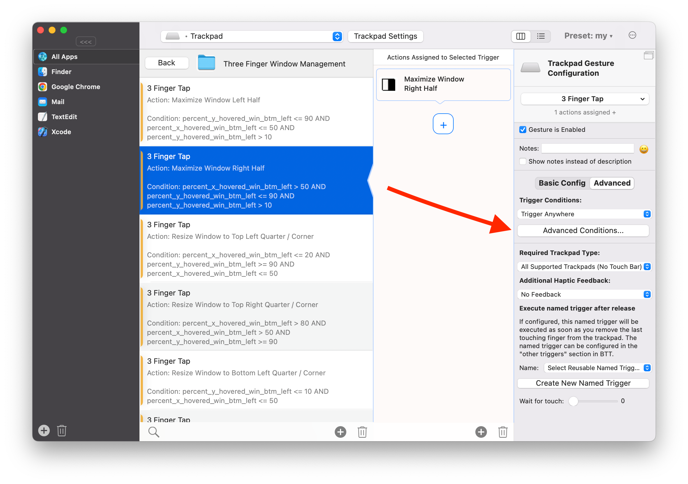

# Conditional Activation Groups and Trigger Conditions

BetterTouchTool offers two different ways to define conditions for triggers.

**Conditional Activation Groups (CAGs)** behave like apps added to BTT. You can assign triggers to CAGs and these triggers will then only work if the conditions defined in the CAG are met.
Conditional Activation Groups are automatically evaluated whenever their underlying variables change. That's why CAGs only contain variables that can be evaluated very quickly & in a performant way. 

Example use cases for CAGs:
  * create a CAG that groups multiple apps, for example if you want to assign the same shortcuts to all web browsers
  * create triggers that only work in a specific wifi

**Advanced Trigger Conditions (ATCs)** are conditions you directly assign to a specific trigger. In contrast to CAGs, Advanced Trigger Conditions are only evaluated **after** BetterTouchTool has recognized a specific trigger. BetterTouchTool then evaluates the conditions and decides whether it should perform the actions you have assigned to the trigger, or whether it should stop.
Because Advanced Trigger Conditions are only evaluated after BTT has recognized a trigger it doesn't matter whether the evaluation takes a few more milliseconds, and thus they allow for some more complicated conditions. However ATCs are in other ways more limited than CAGs. For example if you assign a keyboard shortcut to a CAG, it will only work while that CAG is active. If it is not active, the keyboard shortcut will perform its default macOS functionality. In contrast a keyboard shortcut that has some Advanced Trigger Conditions defined, will always be caught by BTT, only after it has been caught & recognized BTT will evaluate the conditions. This means in case of ATCs the shortcut will NOT fall back to the default system implementation if the conditions are false. 

Example use cases for Advanced Trigger Conditions:
*  create multiple same triggers, which do different things depending on their conditions. E.g. one keyboard shortcut to do multiple things.

## Configuring Conditional Activation Groups (CAGs):

  
To create a nested rule like shown in the screenshot, hold the option key while pressing the little + button.

## Configuring Advanced Trigger Conditions (ATCs):

-----

## Available Variables
Currently the following variables are available and can be used in conditions:

**Information about UI elements**

* visible_window_list
  * This lets you check for specific windows. You can see the list of currently visible windows by clicking the "Visible Windows Viewer" button on the top right. Afterwards you can use the "contains" condition to check whether the list contains a specific window.
  *   

* hovered_element_details
  * This gives information about the currently hovered UI element. You can view the current information by pressing the "UI Element Viewer. You can use the "contains" condition to check if the details shown in the "UI Element Viewer" contain a specific text. 
* focused_element_details.
  *   
* color_under_cursor
  * The hex color of the pixel at the cursor location
  
**Mouse Buttons**
* left_mouse_down
* middle_mouse_down
* right_mouse_down

**Touches**
* fingers_touching_trackpad
* thumb_recognized
  * If a thumb has been recognized on the trackpad, this will be one. Otherwise 0
* thumb_x_percent
* thumb_y_percent
* fingers_touching_magic_mouse

**Mouse Position (from Top Left Corner:)**
* mouse_position_x
* mouse_position_y
* mouse_pos_percent_x
* mouse_pos_percent_y

**Mouse position in active window:**
* dist_x_active_win_top_left
* dist_y_active_win_top_left
---
* dist_x_active_win_top_right
* dist_y_active_win_top_right
---
* dist_x_active_win_btm_left
* dist_y_active_win_btm_left
---
* dist_x_active_win_btm_right
* dist_y_active_win_btm_right
---
* percent_x_active_win_btm_left
* percent_y_active_win_btm_left
---
* percent_x_hovered_win_btm_left
* percent_y_hovered_win_btm_left

**Frame of screen with mouse:**
* mouse_screen_x
* mouse_screen_y
* mouse_screen_width
* mouse_screen_height

**Frame of screen with focused window:**
* focused_screen_x
* focused_screen_y
* focused_screen_width
* focused_screen_height

**Variables:**
* BTTLastTriggeredAction
* BTTLastTriggeredUUID
* BTTLastTriggerTime
* BTTActiveAppBundleIdentifier

* Any custom variable you define can also be used.

## Example: Use one gesture for all your window snapping needs
This example makes use of the "percent_x_hovered_win_btm_left / percent_y_hovered_win_btm_left" variable to execute different actions depending on the location of the mouse in the hovered window:

<video width="50%" height="100%" preload="metadata" controls="">
      <source src="https://community.folivora.ai/uploads/default/original/3X/1/d/1dbd95e86992737156bd8ba492cf2b805c05595c.mov">
      <a href="https://community.folivora.ai/uploads/default/original/3X/1/d/1dbd95e86992737156bd8ba492cf2b805c05595c.mov">/uploads/default/original/3X/1/d/1dbd95e86992737156bd8ba492cf2b805c05595c.mov</a>
    </video>

Details on how to set this up:
https://community.folivora.ai/t/using-one-gesture-for-all-your-window-management/28336

**Another example**: use the number of fingers touching the trackpad to execute different functionality:
https://community.folivora.ai/t/use-number-of-fingers-touching-the-trackpad-as-modifier-for-keyboard-shortcuts/28272

---------------