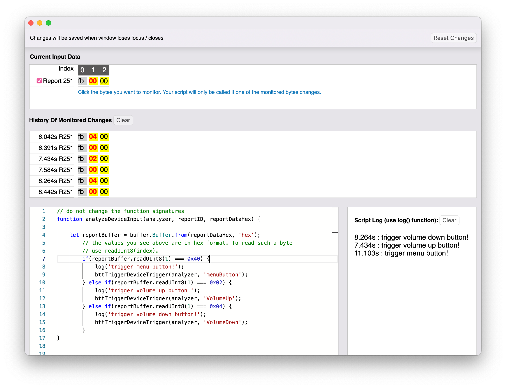
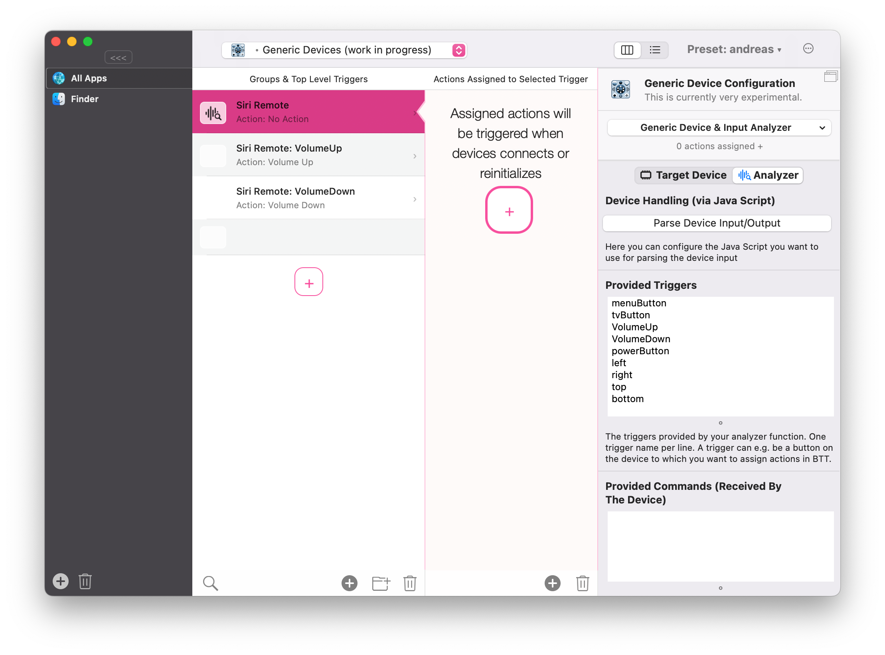

# Generic Device Support

Many input devices produce relatively simple output, however, they can be difficult to use without proper software support. To make it possible to use almost any input device with BetterTouchTool, I have begun working on "Generic Device Support." The concept is straightforward. BTT connects to a device and provides you with raw input data. You write a small JavaScript function that interprets the input data and activates triggers in BTT.

This is a work in progress and there is not much documentation available yet. In this example video I'm using the Siri Remote as an example and show how to make BetterTouchTool recognize its buttons:

<iframe src="https://player.vimeo.com/video/793341135?h=710e90bccc&amp;badge=0&amp;autopause=0&amp;player_id=0&amp;app_id=58479" frameborder="0" allow="autoplay; fullscreen; picture-in-picture" allowfullscreen style="position:absolute;top:0;left:0;width:100%;height:100%;" title="Generic Device Support: Siri Remote example"></iframe>

  
  
  
  

