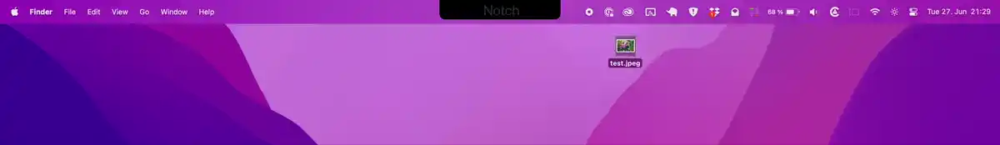

# Floating Menus / Widgets 

Floating menus / widgets are one of the coolest features I have ever added to BetterTouchTool. They have been an idea I have been thinking / working on for quite a while. My first experiments have been based on webviews, which unfortunately came with some disadvantages so I moved away from that approach again. Now since macOS 13 SwiftUI has become pretty powerful and I was able to implement the floating menus using that technology.

Use https://community.folivora.ai/c/floatingmenus/18 for any Floating Menu related questions

<iframe src="https://player.vimeo.com/video/874335209?badge=0&amp;autopause=0&amp;quality_selector=1&amp;&texttrack=en;progress_bar=1&amp;player_id=0&amp;app_id=58479" frameborder="0" allow="autoplay; fullscreen; picture-in-picture" style="position:absolute;top:0;left:0;width:100%;height:100%;" title="Untitled"></iframe>

Features:
* Completely customizable menus
* Dynamically positioned by attaching to windows, screen positions, mouse position and many more
* Resize on hover
* Fix to your desktop, float on top, or behave like normal windows.
* Capable of running scripts & completely scriptable
* Different types of menu items (standard, webviews, sliders, text fields, submenus)
* Keyboard Navigatable
 
Things I'm still working on, coming soon:

* Rendering the floating menus on your iPhone/iPad via an upcoming new version of BTT Remote
* Various Widgets (e.g Weather, Dock, Clipboard)
* Plugin system to allow arbitrary SwiftUI views to be added
* Documentation

The floating menus will also be the base for the new BTT Remote for iOS. (So you can show them on your iPad/iPhone and control your Mac). In the future the existing Notch Bar and the Stream Deck implementation in BTT will also migrate to be specialized versions of Floating Menus.

Some examples:

A circular menu that shows up on three finger swipe up or long pressing right-mouse.

Tutorial here: https://community.folivora.ai/t/tutorial-circular-floating-menu-that-can-be-shown-by-long-right-click-or-gesture/39847

A menu that pops up when hovering the Notch and allows you to drop image files to convert them to png:
https://share.folivora.ai/sP/5cd6c1c8-6ea0-44e7-8e2e-9d114884cee5

A menu that expands on hover and is attached to the focused window.
 https://share.folivora.ai/sP/99bcf777-fa14-470c-8c57-e2a520557106

A simple browser implemented as a floating menus:
https://share.folivora.ai/sP/f2b8dd5d-6c4e-4c18-913b-109349f44450

Using three finger swipe to show a menu at the mouse cursor position, then hide automatically when releasing the fingers from the trackpad:
https://share.folivora.ai/sP/82bddaab-c0eb-406a-9bb0-37bf10495998

Basic scripting and a submenu:
https://share.folivora.ai/sP/9be891ab-c2d6-489e-9b46-15725e26c23d

A Google Translate Menu which is placed on the Desktop:
https://share.folivora.ai/sP/6d4d596e-0208-4c42-aedd-f479188b588b

