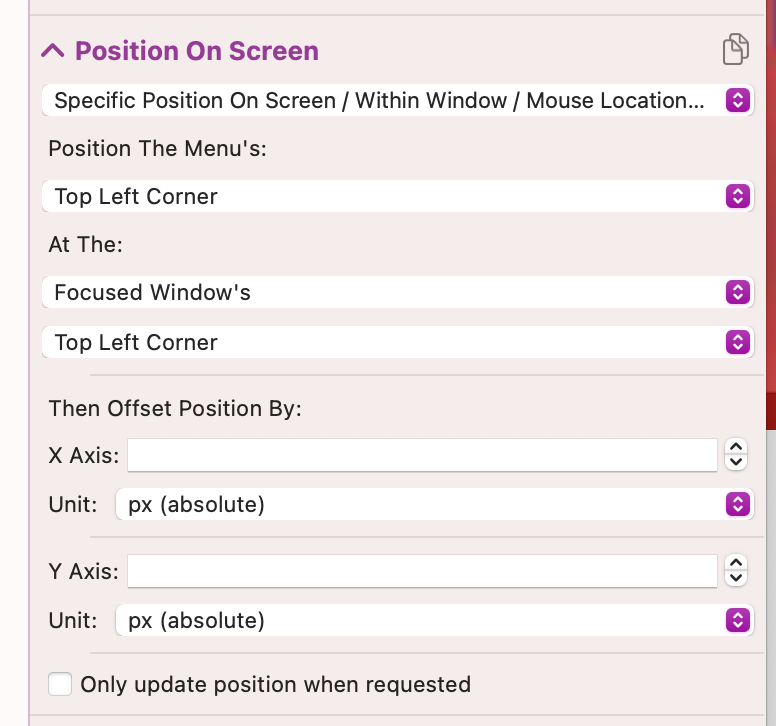

# Floating Menu Basics (Work In Progress)

This section covers:
* Sizing
* Layout Direction
* Menu Positioning

## Global & App Specific Menus
You can have global or app specific Floating Menus. If you add a Floating Menu to the global section and another menu with the same identifer/name to a specific application, they will be merged once that app is active.

## Sizing

First you should decide how big your menu should be when displayed. This can be done in the "Size & Resize On Hover" section:

You can either choose to have a fixed size that never changes, or you can make the menu resize when being hovered by checking the **Resize On Hover** option. 
For example you can have a mini menu which expands to a big one when hovered. You can also define for every menu item whether it shall be displayed in hovered and/or un-hovered mode.

## Layout Direction

After you have decided what size the menu should be, you can choose a layout direction. 

It's easiest to explain the two options (vertical & horizontal) via two quick animations:

**Fill Column, Then Continue With Next Column** 
In this mode BTT will try to fit as many items in a column as allowed by the height of the menu. It will then continue with the next column to the right. Currently it will only work with each item's maximum height and will not try to shrink items to their minimum height unless the menu becomes too small to fit a single item. Shrinking might become an option in the future.

**Fill Row, Then Continue With Next Row**
In this mode BTT will try to fit as many items into a row as allowed by the width of the menu, it will then continue with the next row downwards.
Currently it will only work with the item's maximum width  and will not try to shrink items unless the menu width goes to small to fit the item at all. Shrinking might become an option in the future.

**Circular**
Items will be placed in a circle around the center of the menu

**Absolute**
Items will be placed based on the xy coordinates you set

## Positioning

On the top level you can choose between two positioning options: 
* **Move & Resize Freely:** This is the easiest option. It allows you to drag the menu to a specific position and it will stay there. It won't move even if you connect or disconnect displays - this means if you had it moved to an external display and disconnect that display, the menu might not be visible anymore. (You can use the Predefined Action **Move Free Moving Window To Current Screen** to make it visible again)

* **Specific Position On Screen / Within Window / Mouse Location etc.**: This allows you to position the window in pretty customizable ways. You can choose an anchor point in the menu and and anchor point at some reference, for example the focused window, a specific screen, the mouse location etc.
BTT will then move the menu's anchor point to the selected anchor point in the reference frame - and offset it by the values you provide.
  

## Z-Index / Window Level

You can also choose the z-index at which the window will be positioned, for example you can stick it to the desktop or you can make it float above everything else.