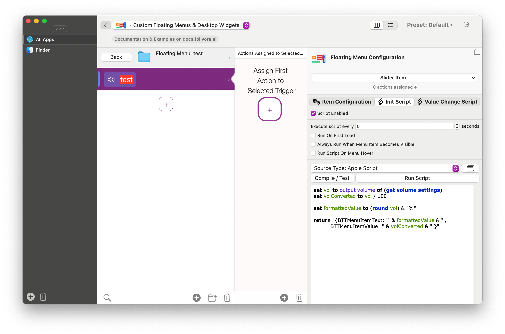
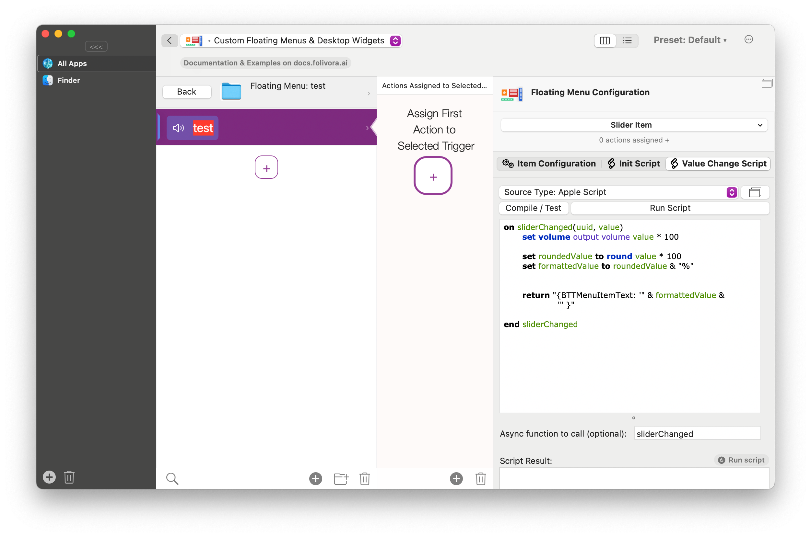

# Floating Menu Items

A Floating Menu can contain various types of items. In the future it will also allow to load external SwiftUI plugin items.
Every item by default has a unique identifier (UUID), which you can access by right-clicking the item. That identifier is needed for some item related actions. You can also enter a custom identifier/name:


### Standard Item
Standard items render text and icons / images. They are scriptable and probably the most useful menu items.
You can drop files onto a standard item, these dropped files can then be accessed by reading the value of the item (see bottom).

### Web View Items
Web View items can load arbitrary HTML content, either by URL or by providing the HTML input directly. They are based on BTT's Floating Webview and because of this are quite powerful. They can run Apple Script, Shell Script, Shortcuts etc.

For documentation on this, see [Floating HTML / Web Views](10_0_floating_html_menu.md)

You can modify the content of a web view item by loading a new URL and/or executing Java Script inside of the web view like this:

### Loading Content Into A Web View Item or Executing Java Script

Java Script Example: Load https://apple.com:
```JavaScript
(async ()=> {
   await webview_menu_item_load_html_url_js(
      {
         "item_uuid": "4FAAE4F8-5858-4444-A0E4-3498B7534CF2", 
         "html_or_url": "https://apple.com"
      }
   )
   returnToBTT('done');
})()
```

**Apple Script Example: Load https://apple.com**

```AppleScript
tell application "BetterTouchTool"
	# instead of the uuid you can also use the item_name and menu_name parameters.
	webview_menu_item_load_html_url_js "9E2989CF-77C7-4F14-A646-49342D2F8331" html_or_url "https://apple.com"
end tell
```

**Java Script Example: Show Alert**:
```JavaScript
(async ()=> {
   await webview_menu_item_load_html_url_js( 
      {
         "menu_name": "TheMenuName", 
         "item_name": "TheItem", 
         "javascript_to_execute": "alert('hello world');"
      }
   )
   returnToBTT('done');
})()
```

**Apple Script Example: Show Alert**

```AppleScript
tell application "BetterTouchTool"
	# instead of the uuid you can also use the item_name and menu_name parameters.
	webview_menu_item_load_html_url_js "9E2989CF-77C7-4F14-A646-49342D2F8331" javascript_to_execute "alert('hello world')"
end tell
```

### Slider Items
They display a scriptable slider. They have two associated scripts: one for retrieving the current/initial value and one that is called when dragging the slider.

Here is an example preset that contains such a slider: https://share.folivora.ai/sP/80d02742-50ec-45a3-833f-5b9ee8144e72

The initialization script should return a value between 0 and 1 and the label that shall be display right of the slider. This needs to be done in JSON/JSON5 like in this example:
```AppleScript
return "{BTTMenuItemText: '50%', BTTMenuItemValue: 0.5}"
```




The change script needs to look like this, it can should return the formatted label (if any):
```AppleScript
on sliderChanged(uuid, value)
	set volume output volume value * 100
	set roundedValue to round value * 100
	set formattedValue to roundedValue & "%"
	return "{BTTMenuItemText: '" & formattedValue & "' }"
	
end sliderChanged
```



### Textfield Items 
Allow to enter some text. The text can be accessed via the Floating Menu scripting interfaces. See [Scripting Floating Menus](1603_scripting_floating_menus.md)

### Widgets
Upcoming...
