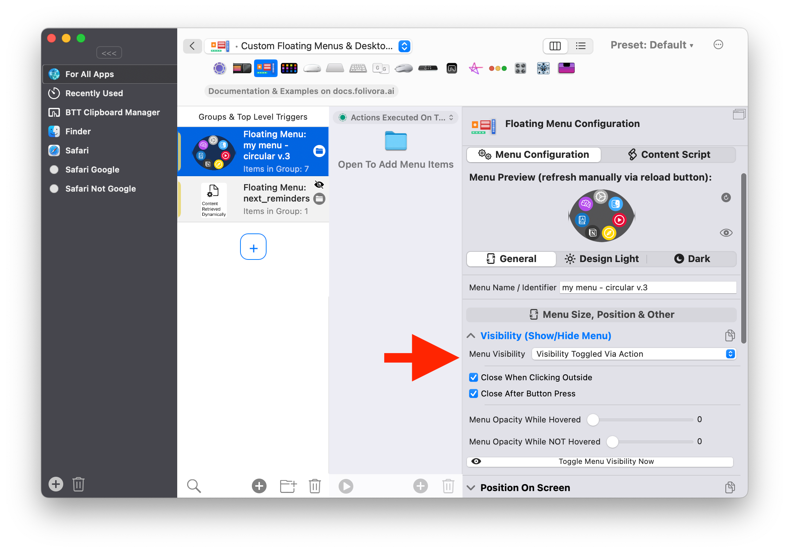
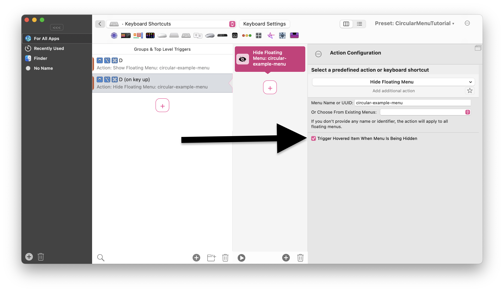
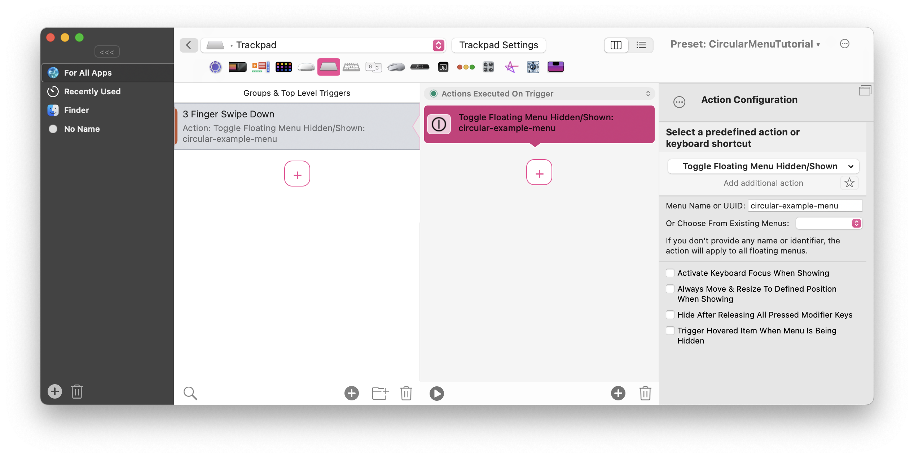
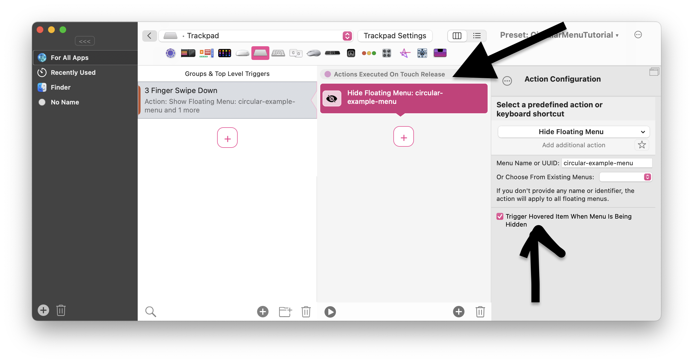
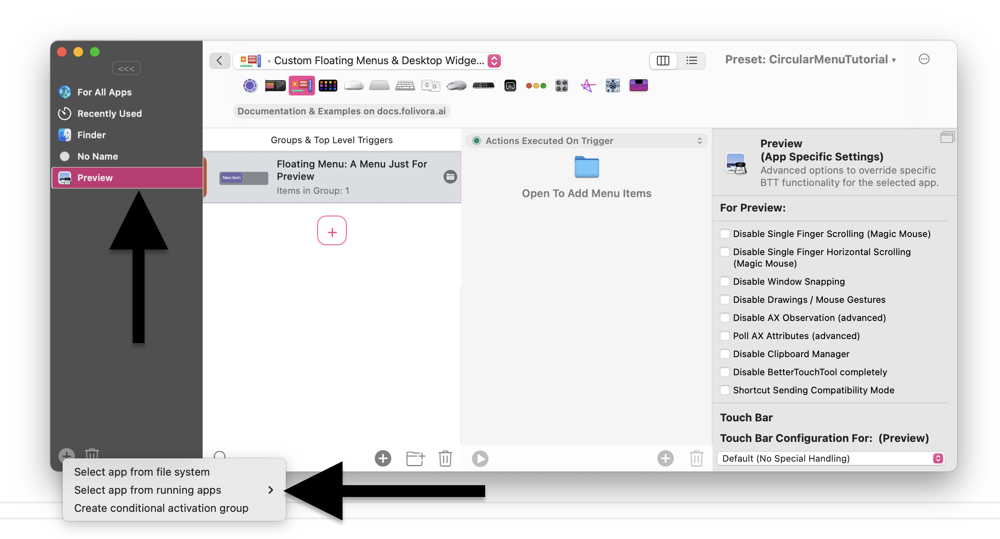

- [Showing and Hiding Floating Menus](#showing-and-hiding-floating-menus)
  - [Positioning](#positioning)
  - [Choosing Whether A Floating Menu Is Visible On Launch Or Toggle By Action](#choosing-whether-a-floating-menu-is-visible-on-launch-or-toggle-by-action)
  - [Using a Keyboard Shortcut to Show/Hide the Floating Menu](#using-a-keyboard-shortcut-to-showhide-the-floating-menu)
  - [Using a Trackpad Gesture to Show/Hide the Floating Menu](#using-a-trackpad-gesture-to-showhide-the-floating-menu)
  - [Showing a Floating Menu in Specific Apps Only](#showing-a-floating-menu-in-specific-apps-only)
  - [Showing a Floating Menu While Holding Modifier Keys](#showing-a-floating-menu-while-holding-modifier-keys)

# Showing and Hiding Floating Menus

To make Floating Menus actually useful it's often necessary to only show and position them on demand. In general you can use any trigger BTT provides to show/hide a Floating Menu.
The following actions can be used for this:

* Show Floating Menu
* Hide Floating Menu
* Toggle Floating Menu Hidden / Shown.

Additionally you could also use modifier based visibility that would only show a menu while specific modifiers are pressed (or not pressed) or you can have Floating Menus that only show up in specific applications.

## Positioning
Before thinking about how you'd want to show your menu, you should decide where it should be positioned. This needs to be configured on the menu before showing it.
For example often you'll want to show a menu at your mouse location, these settings would achieve that:

## Choosing Whether A Floating Menu Is Visible On Launch Or Toggle By Action

If you plan to show/hide the menu via a a trigger (e.g. a keyboard shortcut) make sure to set the menu visibility to be "Toggled Via Action"

## Using a Keyboard Shortcut to Show/Hide the Floating Menu

Using a keyboard shortcut is probably the easiest way to show/hide a floating menu.
The absolute simplest setup would look like this - you have a shortcut that shows the menu when pressed, and hides it again if you press it again:

There are also more complex / useful setups possible using keyboard shortcuts. For example you might want to show a menu while holding a specific keyboard shortcut and hide it when releasing the keyboard shortcut.
To achieve this you'd need to split up the keyboard shortcut in two.

Assign the "Show Floating Menu" action to the standard shortcut. Then create an additional shortcut an set it to trigger "On Key Up" and assign the "Hide Floating Menu" action to that.

For the "Hide Floating Menu" action it is often also convenient to enable the "Trigger Hovered Item When Menu Is Being Hidden" option.

## Using a Trackpad Gesture to Show/Hide the Floating Menu

Using a Trackpad Gesture to Show/Hide a Floating Menu is quite similar to using a keyboard shortcut.

You can set up a simple gesture that shows and hides a menu like this:

Or you can do a more complex setup where you'd show a Floating Menu when the gesture is triggered and hides the menu when all fingers are removed from the trackpad. This can be achieved by using the "On Touch Release" action trigger category:

## Showing a Floating Menu in Specific Apps Only

To show a menu only in one specific application, you'd add that app to your app list in BTT, and add the menu to that app specifically:

To make a menu show up in a group of apps or for specific windows or on specific websites, you can create a [conditional activation group](1400_conditions.md) and assign it to that

## Showing a Floating Menu While Holding Modifier Keys

To only show a menu if specific modifier keys are pressed, use this configuration option in the menu's settings:
