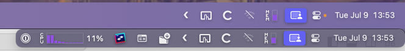
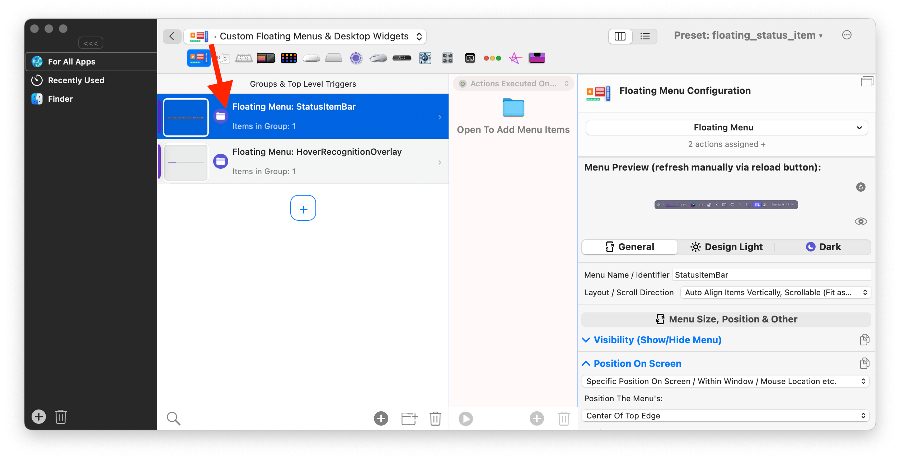
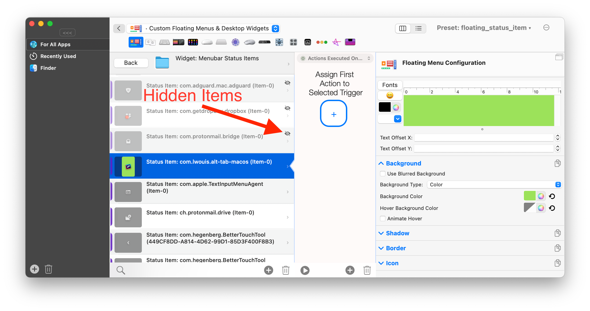
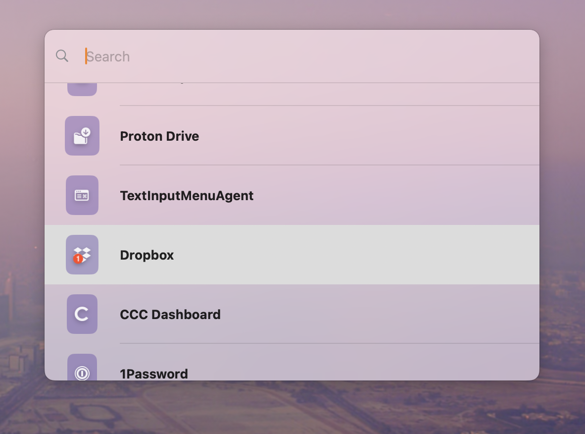

# Manage Menubar Status Items using BTT.

Starting with BetterTouchTool 4.615 you can manage your menubar's status items via BTT. 

**Note** This feature is **work in progress**. Please post feature requests, bug reports or questions on [https://community.folivora.ai](https://community.folivora.ai)

The main discussion for this feature is happening here:
https://community.folivora.ai/t/bartender-controversy-tutorial-on-how-to-manage-menubar-status-items-via-btt/37429

There are three base features that make this possible:
* The predefined action "Move Menu Bar Status Item To New Position"
* The predefined action "Hide Menu Bar Icons Left Of Specific Icon"
* A "Menubar Status Item" Widget that can be placed in a [Floating Menu](1600_floating_menus.md)
* The predefined action "Search Menu Bar Status Items"

Here is **a ready to use preset** that shows how these features work toghether:
[Example Preset Download](https://share.folivora.ai/sP/c6dcbba0-25ee-4c1f-ad5b-832b1579a738)

<iframe src="https://player.vimeo.com/video/984146357?h=8f12863c83&amp;badge=0&amp;autopause=0&amp;player_id=0&amp;app_id=58479" frameborder="0" allow="autoplay; fullscreen; picture-in-picture; clipboard-write" style="position:absolute;top:0;left:0;width:100%;height:100%;" title="Managing Menubar Items via BTT"></iframe>

## Configuring the Status Item Bar
By default this preset shows a floating bar with all of your menubar status items when you move your mouse to the top right edge of your screen. This bar is configured in the "Custom Floating Menus" section in BTT:

You can change the appearance of the whole bar or of individual items. You can also hide items from the bar (press cmd+d to hide the selected item)

## Configuring Which Status Items To Hide From The BTT bar

Hiding items you don't want to have constantly visible is done via the predefined action "Hide Menu Bar Icons Left Of Specific Icon". This action can be assigned to any trigger in BTT, for example you could assign it to a keyboard shortcut.

The preset shared above assigns this action to a [custom menubar status item](1008_custom_statusbar_items.md) and configures the action to hide any item left of that item itself. 
Once you import the preset an item with this symbol will appear in your menubar: ❮
When clicking this item, it will hide any item that is positioned left of it.

Of course you can cmd+drag this item to the position you want and thereby influence which items in your menubar will be hidden.

## Configuring Which Status Items To Hide From The Real Menu Bar

You can drag items above the "always hidden" section in the BTT UI, then they will always be hidden from the main menubar. (watch the short video above)

## Quick Access For Menu Bar Status Items Via Predefined Action "Search Menu Bar Status Items"

