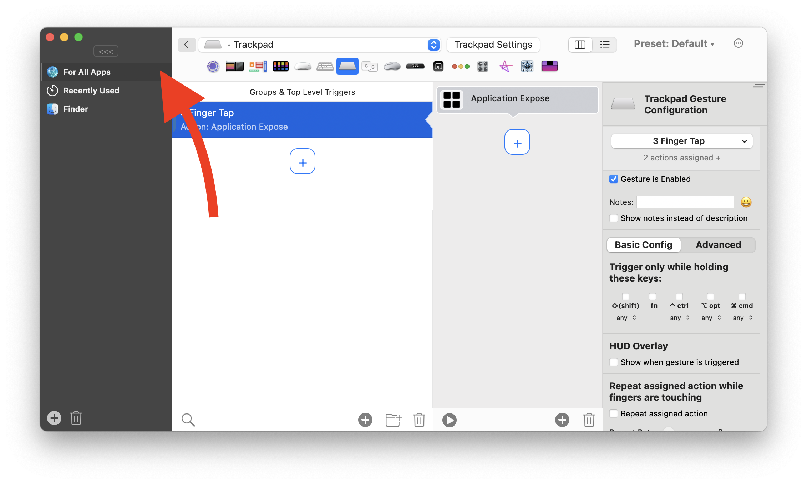
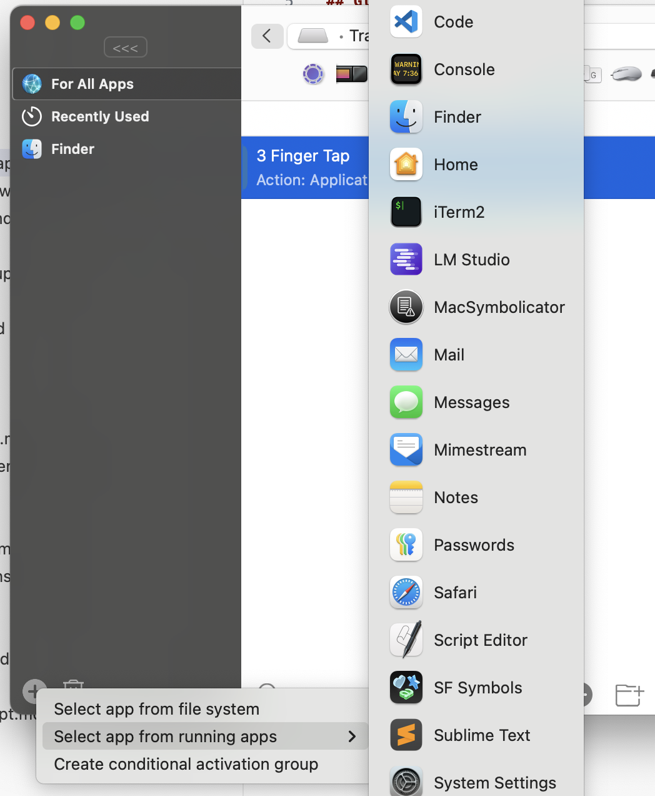
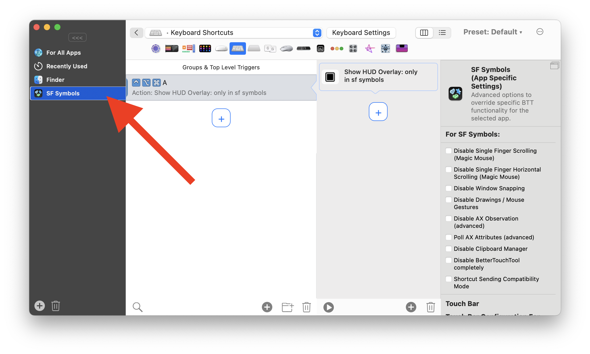
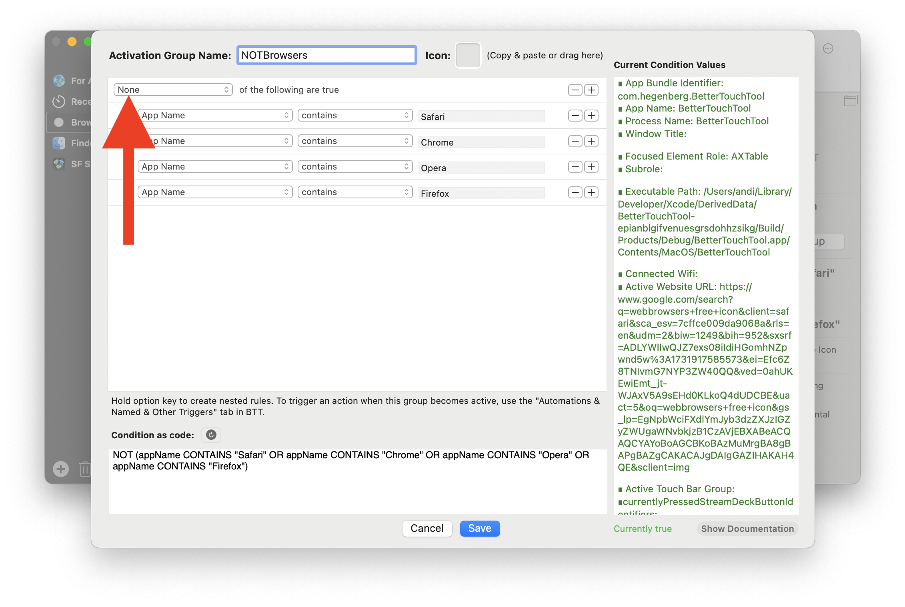

# Global and App-Specific Triggers

In BetterTouchTool, you can configure either **global triggers** that work across all apps or **app-specific triggers** that are active only when a specific app is in focus.

- [Global and App-Specific Triggers](#global-and-app-specific-triggers)
  - [Global Triggers](#global-triggers)
  - [App-Specific Triggers](#app-specific-triggers)
  - [Specify Triggers for Groups of Apps](#specify-triggers-for-groups-of-apps)
  - [Exclude Global Triggers from Specific Apps](#exclude-global-triggers-from-specific-apps)
- [Special Cases (Work in Progress)](#special-cases-work-in-progress)
  - [Floating Menus and Merging](#floating-menus-and-merging)
  - [Stream Deck](#stream-deck)
  - [Touch Bar](#touch-bar)

## Global Triggers

To create a trigger that works in all apps:

1. Select **"All Apps"** from the sidebar.
2. Add the desired trigger.

## App-Specific Triggers

To create a trigger for a specific app:

1. Click the **+** button at the bottom left of the BetterTouchTool preferences window.
2. Choose an app from your running applications or your file system.

3. Select the added app in the sidebar and configure your trigger.

## Specify Triggers for Groups of Apps

Sometimes, you may want to assign triggers to a group of apps (e.g., all browsers). To do this, use **Conditional Activation Groups**:

1. Click the **+** button at the bottom left of the preferences window and select **"Create Conditional Activation Group."**
2. Define a condition that applies to multiple apps.

3. Assign your trigger to the conditional activation group.

Conditional activation groups can also be used to create exclusions. For instance, the following condition excludes specified browsers but enables the assigned triggers to all other apps:

## Exclude Global Triggers from Specific Apps

To exclude some global triggers for specific apps, you have several options:

1. **Disable the global trigger for the app**:
   - If a trigger is disabled for a specific app, the app will fall back to its default behavior for that trigger.

2. **Assign the action "Use Apple Default or Do Nothing"**:
   - Same as disabling a trigger, the app will fall back to its default behavior for that trigger.

3. **Use Conditional Activation Groups**:
   - Define conditions to specify where the trigger should be active. See the [previous section](#triggers-for-groups-of-apps) for details.

---

# Special Cases (Work in Progress)

## Floating Menus and Merging

If you define an app-specific floating menu, it will appear only in that app. However, if you configure a floating menu with the **same identifier** in the "All Apps" section, BetterTouchTool will merge these menus.

This functionality allows you to dynamically adjust menus based on the active app or the active [Conditional Activation Group](1400_conditions.md).

To control the order of merged menu items, use the **"Display Order"** property:

## Stream Deck

## Touch Bar
