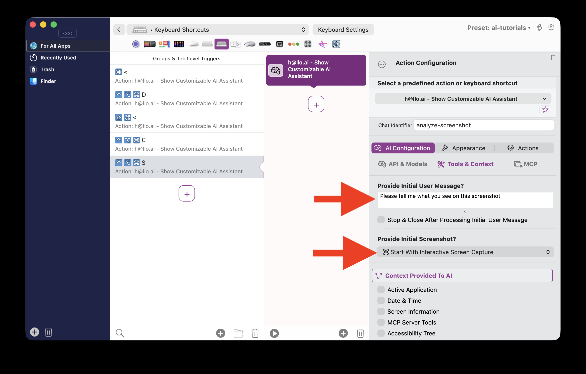

# Providing an initial Screenshot or Message 

BTT's AI assistants allow you to configure initial screenshots or messages that are added automatically once the assistant is triggered.

For example you could make an assistant that lets you capture a screenshot when triggered and then automatically make the assistant do something with the captured screenshot.

This example will start interactive screen capture if you press ctrl+opt+cmd+S, then it will directly ask the AI Assistant "Please tell me what you see on this screenshot".

Here you can see what happens when I press ctrl+opt+cmd+S, it first allows the macOS interactive screenshot capture, then automatically posts the captured screenshot and defined user message to the AI Assistant:
<video controls src="media/3003_providing_initial_screenshot_or_message2025-09-15T21:10:08.776Z.mov" width="540" title="Title"></video>