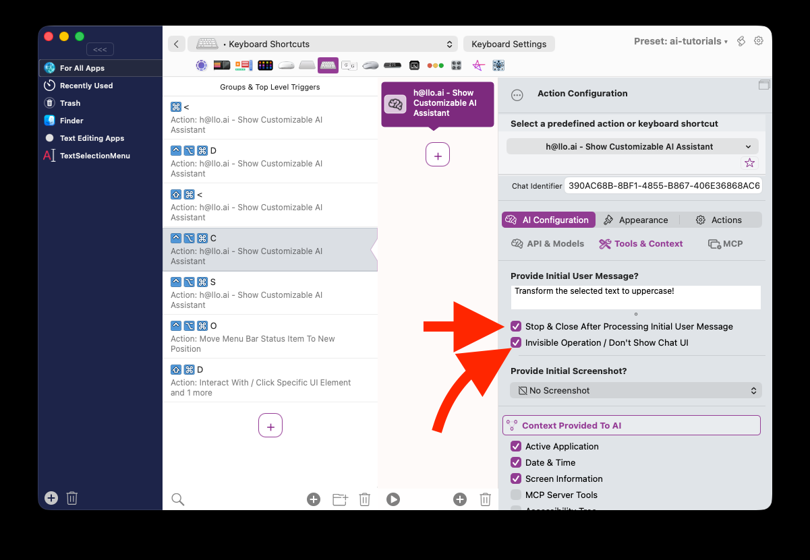

# Usage Without Showing UI

There are situations where you might want an AI assistant do a task without showing any UI. In BetterTouchTool's AI assistants you can do that by providing your task description in the initial user message text area in AI Configuration => Tools & Context and by additionally activating these options:

* Stop & Close After Processing Initial User Message
* Invisible Operation / Don't Show UI

 