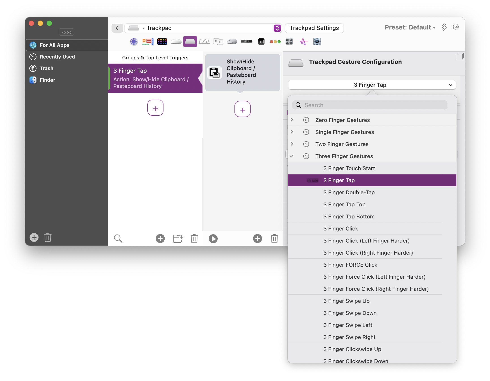
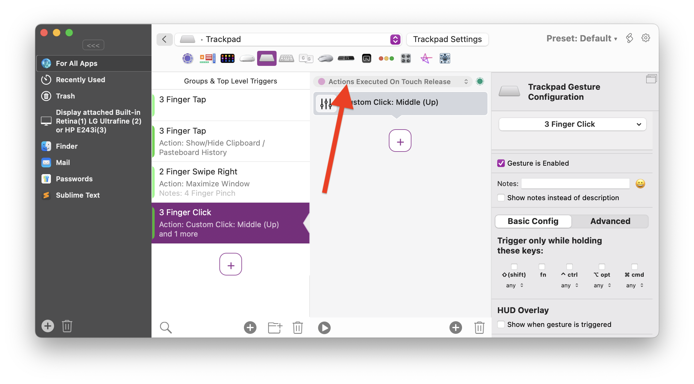

# Magic Mouse & Trackpad Gestures

BetterTouchTool currently supports the following touch devices:
* Magic Mouse 1, 2 & 3
* Magic Trackpad 1, 2 & 3
* All multi-touch capable built-in Macbook Trackpads

You can configure many additional gestures for these devices.

In general the setup is pretty straight forward:
1. Select the Magic Mouse or Trackpad section
2. Click the "Add" button.
3. Select the Gesture you want
4. Assign at least one action or keyboard shortcut to that gesture. (If you assign multiple actions they will be executed in sequence)

## Gesture Configuration
There are some basic settings for every gesture:
* Trigger only if specific modifier keys are pressed
* Show a HUD overlay once the gesture is triggered / recognized
* Activate action repeat while at least one finger is still touching after the gesture has been triggered. This doesn't work with all gestures, because e.g. for Three Finger Taps you won't have any fingers touching the trackpad after the gesture has been triggered.

However it can be used e.g. for all click, tip tap and swipe gestures.

  

Additionally there are some advanced options:

* **Trigger conditions**
  * You can select to to trigger only if the mouse cursor is at some specific position
    1. Anywhere
    2. While mouse hovers draggable part of window's titlebar
    3. While mouse hovers anything in window's titlebar
    4. While mouse over Dock
    5. While mouse over menubar
    6. While mouse is NOT over Dock or menubar
    7. While mouse behind Notch
    8. While mouse NOT behind Notch
* **Advanced Trigger Conditions**
  * You can define advanced trigger conditions that allow you to define lots of conditions on when a gesture is allowed to trigger. See  for more details.
  

For example you can make the gesture trigger only on specific trackpad types, you can define a haptic feedback or make a HUD (similar to the macOS volume or brightness change indicators) show up when the gesture is triggered.

## Triggering a second action after removing the last touching finger

Many gestures can be configured to trigger another action once you remove the last finger from the trackpad or Magic Mouse.

This is very useful if you want to set up e.g. a middle click for CAD apps. You could use a three finger click to trigger a "Middle Mouse Down" and then a "Middle Mouse Up" after the last finger has left the trackpad / Magic Mouse surface. This allows you to three finger click, then release two fingers and move the mouse to pan with the remaining finger.
You can use the predefined action "More Mouse Buttons & Modifiers / Custom Click" to send separate down/up clicks.

To do this you need to select the "**On Touch Release**" action category (this only shows up for supported gestures)

