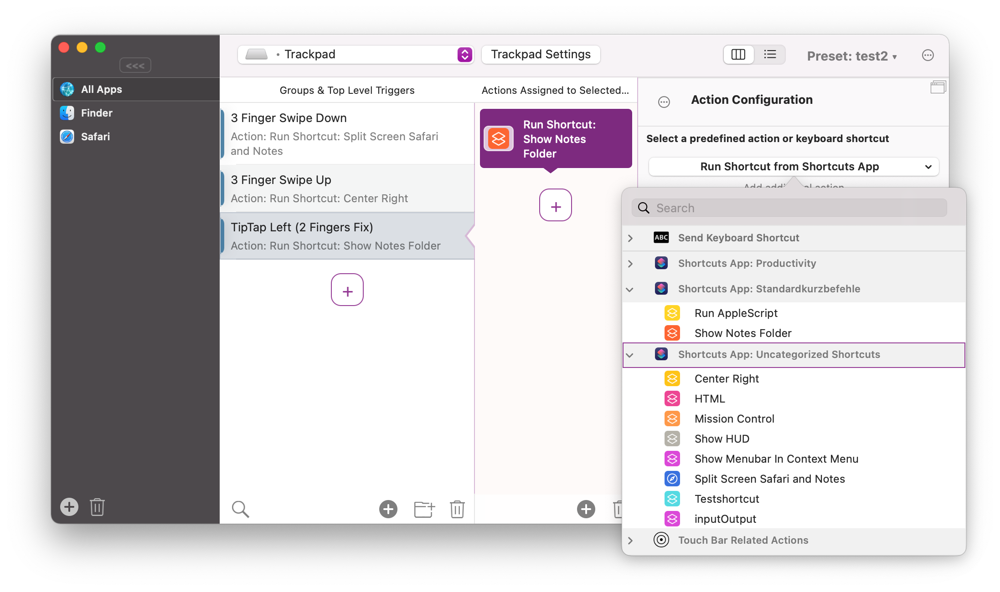
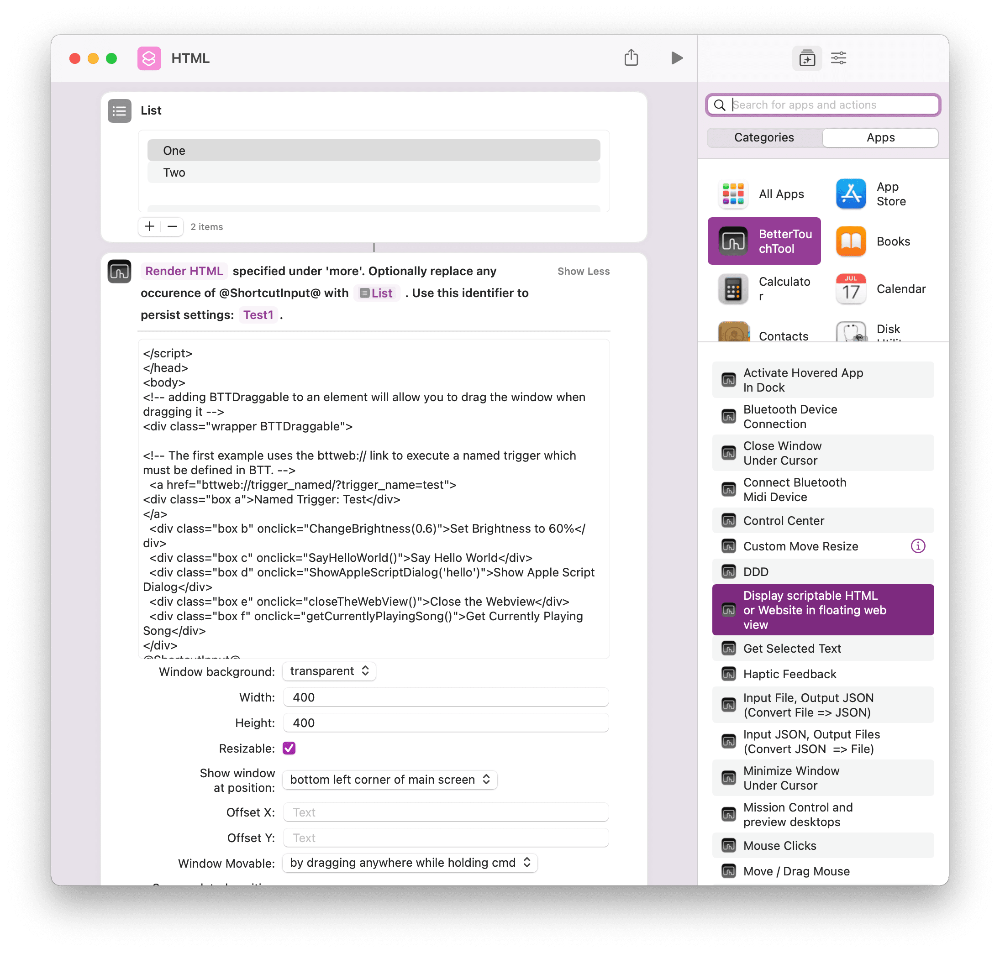

# Shortcuts Integration

On macOS Monterey, BetterTouchTool deeply integrates with the new Shortcuts app. For sharing Shortcuts and discussing this functionality, please have a look at the forum: https://community.folivora.ai/c/shortcuts/18

Any Trigger in BetterTouchTool can be used to run Shortcuts. All your Shortcuts are listed in the standard action list of BetterTouchTool:

On the other hand BetterTouchTool also exposes many of its actions directly in the Shortcuts app, so you can build powerful workflows:

