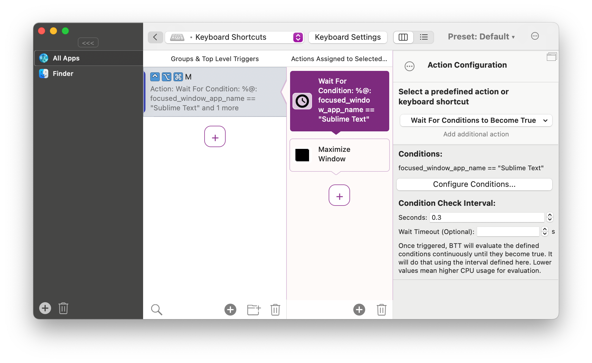
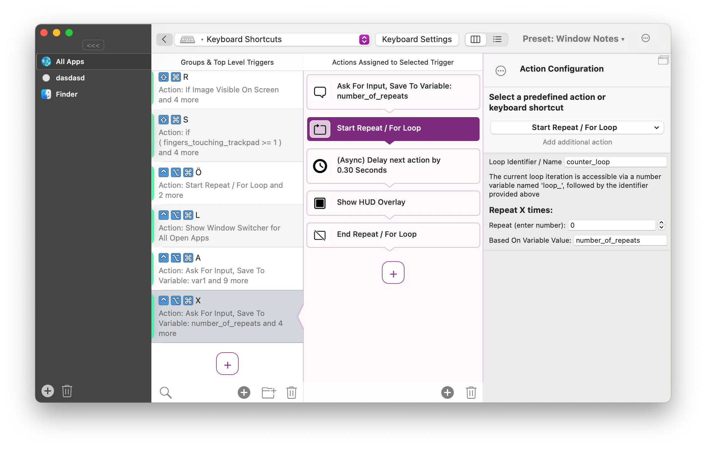
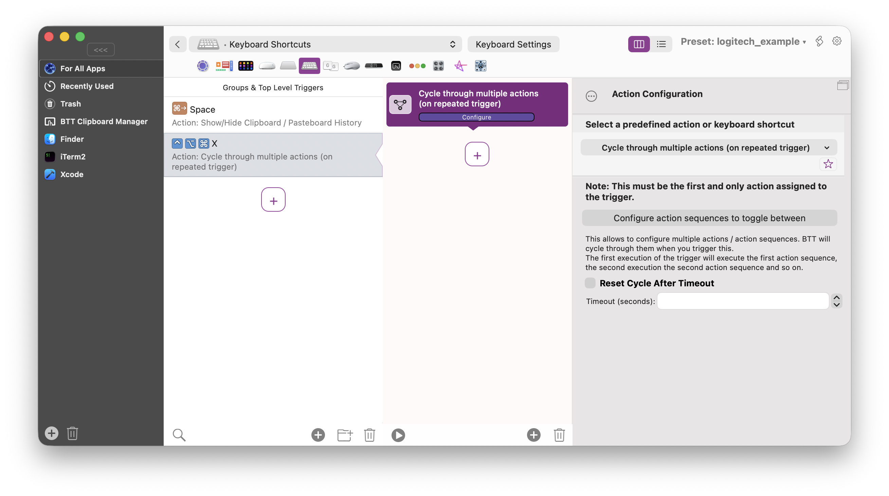
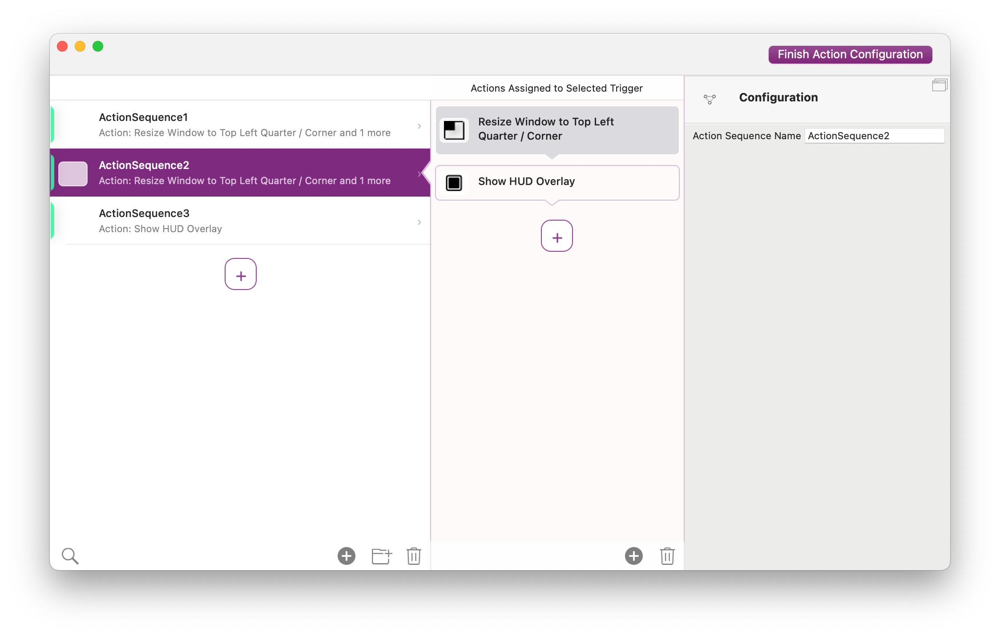
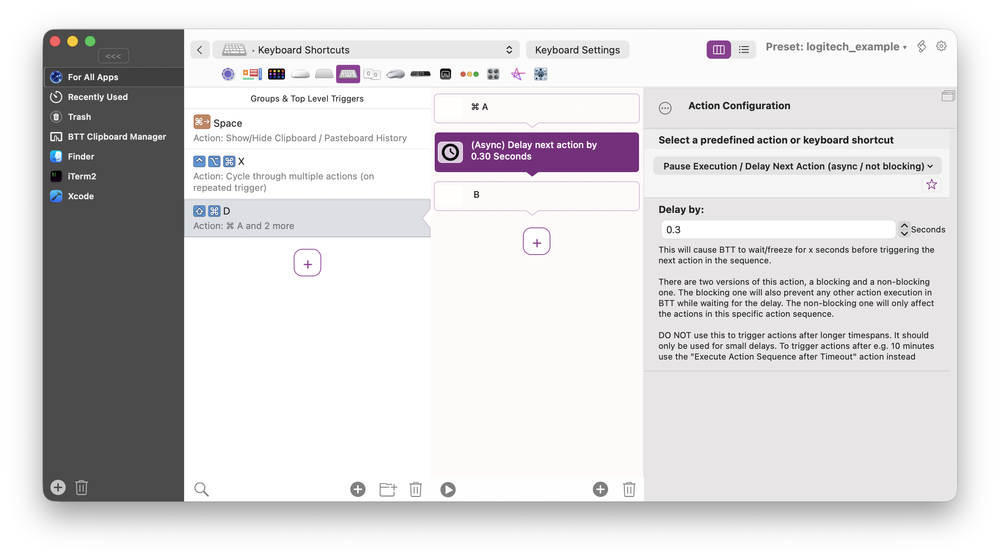
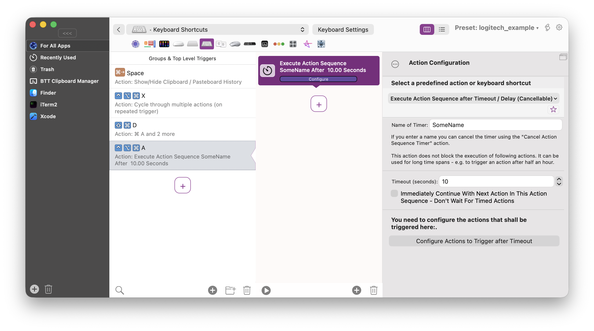
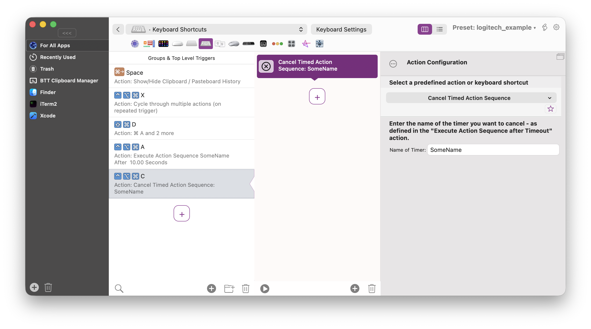

# Control Flow Actions

BetterTouchTool offers various control flow actions

- [Control Flow Actions](#control-flow-actions)
  - [If Conditions](#if-conditions)
  - [Wait For Condition To Become True](#wait-for-condition-to-become-true)
  - [Loops](#loops)
  - [Cycle Through Mutliple Actions](#cycle-through-mutliple-actions)
  - [Delays](#delays)
    - [Async / Non-Blocking Delay](#async--non-blocking-delay)
    - [Blocking Delay](#blocking-delay)
    - [Execute Action Sequence After Delay](#execute-action-sequence-after-delay)

## If Conditions

If conditions always need at least 4 actions in BTT:
* The condition (which can either be based on variables, or whether a specific image can be found on your screen)
* An action that is executed if the if condition is true
* The "End If Condition"

In case you want to execute different actions when the condition is false you need to add the following before the End If:
* The "Else" branch action
* The actions that shall be executed in case the condition is false

In the screenshot above you see an example that begins by asking the user for input. That input is saved to the variable var1.
This is follwed by an if condition that checks whether the var1 variable is 1 and does execute a "Show HUD" action if thats the case.
This is followed by another if that executes different actions depending on whether the var1 variable is equal to 0 or not.

## Wait For Condition To Become True

This is a helpful action if you want to wait for something before triggering other actions.
For example if you want to create a keyboard shortcut that automatically maximizes a window once the app has fully launched, you could do it like in this screenshot:

## Loops

If you want to repeat the same actions multiple times, use the "Start Repeat / For Loop" action.

The following screenshot contains an example that first asks the user how many times the loop shall repeat, then executes a "Show HUD" action multiple times.

You can access the current counter of a loop (e.g. via scripts) using the variable loop_**loopname** variable, which will automatically be populated.

## Cycle Through Mutliple Actions

Sometimes you might want to use one trigger to execute multiple different actions when it is triggered repeatedly.
For example a keyboard shortcut you press multiple times to cycle through different window positions.
You can achieve this using the "Cycle Through Multiple Actions" action. One such action can contain multiple action sequences that will be triggered step by step, one action sequence per time the trigger is executed.

First you need to assign the "Cycle Through Multiple Actions" meta-action to some trigger:

Then you can configure the different "cycle phases" and assign multiple actions to each phase:

## Delays

There are multiple types of delays you can use in your action sequences. 

### Async / Non-Blocking Delay

This is the most common and most useful type of delay. It makes an action sequence wait for the specified amount of time but does not block other things in BTT.

### Blocking Delay

A blocking delay will freeze the whole BetterTouchTool process for the specified amount of time. This can be useful in some situations but should be used carefully. Usually the async delay is much better.

### Execute Action Sequence After Delay

This is a powerful advanced feature. When executed it starts a named timer with a fixed amount of time. After that time is up, the assigned action sequence will be executed. The powerful thing about this is that the timer can be canceled if it has not executed its actions yet. This can be done with the predefined action "Cancel Timed Action Sequence".

