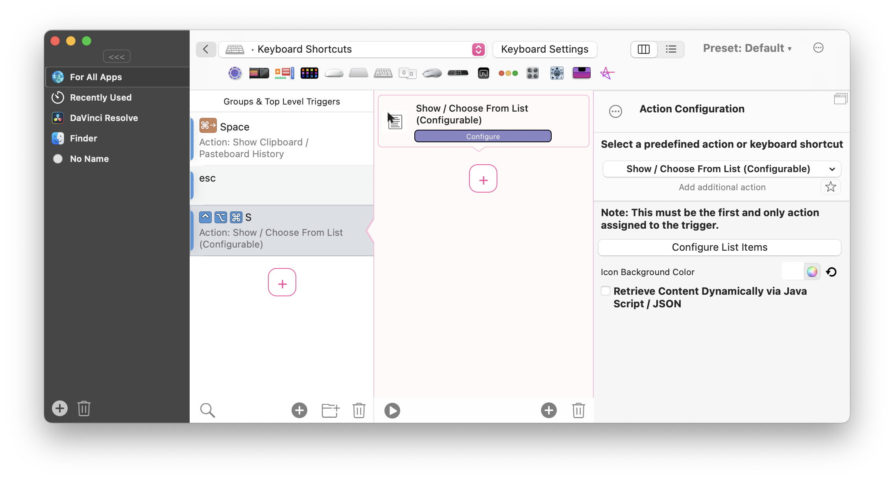
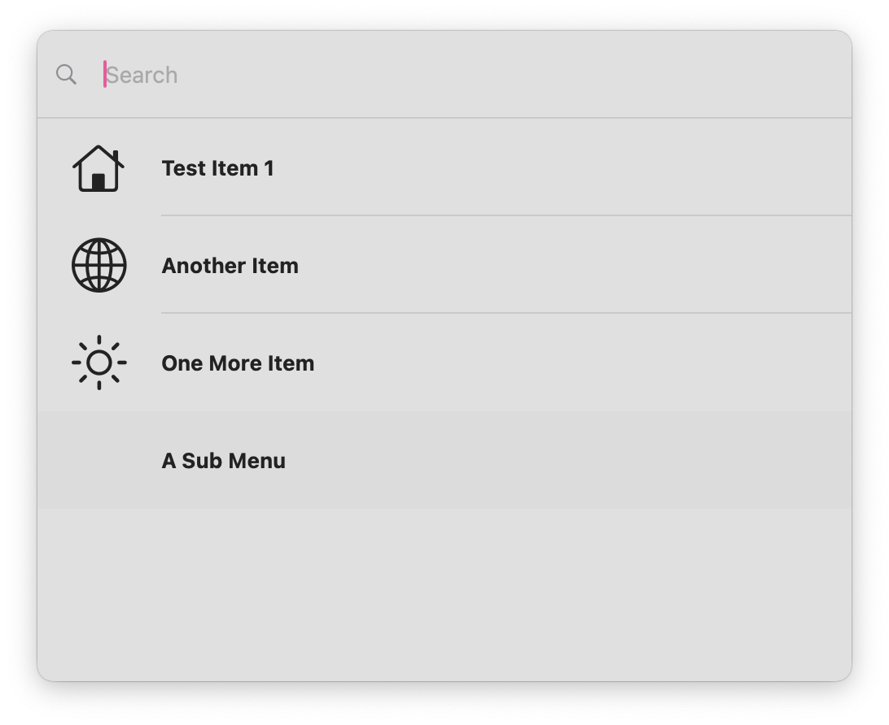

# Choose Action From List / Prompt

You can use the predefined action "Choose From List" to show a Spotlight like interface that allows you to trigger actions you have defined.

You can also let the items be retrieved dynamically via Java Script. See [Define Items via Simple JSON Format](1108_simple_format.md)

