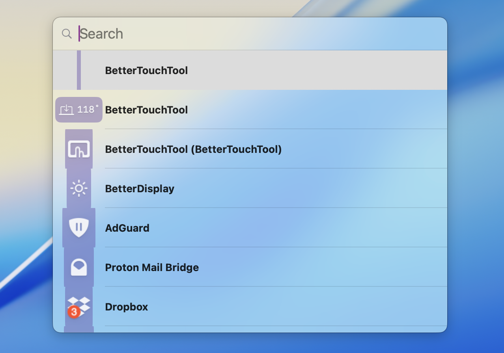

# Managing macOS Menu Bar Status Items

BetterTouchTool has multiple actions and features that allow you to easily make the macOS menubar more clean and accessible.

## Hide Menubar Items You Don't Need

For many users the top right status area of the macOS menubar gets quickly cluttered with many items. This makes it hard to see the really important ones and in some situations macOS even hides the items.

BetterTouchTool allows you to temporarily hide items via these actions:

* Show / Hide Menu Bar Status Icons Left Of Specific Icon
* Hide Menu Bar Status Icons Left Of Specific Icon
* Show Menu Bar Status Icons Left Of Specific Icon

Or to reset any previous hide actions:

* Show / Unhide All Menu Bar Status Icons / Items

### Example of showing / hiding menu bar status items via a keyboard shortcut:

In this example BetterTouchTool is set up to toggle hide/show items left of the wifi icon via a keyboard shortcut. Note: There are some items like the screen recording icon that are prioritized by the system and can not be hidden.

<video width="700" loop autoplay>
  <source src="media/status_items.mov" type="video/mp4">
  Your browser does not support the video tag.
</video>

### Example of showing / hiding menu bar status items via custom menu bar icons:

In this example BetterTouchTool is set up to toggle hide/show items left of the wifi icon via a custom menu bar icons.
Such custom menu bar icons can be configured in the "Automations, Named & Other Triggers" section. You can make them hide/show items left of themselves when being clicked.

<video width="700" loop autoplay>
  <source src="media/status_items_2.mov" type="video/mp4">
  Your browser does not support the video tag.
</video>

### Other Useful Menu Bar Related Actions in BetterTouchTool

**Save / Restore Order:**
* Save Menu Bar Status Item Layout / Ordering
* Restore Saved Menu Bar Status Item Layout / Ordering

**Move & Click Items**
* Move Menu Bar Status Item To New Position
* Click Menu Bar Status Item
  
// **Item Spacing**
// * Change Menu Bar Item Spacing
// 
// **Search**
// * Search Menu Bar Status Items

This allows you to keep your items hidden and still access them by searching for them:

## More Advanced Topics

Using Floating Menus you can do more advanced stuff like e.g. showing a separate bar with your hidden items on demand. However I believe the above actions should cover most use cases already. 

If you want to try the more advanced stuff, have a look here:

https://community.folivora.ai/t/bartender-controversy-tutorial-on-how-to-manage-menubar-status-items-via-btt/37429