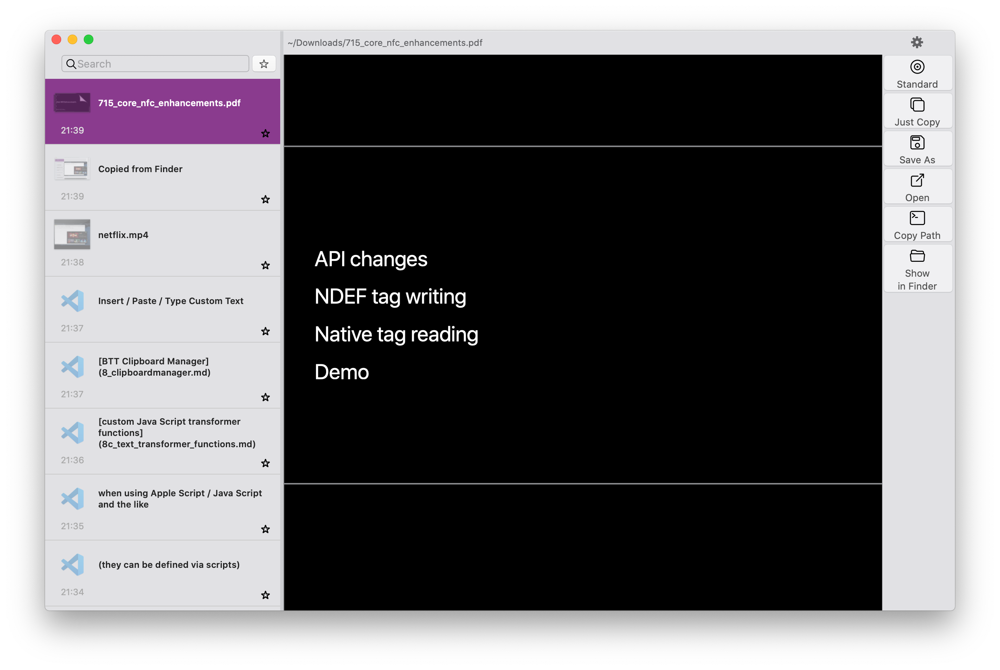

# Clipboard Manager

BetterTouchTool integrates a nice little clipboard manager. You can activate it by assigning the predefined action "Show Clipboard/Pasteboard History" to some trigger in BTT.

## Features:
* Tracks your clipboard history and allows you to access everything you copied
* Can preview all kind of copied files, e.g. pdf, videos, office documents, images etc.
* Can show all the different data types copied to your clipboard and show them in different view modes (e.g. Hex, Raw Text, Rendered...)
* Keep favorite snippets forever
* Search through your clipboard history
* Allows to edit text inside of the clipboard manager
* Allows to **annoate & edit screenshots** and other images
    * This makes for a great screenshot tool if you combine it with the standard macOS "Copy picture of selected area to clipboard", which can be configured in System Preferences => Keyboard => Shortcuts => Screenshots
* Allows to paste / save as file
* Comes with a basic set of text transformation functions (e.g. plain text)
* Since version 3.356 you can define [custom Java Script transformer functions](8c_text_transformer_functions.md)
, this allows you to transform the text before pasting it.
* Only on your computer - no data is synced to any sort of cloud

Here is a video from Dec 21, 2024 showing some of the features:

<iframe src="https://player.vimeo.com/video/1041361249?badge=0&amp;autopause=0&amp;player_id=0&amp;app_id=58479" frameborder="0" allow="autoplay; fullscreen; picture-in-picture; clipboard-write" style="position:absolute;top:0;left:0;width:100%;height:100%;" title="BetterTouchTool Clipboard Manager3"></iframe>

**Preview all sort of copied files**

**Edit images:**

