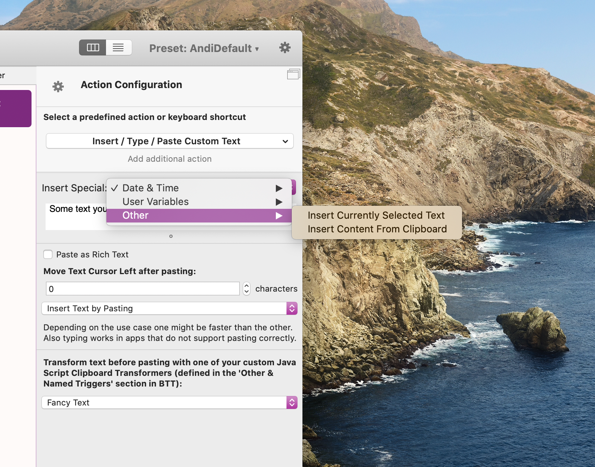

# Insert / Type / Paste Custom Text

This action allows you to paste / type some static text you define. It can also work with some dynamic data and allows to transform text with Java Script Text Transformer functions (starting with BTT 3.356).

You can assign this action to any trigger in BTT, in this example I'm assigning it to a keyboard shortcut:


## Advanced Dynamic Functionality

Instead of just pasting some static text, this action offers various dynamic behaviors.

### Dynamic Placeholders
Using the "Insert Special" dropdown menu, you can choose from a few placeholders that will automatically be replaced when pasting:

**Currently Selected Text or Clipboard Contents**

This allows to include the currently selected text or the clipboard content. This is really powerful when combined with Java Script Text Transformer functions. (See bottom of this page)



<video src="media/inline_text_replacement.mp4" autoplay="" muted="" loop="" style="width:50%">
        Sorry, your browser doesn't support embedded videos, but don't worry, you can
        <a href=""media/inline_text_replacement.mp4">download it</a>
        and watch it with your favorite video player!
    </video>


**Date / Time**

This allows to insert custom date strings into your text. The placeholder that is used for this looks like this:

```(BTT)@dateformat:MM/dd/yy hh:mm:ss a(BTT)``` 

You can use any custom date format you like (see http://www.unicode.org/reports/tr35/tr35-31/tr35-dates.html#Date_Format_Patterns) for more details.


**Variables**

You can access any variables that have been defined in BTT [(they can be defined via scripts)](1105_variables.md)

```(BTT)@variable:theVariableName(BTT)```


## Custom JavaScript Text Transformer Functions

Starting with BTT 3.356 this action allows to transform the text using [custom Java Script transformer functions](8c_text_transformer_functions.md) before pasting it.

