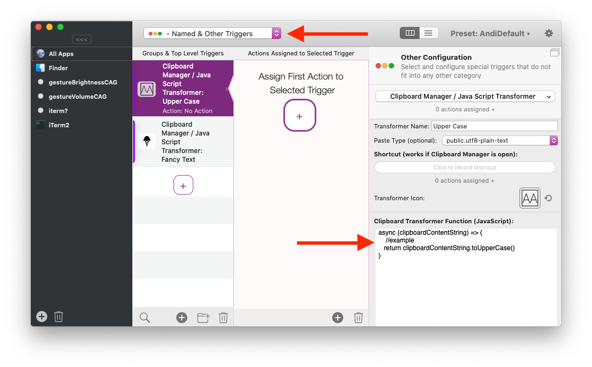

# Java Script Text Transformer functions

Starting with BTT 3.356 you can define custom Java Script functions that can be used to transform text inside of BTT.

## Use Cases
* **[BTT Clipboard Manager](8_clipboardmanager.md):**

 All Java Script Text Transformer functions automatically show up as actions in the BTT Clipboard Manager. This allows to transform copied text before pasting it.


* **In-Place Text Replacement**

Combined with the predefined action **Transform Selected Text With JavaScript** this can be used for replacing selected text with some transformed version:

<video src="media/inline_text_replacement.mp4" autoplay="" muted="" loop="" style="width:50%">
        Sorry, your browser doesn't support embedded videos, but don't worry, you can
        <a href=""media/inline_text_replacement.mp4">download it</a>
        and watch it with your favorite video player!
    </video>

Transformer functions also work with the  **[Insert / Paste / Type Custom Text](8b_paste_type_custom_text.md)** action.

## How to 

To create a new transformer function go to the "Named & Other Triggers" section in BetterTouchTool. Then create a new trigger and select "Clipboard Manager / Java Script Transformer".



There you should enter a name for the transformer. Optionally you can select a pasteboard type (advanced & optional, you usally don't need that for text) and you can also select a keyboard shortcut and icon which will be helpful in the BTT clipboard manager.


## How to define transformer functions

There are three requirements for the transformer functions:
1. The transformer functions always need to be defined as async. 
2. It must take a parameter and that parameter needs to be called clipboardContentString
3. It must return a string

Inside of that function you can use all standard Java Script and additionally the BTT additions to e.g. run shell scripts or apple scripts (see )


**Examples** 

Simple function that converts text to upper case:
```JavaScript
async (clipboardContentString) => {
    //example
   return clipboardContentString.toUpperCase()
}
```

Function that creates 𝕗𝕒𝕟𝕔𝕪 𝕝𝕠𝕠𝕜𝕚𝕟𝕘 text:
```JavaScript
async (clipboardContentString) => {
clipboardContentString= clipboardContentString.replace(/[a-z]/g, (char) => {
    const code = char.charCodeAt() - 97;
    return String.fromCharCode(55349, code + 56658);
  });
return clipboardContentString;
}
```

Function that replaces a selected math equation with its result (stupid example :-):
```JavaScript
async (clipboardContentString) => {
   return eval(clipboardContentString);
}
```

Function that executes a terminal command

```JavaScript
async (clipboardContentString) => {
  let shellScript = `date`;

    let shellScriptWrapper = {
        script: shellScript, // mandatory
        launchPath: '/bin/bash', //optional - default is /bin/bash
        parameters: '-c', // optional - default is -c (please separate additional parameters using ;;)
        environmentVariables: '' //optional e.g. VAR1=/test/;VAR2=/test2/;
    };


    let result = await runShellScript(shellScriptWrapper);
    return result
}
```