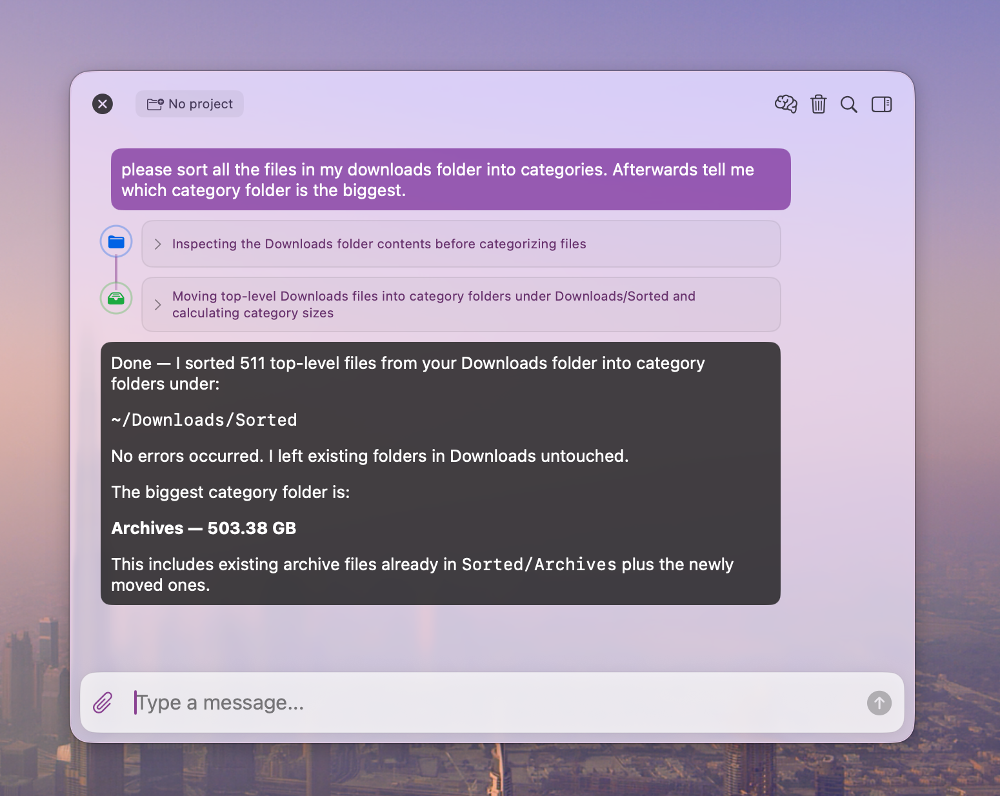
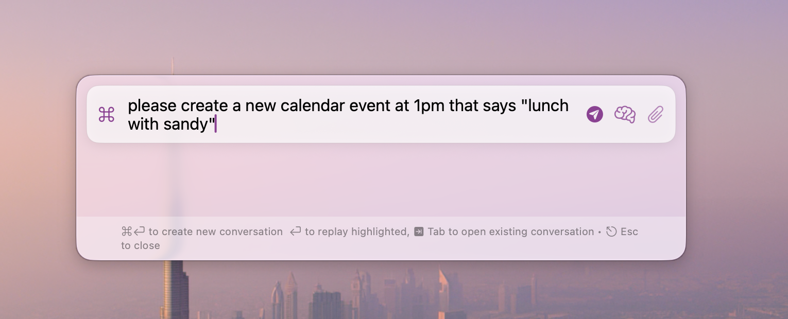
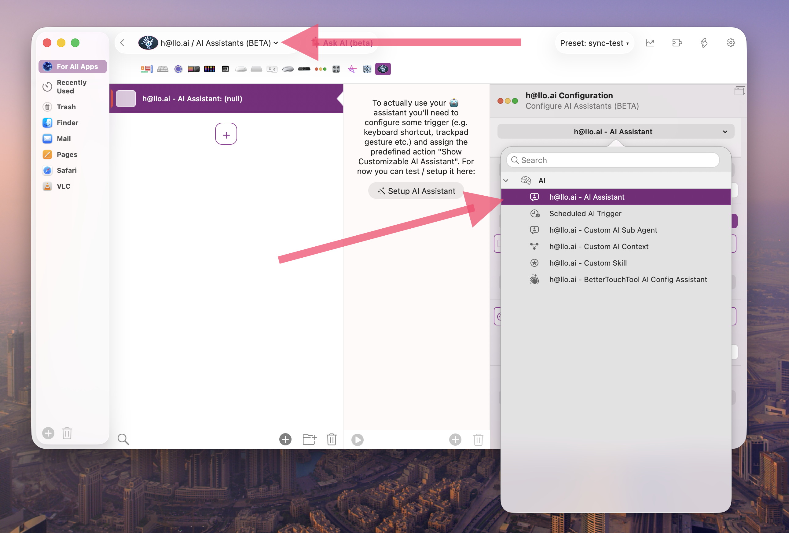
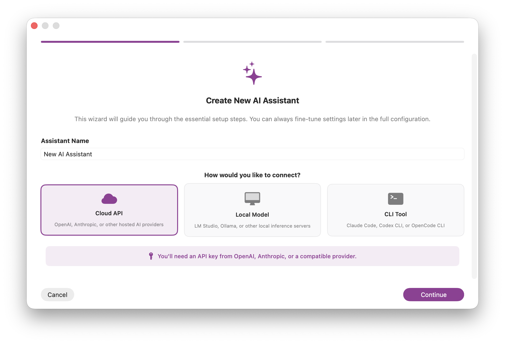
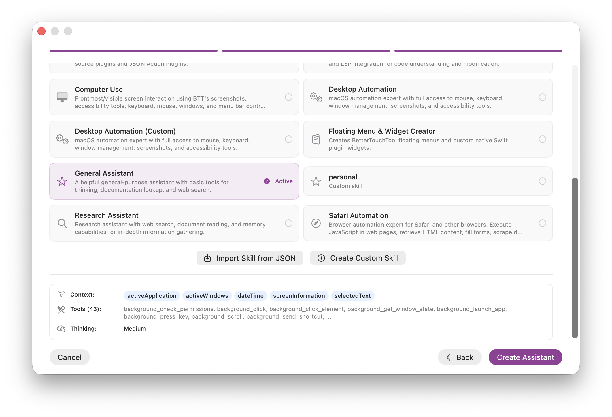
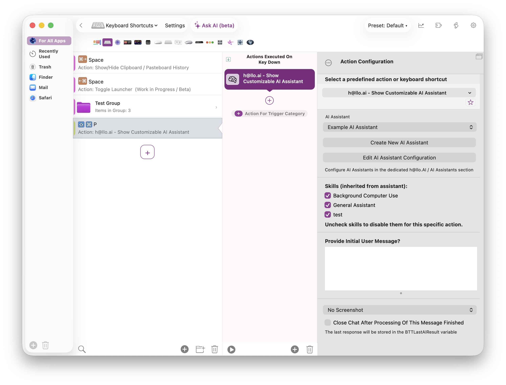

# h@llo.ai / AI Assistants

BetterTouchTool AI Assistants let you build your own Mac assistants for chat, BTT configuration, automation, research, coding, and computer use.

BTT does not provide the AI model service itself. You choose the provider or local model, and BTT sends requests directly to that provider from your Mac. No assistant chat data is routed through BetterTouchTool servers.

## Main Features

- **Skills:** The recommended way to configure assistants. A skill bundles instructions, tools, context, subagents, and thinking settings for a specific job.
- **BTT configuration:** Assistants can search BTT documentation and create or edit triggers, actions, floating menus, snippets, and plugins.
- **Computer use:** Assistants can inspect windows, use accessibility data, click, type, use menu bar commands, and verify results with screenshots.
- **Background computer use:** Assistants can target specific windows without activating them, including optional fake cursor feedback for background clicks.
- **Text and document workflows:** Assistants can read selected text, transform it, replace it, inspect active documents, and work with files when allowed.
- **Memory and context:** Assistants can remember useful information and receive selected context such as date, active app, selected text, windows, and project files.
- **Subagents:** Larger assistants can delegate focused tasks to specialized helper agents.
- **MCP support:** External MCP servers automatically become skills with all their tools available, and BTT can also expose configured assistants to external MCP clients.

## Get Started

1. Create or edit an action using **h@llo.ai - Show Customizable AI Assistant**.
2. Choose an AI provider or local model and add the required credentials.
3. Open **AI Configuration** and select **Manage Skills...**.
4. Turn on one or more skills that match what the assistant should do.
5. Trigger the assistant from any BetterTouchTool trigger, for example a keyboard shortcut, menu item, Stream Deck button, or floating menu.

For a first assistant, start with **General Assistant** plus one focused skill such as **BTT Expert**, **Computer Use**, or **Research Assistant**. Add more skills only when the assistant needs them.

Next use the setup wizard to configure your AI Assistant:

Then use the predefined action **h@llo.ai - Show Customizable AI Assistant** and assign it to some trigger:

## Example Prompts For Chosen Skills

**BTT Expert**

- "Create a keyboard shortcut that toggles Dark Mode."
- "Add a Stream Deck button that opens my daily apps."
- "Explain what the selected BTT trigger does and suggest improvements."

**Computer Use**

- "Use the current window and click the Export button, then verify it worked."
- "Open System Settings and turn on Do Not Disturb."

**Background Computer Use**

- "Refresh Safari in the background without bringing it to the front."
- "Click Play in the Spotify window without moving my real cursor."

**General Assistant / Text Workflows**

- "Summarize the selected text and replace it with a shorter version."
- "Rewrite the selected text in a friendlier tone."

**Research Assistant**

- "Research this topic and save the most useful findings to memory."
- "Compare these two products and summarize the tradeoffs."

**Floating Menu & Widget Creator**

- "Create a floating menu with buttons for my daily actions."
- "Build a small widget that shows the current clipboard length."

**Plugin Creator / Editor**

- "Create a JSON Action Plugin that shows a configurable HUD message."
- "Update this Swift plugin to add a polling interval setting."

## Safety

Skills can grant powerful capabilities such as file editing, shell scripts, AppleScript, and desktop control. Only enable skills you need, and use optional skills for capabilities that should be loaded on demand.

See [Skills](./skills), [Tools](./tools), and [BTT as MCP Provider](./external-mcp-provider) for the details behind the setup.
