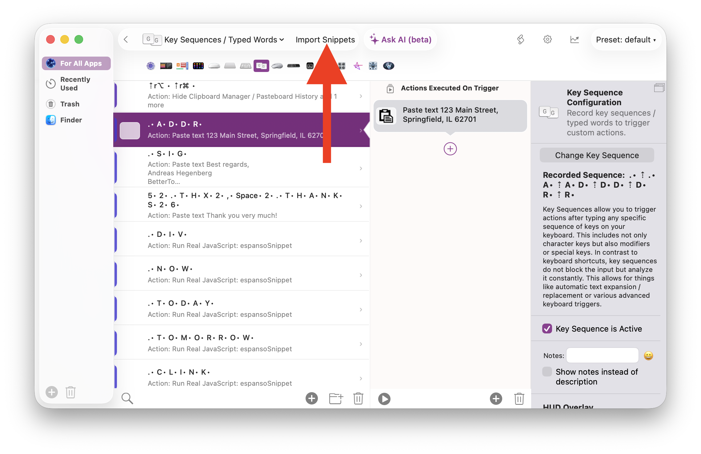

# Key Sequence Snippet Import

BetterTouchTool can bulk-import text-expansion snippets from **CSV** or **JSON** files. Each snippet creates a Key Sequence trigger that fires when you type the trigger text and then either pastes replacement text or runs a JavaScript transform.



## Supported Action Types

| Type | Description |
|------|-------------|
| **Plain text paste** | Pastes a string using the *Insert / Type / Paste Custom Text* action (action 118). |
| **JavaScript transform** | Runs a JavaScript function via *Transform & Replace Selection With JavaScript* (action 284). The script has full access to BTT's JavaScript API (`callBTT`, variables, shell scripts, etc.). |

---

## CSV Format

- **Separator:** `;` (semicolon). Only the **first** semicolon on each line is used as delimiter, so semicolons inside JavaScript code are fine.
- **Comments:** Lines starting with `#` are ignored.
- **Empty lines** are skipped.

### Plain text snippet

```
trigger_text;replacement text
```

### JavaScript snippet

Prefix the content with `JSPASTE:`:

```
trigger_text;JSPASTE:javascript code
```

### Configuring the between-key pause

By default the allowed pause between keys is **0.5 s**. You can change it for all subsequent snippets by adding a special comment anywhere in the file:

```
#BTTBetweenTime: 0.5
```

This applies to every snippet **below** that line, so you can change it multiple times in a single file:

```csv
#BTTBetweenTime: 0.2
fast1;quick snippet
fast2;another quick one

#BTTBetweenTime: 0.8
slow;this one allows slower typing
```

### Example CSV file

```csv
# Optional: set the pause between keys (default 0.3s)
#BTTBetweenTime: 0.4

# Text expansions
addr;123 Main Street, Springfield
sig;Best regards, John
brb;Be right back!

# JavaScript snippets
date;JSPASTE:async () => { return new Date().toLocaleDateString(); }
hello;JSPASTE:async () => { return "Hello World!"; }
uuid;JSPASTE:async () => { return crypto.randomUUID(); }
```

---

## JSON Format

A JSON **array** of objects. Each object has:

| Field | Required | Description |
|-------|----------|-------------|
| `trigger` | yes | The text the user types to activate the snippet. |
| `content` | yes | The replacement text or JavaScript code. |
| `type` | no | `"text"` (default) or `"js"`. |
| `betweenTime` | no | Allowed pause between key presses in seconds (default `0.3`). |

### Example JSON file

```json
[
  { "trigger": "addr", "content": "123 Main Street, Springfield" },
  { "trigger": "sig",  "content": "Best regards, John", "betweenTime": 0.5 },
  { "trigger": "date", "type": "js", "content": "async () => { return new Date().toLocaleDateString(); }" },
  { "trigger": "hello", "type": "js", "content": "async () => { return \"Hello World!\"; }", "betweenTime": 0.8 }
]
```

---

## How It Works

When a snippet is imported, BetterTouchTool:

1. Converts each character of the trigger text into the correct macOS key code (using the current keyboard layout).
2. Builds the full key sequence structure (key-down events, key-up events, and interleaved mixed events).
3. Handles **uppercase letters** automatically by grouping consecutive uppercase characters under a single Shift key press.
4. Sets `deleteAfterwards` equal to the trigger length, so the typed trigger text is removed before the replacement is pasted.
5. Creates a global Key Sequence trigger with the appropriate paste or JavaScript action.

### Timing defaults

| Property | Value | Configurable |
|----------|-------|--------------|
| Pause between keys | 0.3 s | Yes - via `#BTTBetweenTime:` in CSV or `"betweenTime"` in JSON |
| Pause before / after | 0 s | No |

---

## JavaScript Snippets

JavaScript snippets use BTT's built-in JavaScript engine. The script must be an **async function** that returns a string:

```js
async () => {
  return "replacement text";
}
```

Inside the function you have access to the full BTT JavaScript API, for example:

```js
async () => {
  // Read a BTT variable
  let name = await callBTT("get_string_variable", { variable_name: "myName" });
  return `Hello ${name}!`;
}
```

```js
async () => {
  // Run a shell script
  let result = await runShellScript({ script: "date '+%Y-%m-%d'" });
  return result.trim();
}
```

See the [BTT JavaScript integration docs](/docs/scripting/java-script) for the complete API reference.

---

## Espanso YAML Compatibility

BetterTouchTool can import [Espanso](https://espanso.org) match files (`.yml`/`.yaml`). This makes it easy to migrate existing text expansions or use Espanso-format snippet collections with BTT.

### Supported Espanso Features

| Feature | BTT Support | Notes |
|---------|-------------|-------|
| `trigger` / `triggers` | Full | Multiple triggers create separate key sequences |
| `replace` (plain text) | Full | Simple paste action |
| `replace` with `vars` | Full | Generates BTT JavaScript that evaluates vars then pastes |
| `html` | Full | Pasted via `NSPasteboardTypeHTML` |
| Multi-line (`\|`, `>`) | Full | |
| Cursor positioning (`$\|$`) | Full | Converted to `move_cursor_left_by_x_after_pasting` |
| `propagate_case` | Full | ALL CAPS and Title Case detected |
| `word: true` | Partial | Uses longer between-key pause (0.4s) |
| **Date** extension | Full | strftime formats converted to JavaScript |
| **Clipboard** extension | Full | Uses BTT's `get_clipboard_content()` |
| **Shell** extension | Full | Uses BTT's `runShellScript()` |
| **Script** extension | Full | Runs via shell with the specified interpreter |
| **Random** extension | Full | JavaScript `Math.random()` selection |
| **Echo** extension | Full | Static variable |
| **Choice** extension | Partial | Uses BTT's `show_simple_json_format_menu()` |
| **Form** (shorthand) | Partial | Uses `prompt()` for each field |
| `image_path` | Not supported | |
| `regex` triggers | Not supported | Key sequences are keystroke-based |
| `form_fields` (advanced) | Partial | Basic text fields and defaults |

### Example Espanso File

```yaml
matches:
  # Simple replacement
  - trigger: ":addr"
    replace: "123 Main Street, Springfield"

  # Date variable
  - trigger: ":now"
    replace: "It's {{mytime}}"
    vars:
      - name: mytime
        type: date
        params:
          format: "%H:%M"

  # Shell command
  - trigger: ":ip"
    replace: "{{output}}"
    vars:
      - name: output
        type: shell
        params:
          cmd: "curl -s 'https://api.ipify.org'"

  # Clipboard + cursor positioning
  - trigger: ":clink"
    replace: "<a href='{{clipb}}'>$|$</a>"
    vars:
      - name: clipb
        type: clipboard

  # Case propagation
  - trigger: ":btw"
    replace: "by the way"
    propagate_case: true

  # Random choice
  - trigger: ":quote"
    replace: "{{output}}"
    vars:
      - name: output
        type: random
        params:
          choices:
            - "Every moment is a fresh beginning."
            - "Whatever you do, do it well."

  # Simple form
  - trigger: ":meeting"
    form: |
      Meeting with [[person]] on [[date]] about [[topic]]
```

### How It Works

For simple `trigger → replace` matches (no variables), BTT creates a plain-text paste action - identical to the CSV/JSON import.

For matches with **variables, case propagation, cursor positioning, or HTML**, BTT generates a JavaScript function that:
1. Evaluates each variable in order (date formatting, shell commands, clipboard, etc.)
2. Substitutes `{{varname}}` placeholders in the replacement template
3. Applies case propagation if enabled
4. Handles `$|$` cursor positioning
5. Calls `paste_text()` to insert the result

This means the full power of BTT's JavaScript API is available - shell scripts, Apple Shortcuts, BTT variables, and more.

---

## AutoHotkey Hotstring Compatibility

BetterTouchTool can import [AutoHotkey](https://www.autohotkey.com/) hotstring files (`.ahk`). This lets you reuse existing AHK text expansion scripts on macOS.

### Supported AHK Syntax

```ahk
; Comments start with semicolons

; Basic hotstring: typing "btw" + ending char → "by the way"
::btw::by the way

; Immediate trigger (* = no ending character needed)
:*:addr::123 Main Street

; Don't delete the abbreviation (B0)
:B0:@@::andreas@example.com

; Combined options
:*B0:!!::ALERT

; AHK escape sequences: `n = newline, `t = tab, `s = space
::nl::Line one`nLine two

; Multi-line with continuation section
::letter::
(
Dear Sir or Madam,

Thank you for your inquiry.

Best regards
)

; Case-sensitive (C option)
:C:AFK::Away From Keyboard

; Global default change
#Hotstring B0
```

### Supported Options

| Option | Effect in BTT |
|--------|---------------|
| `*` | Immediate trigger (no ending character) - this is BTT's default behavior |
| `B0` | Don't delete the typed abbreviation (`deleteAfterwards = 0`) |
| `B1` | Delete the abbreviation (default) |
| `C` | Case-sensitive matching |
| `O` | Omit ending character - accepted (BTT always omits) |
| `R`, `T`, `S` | Accepted but no effect in BTT |

### Not Supported

| Feature | Reason |
|---------|--------|
| `X` option (execute code) | AHK scripting is Windows-specific |
| `#HotIf` context sensitivity | Would need BTT trigger conditions |
| `{Send}` commands in replacements | AHK-specific key sending |
| Ending character customization | BTT uses timing-based detection |

### Example AHK File

```ahk
; Common abbreviations
::btw::by the way
::omw::On my way!
::thx::Thank you very much!

; Email shortcuts (immediate trigger)
:*:myemail::andreas@example.com
:*:sig::Best regards, Andreas

; Don't backspace the trigger
:B0:@@::andreas@example.com

; Multi-line template
::letter::
(
Dear Sir or Madam,

Thank you for your inquiry.

Best regards,
Andreas
)
```
