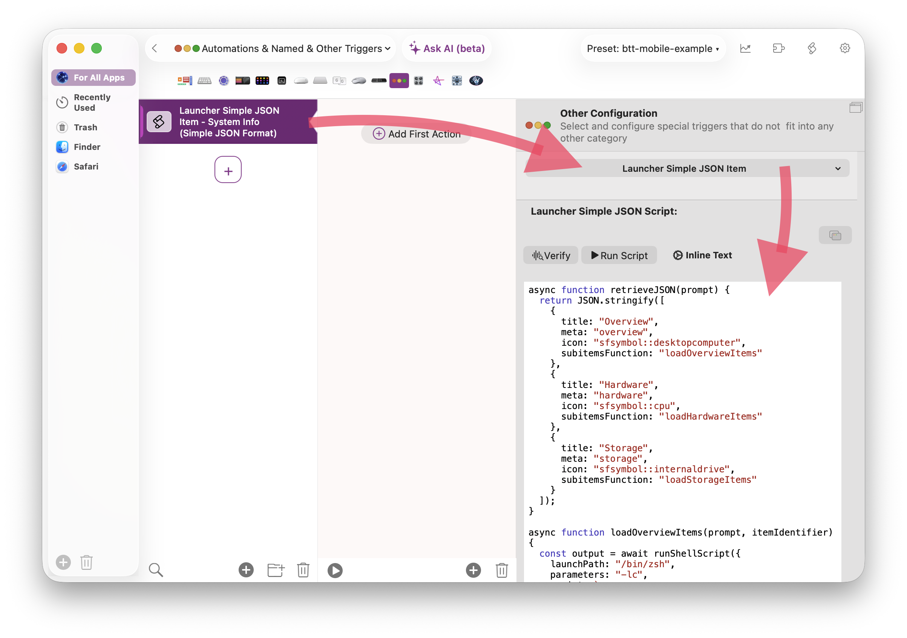

The Launcher allows you to show dynamic items. For example you could dynamically query some APIs (e.g. stock info, weather data etc.), run shell or apple scripts. This all works by leveraging BTT's [Simple JSON Format / JavaScript](../scripting/simple-format.mdx)

To configure this you will need to add a "Launcher Simple JSON Item" in BTT's "Automations, Named & Other Triggers" section and provide a script that returns the JSON to define the items:




Here is an example that dynamically loads various system information by calling some basic shell scripts:
<video src="/media/dynamic_items.mp4" autoPlay muted loop style={{width: '80%'}}>
    Sorry, your browser doesn't support embedded videos, but don't worry, you can
    <a href="/media/dymnamic_items.mp4">download it</a>
    and watch it with your favorite video player!
</video>


Here is the [Simple JSON Format ](../scripting/simple-format.mdx)Script for this example:

```JS
async function retrieveJSON(prompt) {
  return JSON.stringify([
    {
      title: "Overview",
      meta: "overview",
      icon: "sfsymbol::desktopcomputer",
      subitemsFunction: "loadOverviewItems"
    },
    {
      title: "Hardware",
      meta: "hardware",
      icon: "sfsymbol::cpu",
      subitemsFunction: "loadHardwareItems"
    },
    {
      title: "Storage",
      meta: "storage",
      icon: "sfsymbol::internaldrive",
      subitemsFunction: "loadStorageItems"
    }
  ]);
}

async function loadOverviewItems(prompt, itemIdentifier) {
  const output = await runShellScript({
    launchPath: "/bin/zsh",
    parameters: "-lc",
    script: `
      printf 'macOS|%s\\n' "$(/usr/bin/sw_vers -productVersion)"
      printf 'Uptime|%s\\n' "$(/usr/bin/uptime | /usr/bin/sed 's/^.*up //; s/, [0-9]* users.*$//')"
      printf 'Computer Name|%s\\n' "$(/usr/sbin/scutil --get ComputerName 2>/dev/null || /bin/hostname)"
    `
  });

  return JSON.stringify(itemsFromPipeOutput(output, "sfsymbol::info.circle"));
}

async function loadHardwareItems(prompt, itemIdentifier) {
  const output = await runShellScript({
    launchPath: "/bin/zsh",
    parameters: "-lc",
    script: `
      printf 'Model|%s\\n' "$(/usr/sbin/sysctl -n hw.model)"
      printf 'Chip|%s\\n' "$(/usr/sbin/sysctl -n machdep.cpu.brand_string 2>/dev/null || /usr/sbin/sysctl -n hw.model)"
      printf 'CPU Cores|%s\\n' "$(/usr/sbin/sysctl -n hw.ncpu)"
      printf 'Memory|%s\\n' "$(/usr/sbin/sysctl -n hw.memsize | /usr/bin/awk '{printf "%.1f GB", $1/1024/1024/1024}')"
    `
  });

  return JSON.stringify(itemsFromPipeOutput(output, "sfsymbol::cpu"));
}

async function loadStorageItems(prompt, itemIdentifier) {
  const output = await runShellScript({
    launchPath: "/bin/zsh",
    parameters: "-lc",
    script: `
      /bin/df -h / /System/Volumes/Data 2>/dev/null | /usr/bin/awk 'NR>1 {print $9 "|" $4 " free of " $2}'
    `
  });

  return JSON.stringify(itemsFromPipeOutput(output, "sfsymbol::internaldrive"));
}

function itemsFromPipeOutput(output, icon) {
  return String(output)
    .trim()
    .split("\n")
    .filter(Boolean)
    .map((line) => {
      const [title, ...valueParts] = line.split("|");
      const value = valueParts.join("|");
      const text = `${title}: ${value}`;

      return {
        title,
        subtitle: value,
        icon,
        action: `btt::paste_text@@${JSON.stringify({ text })}`
      };
    });
}
```