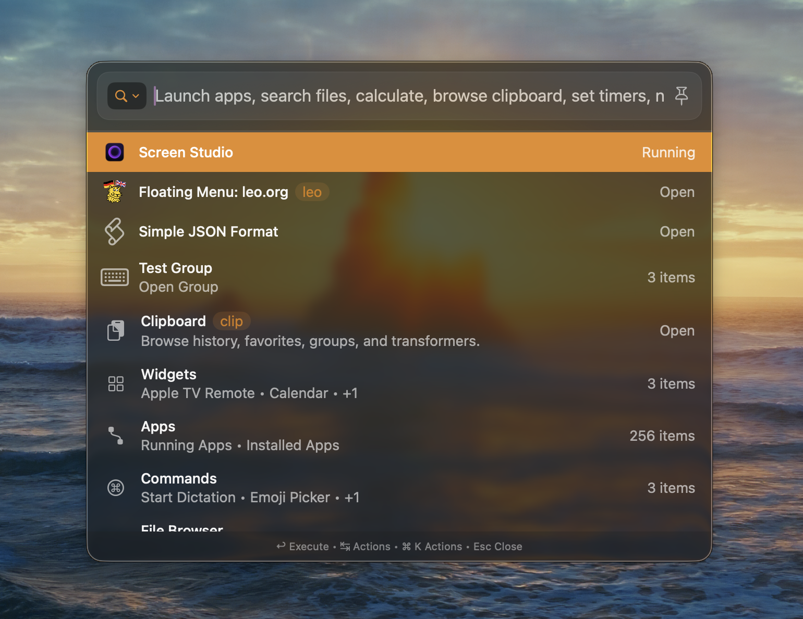
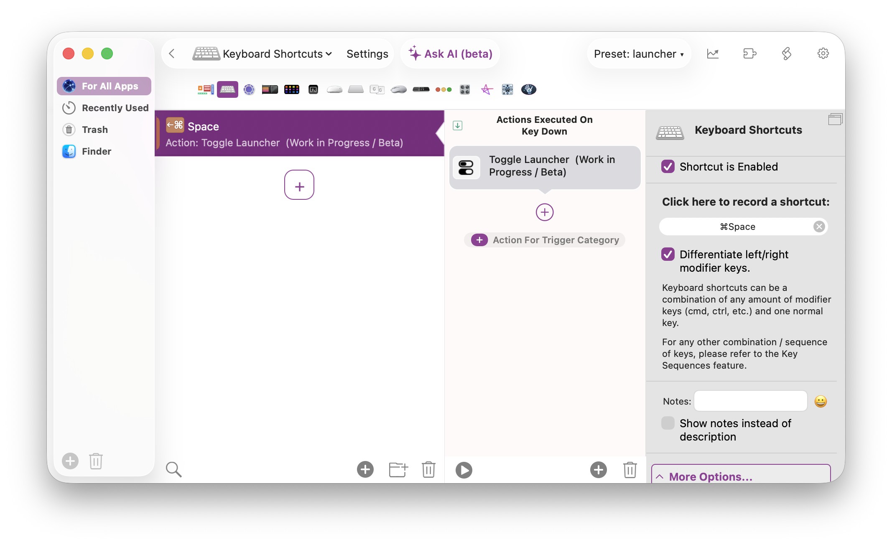
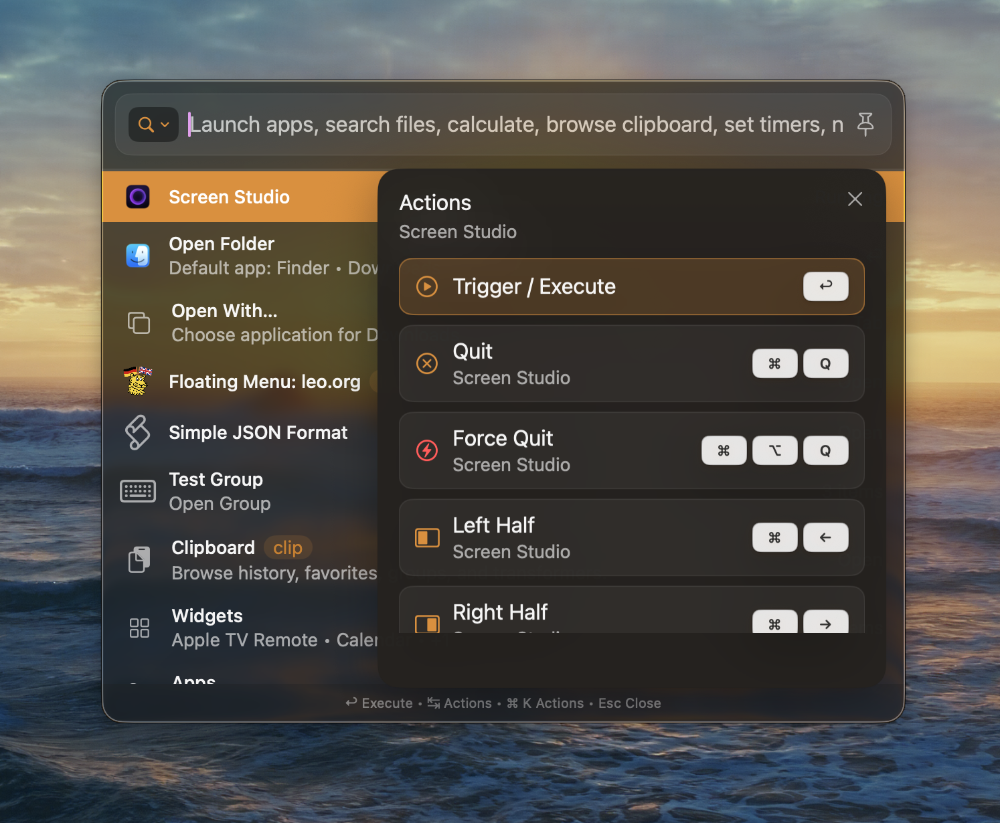

# The BetterTouchTool Launcher

The Launcher is a Spotlight-style command window built into BetterTouchTool. Access apps, files, your BTT triggers, your clipboard, your calendar, and much more.

Requires **macOS 13 or newer and BetterTouchTool 6.440 or newer**.

## Highlights

- **Reuse Your Configured BTT Triggers** - You can put **any BetterTouchTool trigger** into the Launcher, simply by enabling "Show in Launcher" in its configuration. Every BTT trigger can become a searchable, named command - a true command palette for your automations. The prompt is saved to variables BTTLauncherPrompt (full prompt), BTTLauncherPromptKeyword (first word) and BTTLauncherPromptInputWithoutKeyword (remaining text) and can be accessed from your automations.
- **Search everything** - apps, windows, files, BTT actions, your own triggers, and calendar events from one field.
- **Clipboard Manager** - full history with previews, inline editing, text transformers, and image markup.
- **Calendar & Reminders** - browse your macOS calendars and create events or reminders without leaving the keyboard.
- **Speech Dictation** - voice-to-text with review, edit, paste, or copy.
- **File Search & Browser** - fast name search with configurable scopes, plus a Finder-like browser.
- **Apple TV Remote** - full on-screen remote as a built-in widget.
- **Plugins** - third-party extensions can contribute their own rows, commands, and rich surfaces.
- **AI Chat** - jump straight back into recent h@llo.AI conversations, run AI queries or use it to configure BTT.
- **AI Launcher Plugin Generation** - use BetterTouchTool's AI Configuration Assistants (Ask AI) to generate completely custom native launcher plugins
- **Multiple Instances** - run several launchers in parallel, each with its own pinned items, window position, aliases, and query memory.

<video src="/media/bttlauncher.mp4" autoPlay muted loop style={{width: '100%'}}>
    Sorry, your browser doesn't support embedded videos, but don't worry, you can
    <a href="/media/bttlauncher.mp4">download it</a>
    and watch it with your favorite video player!
</video>

## Opening the Launcher

The Launcher is controlled through three predefined BetterTouchTool actions. Assign any of them to a trigger (hotkey, trackpad gesture, menu bar item, Stream Deck button, …):

| Action | Description |
| --- | --- |
| **Show Launcher** | Shows the Launcher, optionally with prefilled text. |
| **Hide Launcher** | Hides the currently active Launcher. |
| **Toggle Launcher** | Shows the Launcher if hidden, otherwise hides it. |

A typical setup is a keyboard shortcut like `⌥ Space` bound to **Toggle Launcher**.

All three actions accept an optional **launcher ID** and positioning parameters so you can run several independent Launcher instances side by side and place them exactly where you want.

## Customizing Results

Every row in the Launcher can be tailored - no code required:

- **Aliases / keywords** - make a row match extra search terms.
- **Pinning** - keep a quick pill above the results for one-click access.
- **Priority** - boost or lower a row's ranking in filtered searches.
- **Hide** - remove a row from results without deleting the underlying trigger.
- **Groups (folders)** - collect related sections into browsable folders with their own SF Symbol icons and keyboard shortcuts.

All of this is reachable from the per-item actions popover (`⌘P` by default) or the Launcher settings sheet, opened from the menu button in the top-left corner of the Launcher window.

## Keyboard-First

The Launcher is designed to be driven from the keyboard. The most important keys:

| Key | Action |
| --- | --- |
| `↑` / `↓` | Move selection. |
| `↩` | Activate the selected item. |
| `Tab` / `→` | Enter child items (e.g. an app's windows). |
| `←` | Go back one level. |
| `Esc` | Exit the current surface, or close the Launcher. |
| `Space` | Quick Look preview on file rows. |
| `⌘P` | Per-item actions popover. |

## Learn More

See [Items & Widgets](/docs/launcher/items) for the full catalogue of what can appear in the Launcher and what each item can do.
