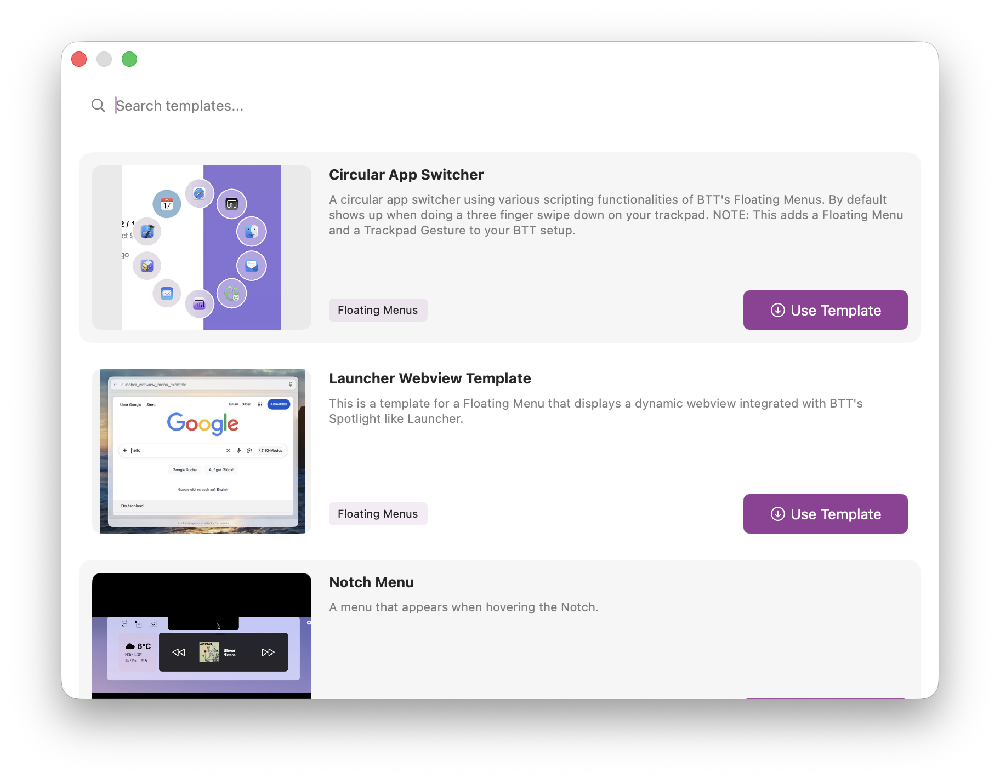
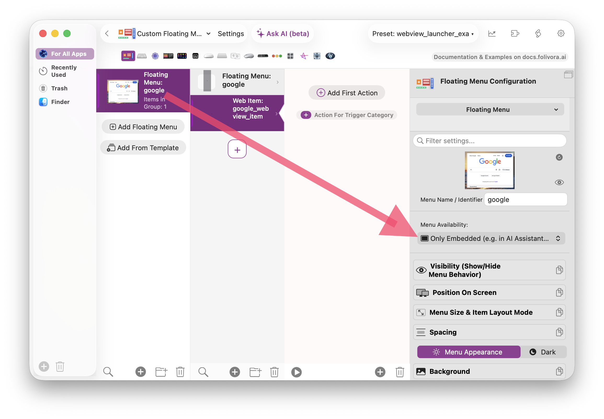
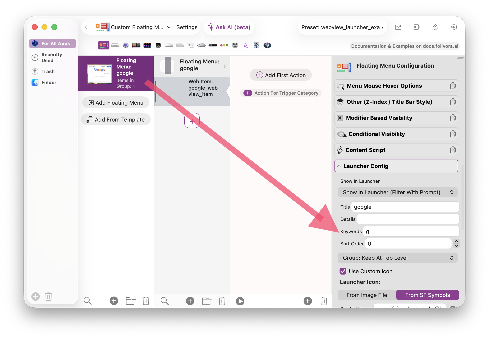
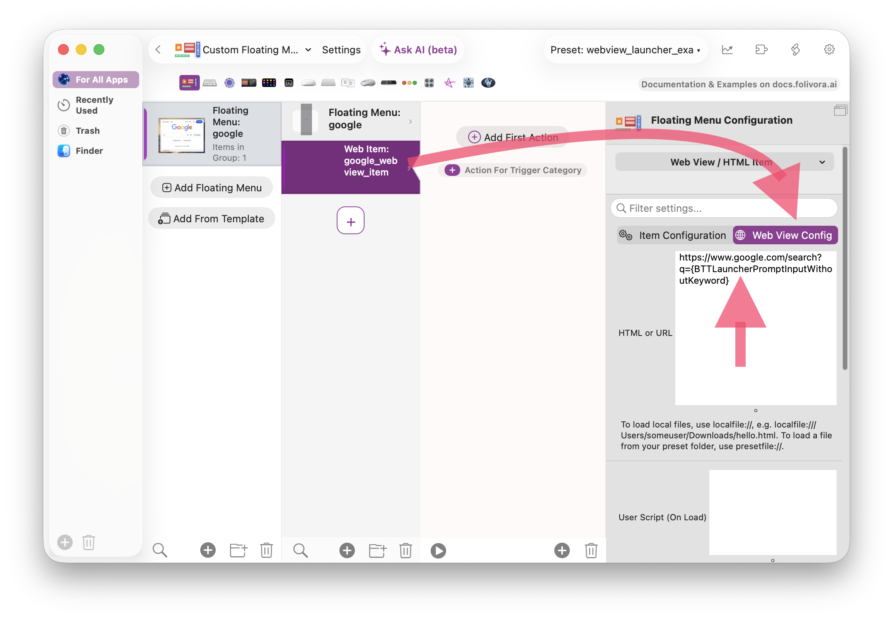

The Launcher supports to include arbitrary [Floating Menus](../floating-menus/index.mdx). Floating Menus support including web view items. This makes for a very powerful combination.

Here is a simple example that passes the Launcher prompt to a dictionary website:

<video src="/media/leo.mp4" autoPlay muted loop style={{width: '100%'}}>
    Sorry, your browser doesn't support embedded videos, but don't worry, you can
    <a href="/media/leo.mp4">download it</a>
    and watch it with your favorite video player!
</video>

## Configuration Steps

<video src="/media/launcher_webview.mp4" autoPlay muted loop style={{width: '100%'}}>
    Sorry, your browser doesn't support embedded videos, but don't worry, you can
    <a href="/media/launcher_webview.mp4">download it</a>
    and watch it with your favorite video player!
</video>

# Step 0: Use Floating Menu Template

Best start with the "Launcher Webview Template". It contains a working floating menu that loads google.com with your launcher's prompt. You can modify that to fit your use case.



# Step 1: Define A Floating Menu

For the Floating Menu best set the availability  to "Only Embedded":


# Step 2: Set a Launcher Keyword:

A Launcher Keyword allows you to type e.g. "g hello world" into the launcher to search Google for "hello world":



# Step 3: Configure The Web View

Configure the web view to load a URL with the launcher's prompt as URL parameter. The variable BTTLauncherPromptInputWithoutKeyword contains the entered prompt without the keyword, so for example "g hello world" would store "hello world" in that variable.

Use that variable in any URL like this (in curly braces):
```
https://www.google.com/search?q={BTTLauncherPromptInputWithoutKeyword}
```




