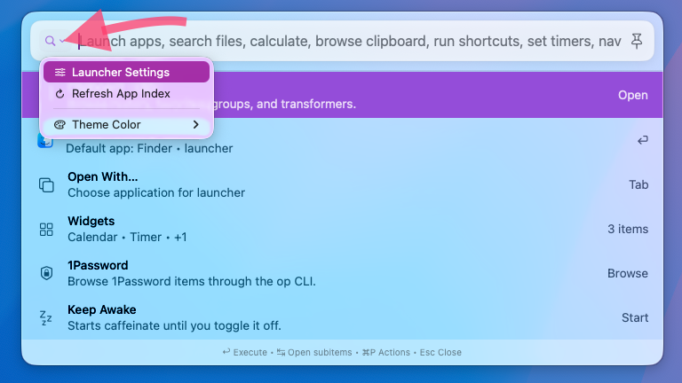
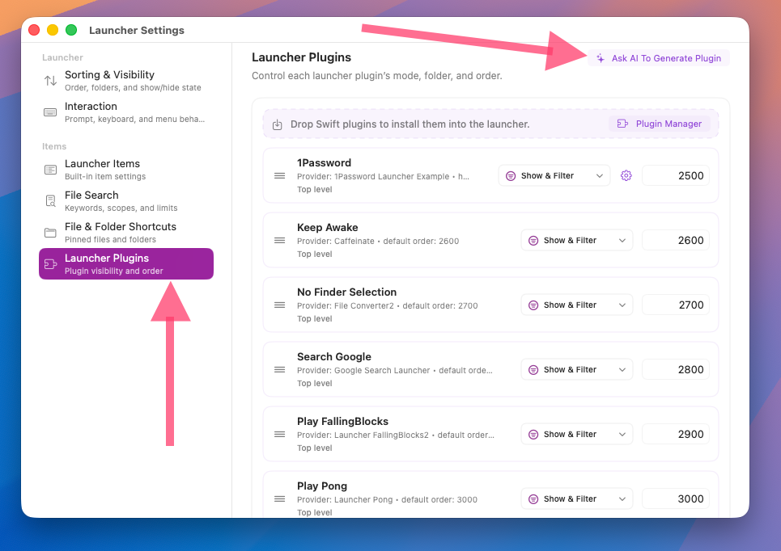
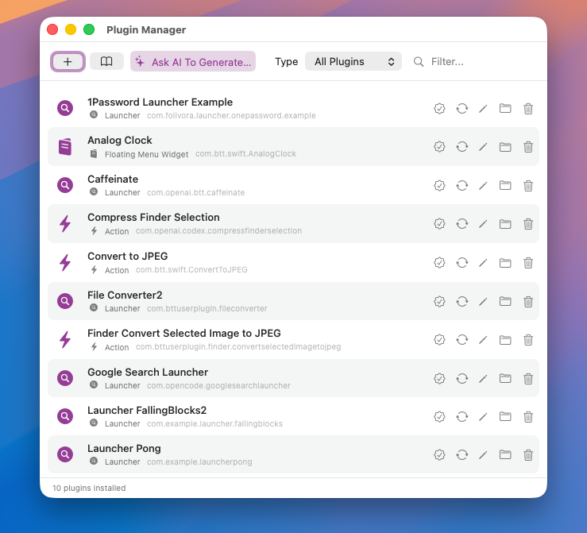
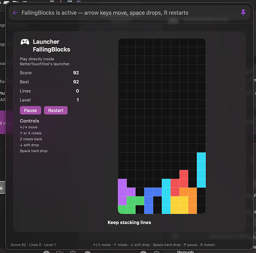
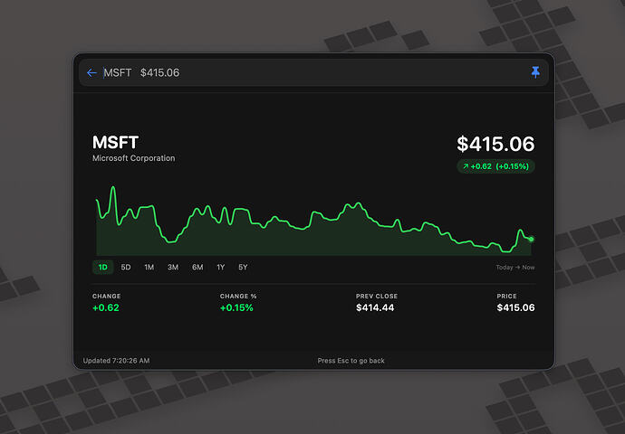
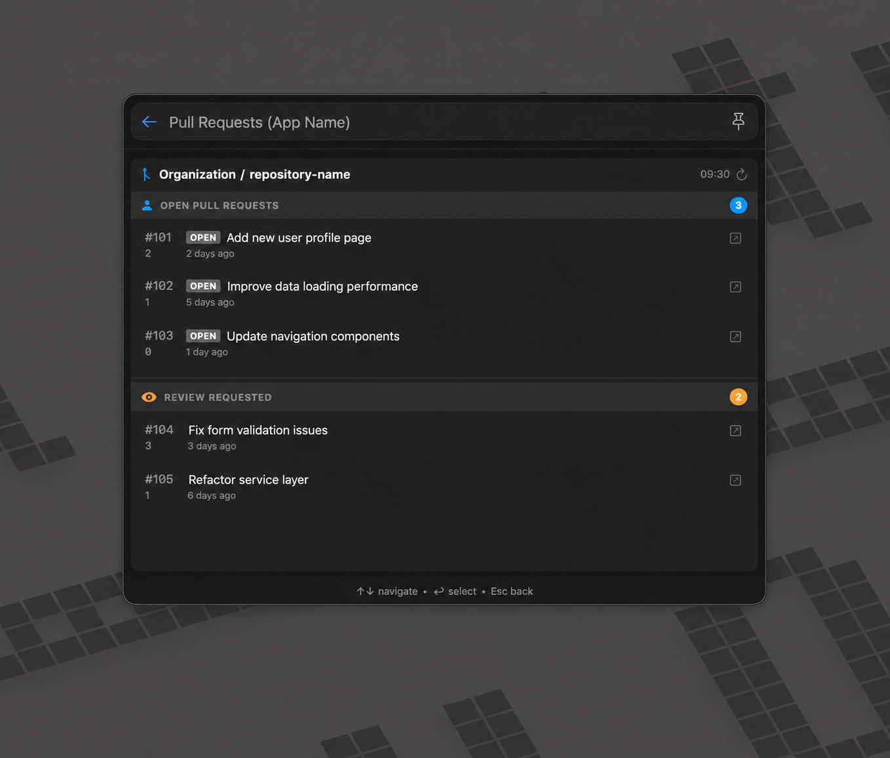
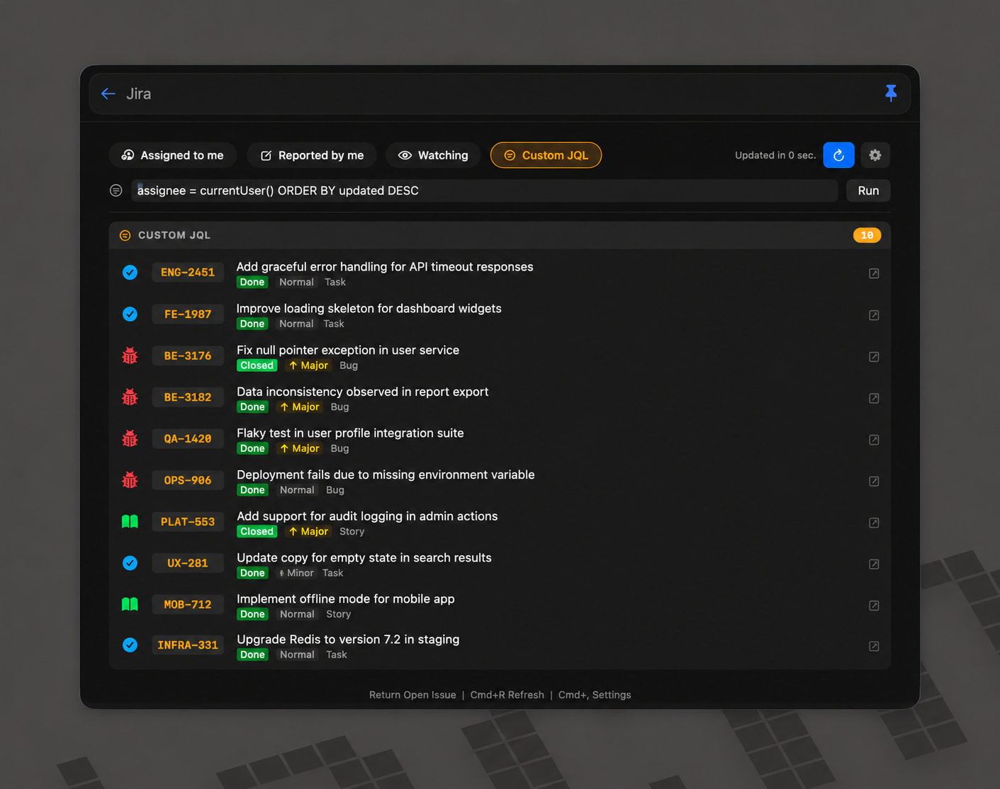

# Native Swift Plugins

BetterTouchTool's launcher supports native swift plugins which allow for rich and interactive UI. You need at least BetterTouchTool 6.503 for this to work.

The plugins have the same permissions as BetterTouchTool itself, so be careful to only install from trusted sources.

## Generate a Plugin Using AI

The easiest (and recommended way) to generate a plugin is to use BetterTouchTool's integrated AI assistant. You can trigger the Plugin Creator assistant directly from the Launcher Settings => Launcher Plugins (requires BTT 6.504)

Or via BTT's plugin manager (access via menubar => view => plugin manager)

## Generate Plugins manually

The documentation for plugins is available here:

https://docs.folivora.ai/docs/plugins/launcher

https://github.com/folivoraAI/BetterTouchToolPlugins

## Examples

It is still very early, but users have provided some great example plugins already:

https://community.folivora.ai/t/discussion-bettertouchtool-launcher-spotlight-replacement-very-much-work-in-progress/46768/125?u=andreas_hegenberg

https://community.folivora.ai/t/discussion-bettertouchtool-launcher-spotlight-replacement-very-much-work-in-progress/46768/161

https://community.folivora.ai/t/discussion-bettertouchtool-launcher-spotlight-replacement-very-much-work-in-progress/46768/167?u=andreas_hegenberg