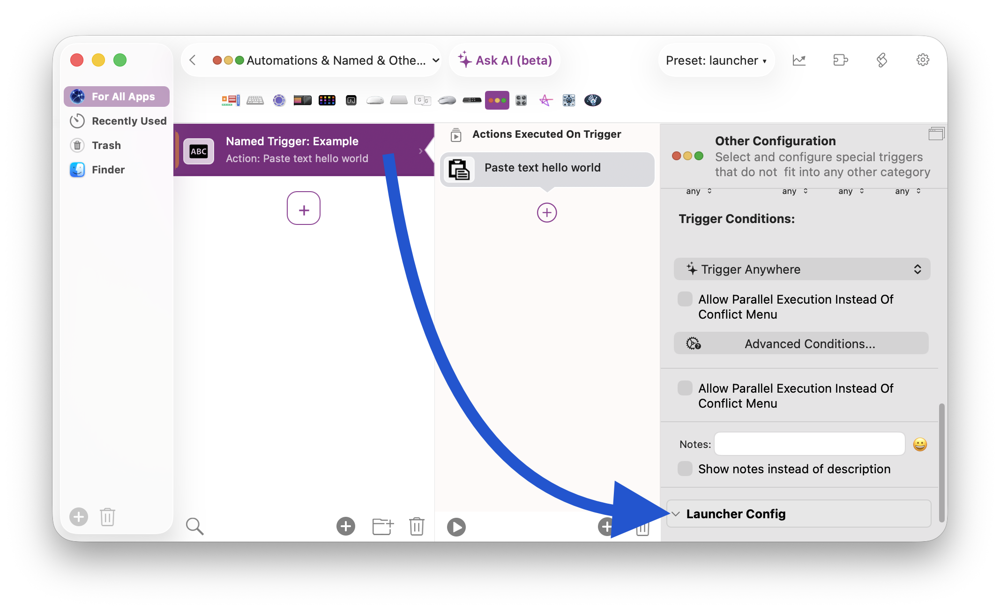
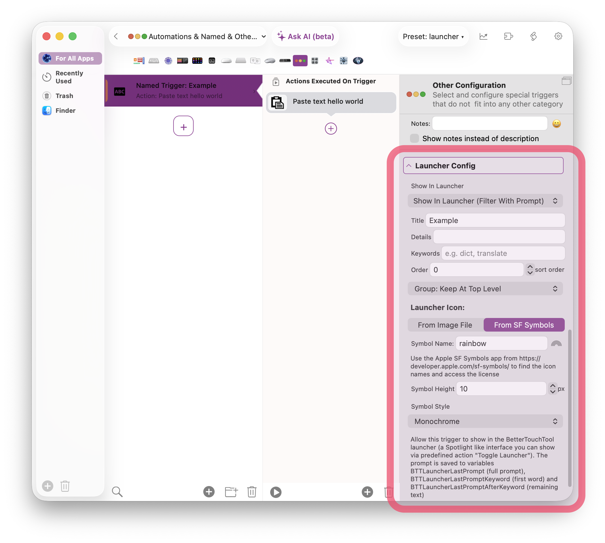
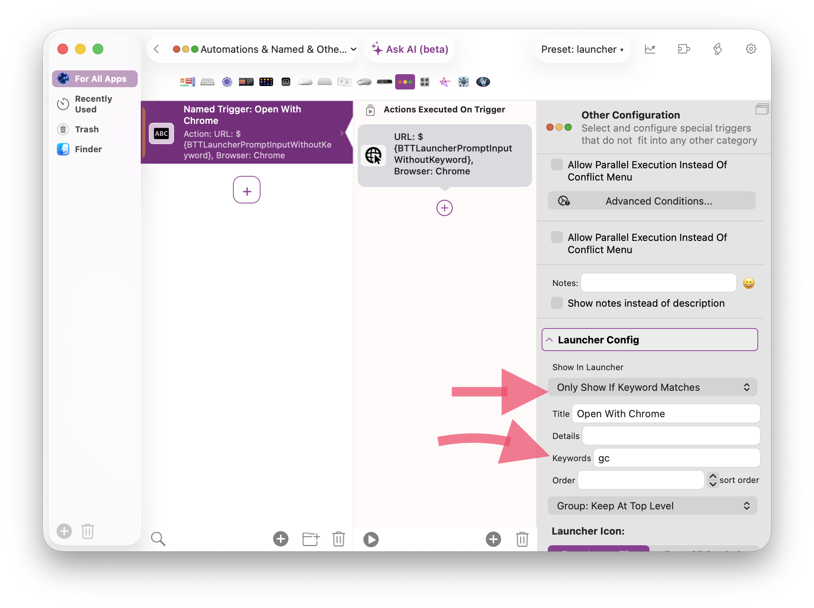
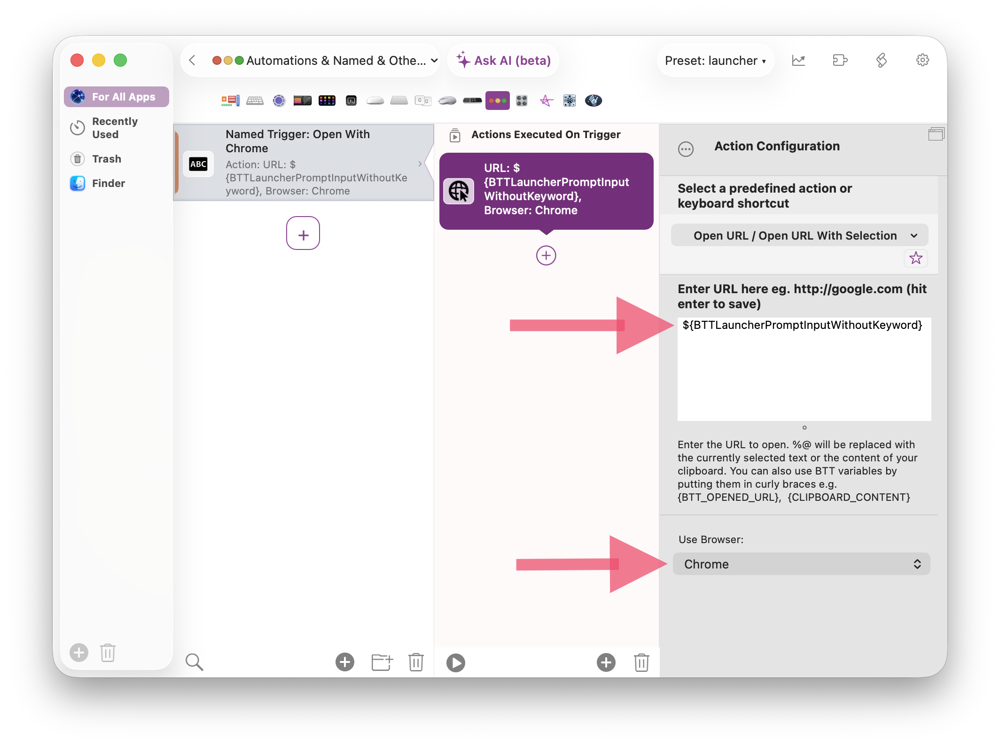

# Include Existing BetterTouchTool Triggers In The Launcher

Every trigger (AND every group!) in BTT can be included in the Launcher. To do that, select the trigger and scroll down to the bottom of its configuration sidebar. There you'll see the "Launcher Config"

# Filtering Options

By default configured BetterTouchTool triggers are set to "Don't Include In Launcher". To include it in the Launcher choose one of these options:

* **Show In Launcher (Filter With Prompt)**
The trigger will always show at the Launcher while no prompt / search is entered. If something is entered, it will only show if the search matches the defined title.

* **Only Show If Keyword Matches**
The trigger will now show by default at the top level. It will however show up if the entered search / prompt matches the assigned keyword. A keyword is normally followed by a space (e.g. `gc apple.com`); keywords that end in a symbol character (e.g. `>` or `gh:`) can have the input attached directly, like `>open safari`.

* **Only Show If Prompt Matches**
The trigger will now show by default at the top level. It will however show up if the entered search / prompt matches the defined title.

* **Only Show If Prompt Matches Or Nothing Else Matches**
The trigger will now show by default at the top level. It will however show up if the entered search / prompt matches the assigned keyword OR if search / prompt text is entered but doesn't match anything else.

* **Show In Launcher (Ignore Prompt, Always Show)**
The trigger will always show regardless of whether the prompt is empty or not and regardless of whether the prompt matches any part of the launcher config.

# Dynamic Behavior Based On The Prompt Input

Once a configured trigger is called from the launcher it has these three variables available:

- `BTTLauncherPrompt` — the full current prompt text.
- `BTTLauncherPromptKeyword` — the matched launcher keyword of the activated trigger; if none of its keywords matches, the first whitespace-separated word of the prompt
- `BTTLauncherPromptInputWithoutKeyword` — the remainder of the prompt after the keyword.

So for example you might want to open a URL with Google Chrome. You could assign the keyword "gc" to a trigger and make it "Only Show If Keyword Matches". Now when you'd type "gc https://apple.com" the url will be available via variable BTTLauncherPromptInputWithoutKeyword

Symbol keywords work without the space: assign the keyword `>` to a trigger that runs a terminal command and type `>open "Safari"` — the trigger matches immediately and `BTTLauncherPromptInputWithoutKeyword` contains `open "Safari"`.

Of course these variables can be used with lots of BTT's actions, [in conditions](../actions/conditions.mdx), or with the various [scripting options in BTT.](../scripting/index.mdx)